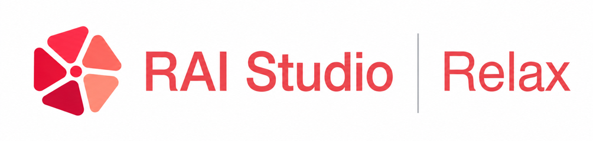

<div align="center">

## Relax: An Asynchronous Reinforcement Learning Engine for Omni-Modal Post-Training at Scale



<p>
  <a href="./LICENSE">
    
  </a>
  <a href="https://www.python.org/downloads/">
    
  </a>
  <a href="https://arxiv.org/abs/2604.11554">
    
  </a>
  <a href="https://redai-studio.github.io/Relax">
    
  </a>
  <a href="https://github.com/redai-studio/Relax/discussions/48" target="_blank">
    
  </a>
  <a href="https://github.com/redai-studio/Relax/discussions/30" target="_blank">
    
  </a>
</p>

<p>
  <a href="./README.md">📖 English</a> | <a href="./README_zh.md">📖 中文</a>
</p>
</div>

**Relax** is an open-source reinforcement learning post-training framework from the Xiaohongshu AI Infra Team. It trains large models on text, images, video, and audio, and supports agents that interact with tools and environments.

Relax uses Megatron-LM for training, SGLang for inference, and Ray Serve to manage services. [TransferQueue](https://github.com/redai-studio/TransferQueue) passes samples between training and inference so they can run independently.

## ✨ Highlights

- **Omni-modal training** — Train text, vision-language, and audio-visual models in one framework, including Qwen3-Omni.
- **Async training** — Generate samples while training runs, with configurable data staleness. Choose a training mode based on GPU availability and how closely samples must follow the current policy.
- **Agentic RL** — Train with tools, environment feedback, and multi-turn or multi-agent interactions. Loss masking trains on model outputs while excluding environment observations. Multimodal context carries across turns. See the [Agentic guide](docs/en/guide/agentic-rollout.md).
- **Dense and MoE models** — Scale training with tensor, pipeline, context, and expert parallelism (TP/PP/CP/EP). [LoRA training](docs/en/guide/low-rank-adaptation-training.md) supports dense and MoE models.
- **Algorithms and rewards** — Use RL algorithms and on-policy distillation with math, question-answering, and instruction-following rewards. Add a custom reward or use [GenRM](docs/en/examples/generative-reward-model.md) to score responses with a model.
- **Elastic rollout** — Add inference engines during training, including engines in other clusters. Remove added engines after pending requests finish. See the [scaling guide](docs/en/guide/elastic-rollout.md).
- **Monitoring and recovery** — Restart failed services automatically, with a full training restart if needed. Track metrics with TensorBoard, WandB, or ClearML, and receive training notifications through Apprise.

## 📦 Installation

Use the official Docker image with CUDA, PyTorch, Megatron-LM, SGLang, and Ray pre-installed. Replace `/path/to/your/workspace` with a host directory for code, models, and data.

```bash
# Pull the official image
docker pull ghcr.io/redai-studio/relaxrl:latest

# Launch a container with GPUs, shared memory, and your workspace mounted
docker run -it --gpus all --ipc=host --network=host \
  -v /path/to/your/workspace:/workspace \
  ghcr.io/redai-studio/relaxrl:latest bash

# Inside the container
git clone https://github.com/redai-studio/Relax.git /workspace/Relax
cd /workspace/Relax && pip install -e .
```

> 📖 For GPU driver requirements, multi-node setup, and persistent storage mounts, see the [Installation Guide](docs/en/guide/installation.md).

## 🚀 Quick Start

Choose a **text**, **vision-language**, or **audio-visual** task. Run the commands inside the training container, from `/workspace/Relax`. Set `EXP_DIR=/workspace` so the scripts can find the downloaded models and data. The examples use ClearML in offline mode.

### Task 1 — DAPO Math (Text, 8 GPUs)

Train Qwen3-4B on [`dapo-math-17k`](https://huggingface.co/datasets/zhuzilin/dapo-math-17k) with GRPO and evaluate on AIME 2024. The reward checks answers through rule-based extraction and symbolic math verification.

```bash
hf download --repo-type dataset zhuzilin/dapo-math-17k --local-dir /workspace/dapo-math-17k
hf download Qwen/Qwen3-4B --local-dir /workspace/Qwen3-4B
hf download --repo-type dataset zhuzilin/aime-2024 --local-dir /workspace/aime-2024
python scripts/tools/process_aime.py --input /workspace/aime-2024/aime-2024.jsonl

cd /workspace/Relax
export EXP_DIR=/workspace
export CLEARML_OFFLINE_MODE=1
bash scripts/training/text/run-qwen3-4B-8xgpu.sh
```

<details>
<summary>Open-R1: vision-language training, 8 GPUs</summary>

Train Qwen3-VL-4B on [`multimodal-open-r1-8k-verified`](https://huggingface.co/datasets/lmms-lab/multimodal-open-r1-8k-verified) with GRPO using the `openr1mm` reward.

```bash
hf download --repo-type dataset lmms-lab/multimodal-open-r1-8k-verified \
  --local-dir /workspace/multimodal-open-r1-8k-verified
python scripts/tools/process_openr1.py \
  --input-dir /workspace/multimodal-open-r1-8k-verified/data/train-00000-of-00001.parquet \
  --output-dir /workspace/multimodal-open-r1-8k-verified/data/train-00000-of-00001_converted_noextract.parquet
hf download Qwen/Qwen3-VL-4B-Instruct --local-dir /workspace/Qwen3-VL-4B-Instruct

cd /workspace/Relax
export EXP_DIR=/workspace
export CLEARML_OFFLINE_MODE=1
bash scripts/training/multimodal/run-qwen3-vl-4B-8xgpu.sh
```

</details>

<details>
<summary>AVQA: image and audio training, 16 GPUs / 2 nodes</summary>

Train Qwen3-Omni-30B-A3B on [`AVQA-R1-6K`](https://huggingface.co/datasets/harryhsing/AVQA-R1-6K) with GRPO and a multiple-choice reward.

Before the two-node launch, configure `MASTER_ADDR`, `POD_NAME`, `HOST_IP`, and `WORLD_SIZE` as described in [multi-node training](docs/en/guide/customize-training.md). Both nodes need the same model and data paths. The commands below prepare the data and load the chat template shipped with Qwen3-Omni.

```bash
hf download --repo-type dataset harryhsing/AVQA-R1-6K --local-dir /workspace/AVQA
python scripts/tools/process_avqa.py \
  --input-dir /workspace/AVQA/AVQA_R1/train/omni_rl_format_train.json \
  --output-dir /workspace/AVQA/AVQA_R1/train/omni_rl_format_train_convert.jsonl \
  --md-dir /workspace/AVQA/AVQA_R1/train
python scripts/tools/process_avqa.py \
  --input-dir /workspace/AVQA/AVQA_R1/valid/omni_rl_format_valid.json \
  --output-dir /workspace/AVQA/AVQA_R1/valid/small_valid.jsonl \
  --md-dir /workspace/AVQA/AVQA_R1/valid
hf download Qwen/Qwen3-Omni-30B-A3B-Instruct --local-dir /workspace/Qwen3-Omni-30B-A3B-Instruct

python - <<'PY'
import json
from pathlib import Path

model = Path('/workspace/Qwen3-Omni-30B-A3B-Instruct')
config_path = model / 'tokenizer_config.json'
config = json.loads(config_path.read_text())
if 'chat_template' not in config:
    config['chat_template'] = json.loads((model / 'chat_template.json').read_text())['chat_template']
    config_path.write_text(json.dumps(config, indent=2, ensure_ascii=False))
PY

cd /workspace/Relax
export EXP_DIR=/workspace
export CLEARML_OFFLINE_MODE=1
bash -x scripts/entrypoint/spmd-multinode.sh \
  scripts/training/multimodal/run-qwen3-30B-A3B-omni-16xgpu.sh
```

</details>

Once running, you should see logs like:

```text
Finish rollout 0/200
training step 0/200
```

> 📖 Full walkthrough: [Quick Start Guide](docs/en/guide/quick-start.md) · [Customize Training](docs/en/guide/customize-training.md) · [Configuration Guide](docs/en/guide/configuration.md)

## 🏗️ Training Modes

Choose how training and sample generation (rollout) use GPUs:

| Mode                | GPU allocation                                                                                                      | Training behavior                                                                                        |
| :------------------ | :------------------------------------------------------------------------------------------------------------------ | :------------------------------------------------------------------------------------------------------- |
| **Colocate (Sync)** | Training and rollout share the same GPUs.                                                                           | Generate a batch, then train on it. Uses strict on-policy data.                                          |
| **Fully Async**     | Training and rollout use separate GPUs. Auxiliary services run independently.                                       | Overlap sample generation and training. Configure staleness to balance data freshness and throughput.    |
| **Hybrid**          | Training and rollout use separate GPUs. Reference-model inference and auxiliary calculations use the training GPUs. | Keep the streaming workflow with configurable staleness, while reusing training GPUs for auxiliary work. |

<div align="center">
  
</div>

> 📖 Setup and tradeoffs: [Architecture Guide](docs/en/guide/architecture.md) · [Fully Async Training](docs/en/guide/fully-async-training.md) · [Hybrid Training](docs/en/guide/hybrid-training.md)

## 🧠 Supported Algorithms

| Algorithm                  | Description                                       |
| :------------------------- | :------------------------------------------------ |
| **PPO**                    | Proximal Policy Optimization                      |
| **GRPO**                   | Group Relative Policy Optimization                |
| **M2PO**                   | Second-Moment Trust Policy Optimization           |
| **RLOO**                   | REINFORCE Leave-One-Out                           |
| **REINFORCE++**            | Token KL-to-go with global normalization          |
| **REINFORCE++-baseline**   | Group-baseline REINFORCE++ variant                |
| **GSPO**                   | Group-wise Sequence-level Policy Optimization     |
| **SAPO**                   | Soft Adaptive Policy Optimization                 |
| **CISPO**                  | Clipped Importance-ratio Soft Policy Optimization |
| **On-Policy Distillation** | Teacher-student KL penalty distillation           |

> 📖 See the [Algorithm Reference](docs/en/examples/algorithms.md) for objectives, recipes, and execution-mode constraints.

## 🤖 Supported Models

The models below use the Megatron backend. Browse [model configurations](scripts/models/) and [training scripts](scripts/training/) for available setups.

| Model Family                                                    | Example Sizes                              | Modality              |
| :-------------------------------------------------------------- | :----------------------------------------- | :-------------------- |
| **Qwen3**                                                       | 4B, 30B-A3B (MoE)                          | Text                  |
| **Qwen3-VL**                                                    | 4B, 30B-A3B                                | Vision + Language     |
| **Qwen3.5**                                                     | 4B, 9B, 27B, 35B-A3B, 122B-A10B, 397B-A17B | Text + Vision         |
| **Qwen3-Omni**                                                  | 30B-A3B                                    | Text + Vision + Audio |
| **Qwen3.6**                                                     | 27B, 35B-A3B                               | Text + Vision         |
| **Qwen3.8**                                                     | 27B                                        | Text + Vision         |
| **GLM5**                                                        | 744B-A40B (MoE)                            | Text                  |
| **Kimi K2.6**                                                   | ~1T-A32B (MoE)                             | Vision + Language     |
| **[dots.mocr](https://huggingface.co/rednote-hilab/dots.mocr)** | 3B                                         | Vision + Language     |

The Kimi K2.6 example includes INT4 QAT training. The dots.mocr examples cover OCR and document understanding.

> 📖 To add another model architecture, see the [External Model Integration Guide](docs/en/guide/external-model-integration.md).

## 📚 Documentation

Read the [full documentation](https://redai-studio.github.io/Relax/en/), or start with a task:

- [Customize training](docs/en/guide/customize-training.md): change the model, dataset, reward, or launch settings.
- [Configure a run](docs/en/guide/configuration.md): look up training parameters.
- [Monitor training](docs/en/guide/metrics-service-detailed.md): record metrics and inspect progress.
- [Export a model](docs/en/guide/model-conversion.md): convert checkpoints to Hugging Face weights.

## 🧪 Examples

| Example                                                      | Description                                             |
| :----------------------------------------------------------- | :------------------------------------------------------ |
| [Algorithm Recipes](./examples/algorithms/)                  | RLOO, REINFORCE++, CISPO, and related policy optimizers |
| [DeepEyes](./examples/deepeyes/)                             | Multi-modal vision-language RL with Qwen3-VL            |
| [Search-R1](./examples/search_r1/)                           | Search-augmented single-agent and multi-agent RL        |
| [Mini-SWE-Agent](./examples/mini_swe_agent/)                 | Agentic RL for software-engineering tasks               |
| [NeMo Gym Agentic](./examples/nemo_gym_agentic/)             | Agentic environment integrations and runnable recipes   |
| [On-Policy Distillation](./examples/on_policy_distillation/) | Teacher-student knowledge distillation via KL penalty   |

## 🧩 Projects Built upon Relax

| Project                                                  | Description                                                                                                                                    |
| :------------------------------------------------------- | :--------------------------------------------------------------------------------------------------------------------------------------------- |
| [HyperEyes](https://github.com/DeepExperience/HyperEyes) | A multimodal search agent trained with Relax. It combines visual grounding and retrieval to search for multiple entities in parallel.          |
| [Iris](https://github.com/AllSpark-Research/Iris)        | Open-weight search agents trained with Relax from Qwen3.5/3.6. They collect evidence over multiple searches and manage context for long tasks. |

## 🤝 Contributing

We welcome contributions of all kinds! Please read our [Contributing Guide](docs/en/guide/how-to-contribute.md) to get started.

## 📢 News

<details>
<summary>Project updates</summary>

| 📣 Updates                                                                                                                                                                                                    |
| :------------------------------------------------------------------------------------------------------------------------------------------------------------------------------------------------------------ |
| **\[08/20/2026\]** 🧠 Added **M2PO**, **RLOO**, and two **REINFORCE++** variants, with runnable RLOO and REINFORCE++ recipes plus an [Algorithm Reference](docs/en/examples/algorithms.md) covering all four. |
| **\[08/19/2026\]** 🤖 Added multi-agent training with multi-context trajectory export and a [Search-R1 reference recipe](examples/search_r1/).                                                                |
| **\[08/18/2026\]** 🪶 LoRA RL now supports MoE models in both adapter and merge workflows. See the [LoRA Training Guide](docs/en/guide/low-rank-adaptation-training.md).                                      |
| **\[05/26/2026\]** 🔁 Added **Hybrid** mode: train and sample in parallel, with auxiliary work on the training GPUs. See the [Hybrid Training Guide](docs/en/guide/hybrid-training.md).                       |
| **\[05/11/2026\]** 🚀 Support for Qwen3.6 series models (text + VLM)!                                                                                                                                         |
| **\[04/15/2026\]** 🎉 Relax is now open-source!                                                                                                                                                               |

</details>

## 📝 Citation

If you find Relax useful in your research, please cite:

```bibtex
@software{relax2026,
  title  = {Relax: An Asynchronous Reinforcement Learning Engine for Omni-Modal Post-Training at Scale},
  author = {Relax Contributors},
  url    = {https://arxiv.org/abs/2604.11554},
  year   = {2026}
}
```

## 📜 License

This project is licensed under the [Apache License 2.0](./LICENSE).

## 🙏 Acknowledgements

Relax is built upon the shoulders of excellent open-source projects:

- [Slime](https://github.com/THUDM/slime) — Scalable training and inference framework for reinforcement learning
- [SGLang](https://github.com/sgl-project/sglang) — Fast serving framework for large language models
- [Megatron-LM](https://github.com/NVIDIA/Megatron-LM) & [Megatron-Bridge](https://github.com/NVIDIA-NeMo/Megatron-Bridge) — Large-scale distributed training framework and HF ↔ Megatron weight conversion bridge, with sincere thanks to the entire **NVIDIA** team
- [TransferQueue](https://github.com/Ascend/TransferQueue) — High-performance distributed data transfer queue
- [Ray](https://github.com/ray-project/ray) — Distributed computing framework
- [HuggingFace Transformers](https://github.com/huggingface/transformers) — State-of-the-art model hub

We sincerely thank all contributors and the open-source community for making this project possible.
