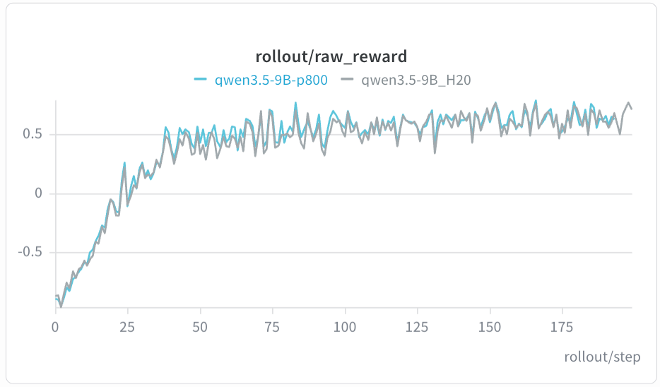
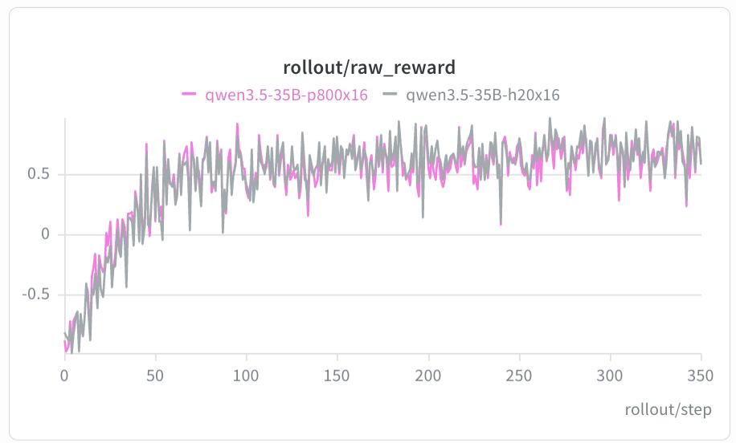
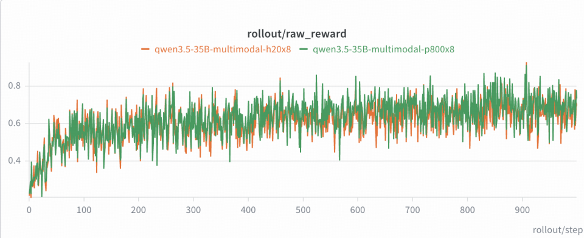

# XPU 适配指导

## 概述

本文档介绍在昆仑芯（KLX）算力节点上使用 Relax 框架业界主流开源大模型的完整流程。Relax 已在 KLX 上完成链路适配，覆盖纯文本 RL、多模态 RL 与 SFT；相同模型、数据集和超参下，KLX 的曲线与 GPU 基线保持一致。

- 精度判据：RL 观察 `raw_reward`，SFT 观察 `loss`，与 H20 基线对齐
- 当前验证集中在 colocate（同步）模式，覆盖 8 卡单机至 16 卡两机
- 后端接入：KLX 设备抽象、Ray 资源识别、BKCL 通信与训推权重同步均已合入主干，用户使用仓库现有脚本即可复现

## 模型支持

| 场景      | 模型                  | 资源         | 参考脚本                                                           |
| --------- | --------------------- | ------------ | ------------------------------------------------------------------ |
| DAPO RL   | Qwen3-4B              | 8 卡         | `scripts/training/text/run-qwen3-4B-8xklx.sh`                      |
| DAPO RL   | Qwen3.5-9B            | 8 卡         | `scripts/training/text/run-qwen35-9B-8xklx.sh`                     |
| DAPO RL   | Qwen3.5-35B-A3B       | 16 卡 / 两机 | `scripts/training/text/run-qwen35-35B-A3B-16xklx.sh`               |
| DAPO RL   | Qwen3.6-27B           | 8 卡         | `scripts/training/text/run-qwen36-27B-8xklx.sh`                    |
| DAPO RL   | Qwen3.6-35B-A3B       | 8 卡         | `scripts/training/text/run-qwen36-35B-A3B-8xklx.sh`                |
| 多模态 RL | Qwen3.5-9B（VL）      | 8 卡         | `scripts/training/multimodal/run-qwen35-9B-8xklx-openr1mm-sync.sh` |
| 多模态 RL | Qwen3.5-35B-A3B（VL） | 8 卡         | `scripts/training/multimodal/run-qwen35-35B-A3B-8xklx.sh`          |
| SFT       | Qwen3.5-9B            | 8 卡         | `scripts/training/sft/run-qwen3.5-9B-8xklx.sh`                     |
| SFT       | Qwen3.5-35B-A3B       | 8 卡         | `scripts/training/sft/run-qwen3.5-35B-A3B-mtp-sft-8xklx.sh`        |

## 环境准备

### 前置准备

- 资源类型：`KLX(XPU)`
- 当前可用镜像包：<https://klx-sdk-release-public.su.bcebos.com/DS_PD/docker/xrelax_torch29_ubuntu2204_xsgl0510_dev_20260715_15.tar.gz>

镜像以 tar 包形式发布，下载后本地导入：

```bash
wget https://klx-sdk-release-public.su.bcebos.com/DS_PD/docker/xrelax_torch29_ubuntu2204_xsgl0510_dev_20260715_15.tar.gz
tar -xvf xrelax_torch29_ubuntu2204_xsgl0510_dev_20260715_15.tar.gz
docker load -i xrelax_torch29_ubuntu2204_xsgl0510_dev_20260715_15.tar
docker images                        # 确认导入后的镜像名与标签
```

### 环境检查

```bash
xpu_smi                              # 查看 XPU 卡状态
xpu_smi -L | grep -c "XPU"           # 确认挂载卡数
```

容器内需可见 `/dev/xpu0` … `/dev/xpu7` 与 `/dev/xpuctrl`，并已安装 XPU/PyTorch 运行时。

## 启动配置

### 容器启动

```bash
CONTAINER_NAME="<自定义容器名>"
PROJECT="<docker load 导入后的镜像名:标签>"

# 拼接 8 张 XPU + xpuctrl
DOCKER_DEVICE_CONFIG=""
for ((idx=0; idx<8; idx++)); do
  DOCKER_DEVICE_CONFIG+=" --device=/dev/xpu${idx}:/dev/xpu${idx}"
done
DOCKER_DEVICE_CONFIG+=" --device=/dev/xpuctrl:/dev/xpuctrl"

docker run --privileged -it ${DOCKER_DEVICE_CONFIG} \
  --net=host \
  --cap-add=SYS_PTRACE --security-opt seccomp=unconfined \
  --tmpfs /dev/shm:rw,nosuid,nodev,exec,size=32g \
  --name ${CONTAINER_NAME} \
  ${PROJECT} /bin/bash
```

> - `--device=/dev/xpuX` / `/dev/xpuctrl`：XPU 卡及管理设备节点
> - `--tmpfs /dev/shm:size=32g`：BKCL / 多进程通信所需共享内存
> - 进入容器后将 Relax 代码库及相关数据 / 权重放置在同一目录下，下文命令以 `/workspace` 为例

### 启动方式

```bash
cd /workspace/Relax
export MODEL_DIR=/workspace
export DATA_DIR=/workspace
export EXP_DIR=/workspace

# 纯文本 RL
bash scripts/training/text/run-qwen3-4B-8xklx.sh
bash scripts/training/text/run-qwen35-9B-8xklx.sh
bash scripts/training/text/run-qwen35-35B-A3B-16xklx.sh

# 多模态 RL
bash scripts/training/multimodal/run-qwen35-9B-8xklx-openr1mm-sync.sh

# SFT
bash scripts/training/sft/run-qwen3.5-9B-8xklx.sh
```

## 精度对齐

以下曲线来自相同模型、数据集和超参下的 XPU 与 H20 对比。RL 以 `raw_reward` 为指标，SFT 以 `loss` 为指标。

Qwen3.5-9B · DAPO RL



Qwen3.5-35B-A3B · DAPO RL



Qwen3.5-9B（VL）· 多模态 RL


Qwen3.5-35B-A3B（VL）· 多模态 RL



Qwen3.5-35B-A3B · SFT


## 适配沉淀

XPU 适配以硬件无关的方式回馈 Relax 主干，新增硬件只需实现统一的设备能力接口。

- **设备抽象**：`relax/utils/device.py` 通过 `/dev/xpuctrl` 自动识别 KLX(XPU)，设备名、分布式后端、可见设备环境变量与 Ray 资源名统一收敛到设备抽象层
- **权重同步**：bridge / direct 两条权重转换链路解除 CUDA 假设，支持非 CUDA 后端
- **应用层 CPU offload**：`--selective-offload` 在不加载 `torch_memory_saver` hook 的前提下完成 colocate sleep/wake 的状态搬运
- **fp16 RL**：KLX(XPU) 支持 fp16 精度的 RL，参考 `scripts/training/text/run-qwen3-4B-fp16-8xgpu.sh`
- **适配范围**：当前集中在 colocate；Hybrid 与 Fully Async 将随回归矩阵持续补齐

## 后续规划

- **Hybrid / Fully Async**：在 colocate 之外，继续适配 Hybrid 与 Fully Async 两种更高吞吐的执行模式
- **OPD 与 Agentic RL**：尝试 OPD 与 Agentic RL 场景，覆盖多轮交互与工具调用
- **更多 RL 算法**：继续适配与验证 RLOO、GSPO、GDPO 等算法
