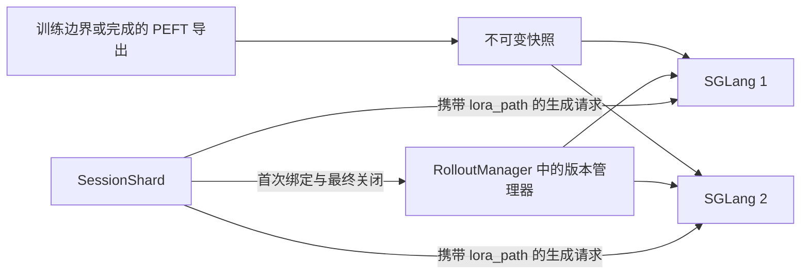

# RFC：不可变 LoRA 在线发布、会话绑定与安全回收

日期：2026-09-25。状态：已实现，本机双 GPU 限定配置验收通过；实测结果及未覆盖硬件范围见 [验收记录](./immutable-lora-validation.md)。

## 1. 目标与范围

持续导出 A、B、C 时，已有 Agent 会话保留第一次生成选定的版本，新会话在全目标就绪后使用新版本。正常发布不暂停全局生成、不清 KV cache、不中断旧会话。

本实现复用本机 `/workspace/Relax` 的 `4cb07d8..dfceac7` LoRA 功能增量，移植到当前仓库，并重新验证。该 checkout 的历史实验不作为本次验收证据。移植后另外修复本地等待 permit 被取消时遗留 WAITING 记录的问题，校正原生 GPU 排空测试的引用保持断言。

参考：[Miles PR #3127](https://github.com/radixark/miles/pull/3127)、[SGLang LoRA serving](https://docs.sglang.io/docs/advanced_features/lora)。SGLang 执行契约以 v0.5.17（`b6a09f38fcc5e96574324b4acc19d421c539cfc6`）及本仓库 `docker/patch/sglang/v0.5.17.patch` 为准，不能只依赖滚动文档。补丁的受管接口不属于未修改的上游 API。

首个验收配置是固定基座的 dense Qwen3、两个 TP=1 引擎、BF16、Triton LoRA、CUDA graph 与 radix cache 开启。制品校验支持 plain dense Qwen2/Qwen3/Llama；MoE、量化、DoRA、改变基座的特殊初始化明确拒绝。不承诺协调器崩溃后的透明恢复、任意进程接管或全部并行组合。

## 2. 所有权



- `relax/engine/lora/snapshot.py`：内容快照、SHA-256、原子封存、磁盘容量。
- `artifact.py`：基座与 PEFT 语义、形状、dtype 和来源校验。
- `publication.py`：版本、默认指针、发布操作、会话引用、业务容量。
- `relax/distributed/ray/rollout.py`：在现有 RolloutManager 内组合管理器；所有异步控制在同一持久 event loop 上运行。
- `relax/agentic/session/service.py`：首次生成资格、稳定 binding、最终 close、请求 permit。
- `relax/agentic/pipeline/runtime.py`：固定目标直连、实际 `lora_path`、单次发送、身份验证和原生请求终态查询。
- SGLang 补丁：pinned 实例、原生请求引用、GPU 使用完成、slot 清理和精确退休。

管理器不代理生成 token。prepare/load/status 等磁盘或网络操作不持有默认指针锁。首次绑定和默认版本提交共用短 `RLock`，构成唯一线性化点。

## 3. 身份与快照

| 身份 | 用途 |
| --- | --- |
| `version_id` + `digest` | 永久内容身份；同 ID 不可换内容 |
| `request_id` | 发布/导出意图的重试幂等键 |
| `operation_id` | 一次具体加载尝试；失败清理后重试分配新 ID |
| `cohort_id`、engine ID、boot ID | 协调者及引擎代际，拒绝旧进程回包 |
| `native_lora_id` | 具体后端加载实例，迟到清理不能命中新实例 |
| `owner_epoch` + `session_id` | 首次绑定、关闭及迟到绑定的幂等键 |
| `rid` | 后端 attempt；abort/resume 更换 attempt，不更换 Session binding |

快照复制 `adapter_config.json`、`adapter_model.safetensors` 和可选 `producer_manifest.json`。摘要覆盖执行内容、固定基座身份和语义契约；时间、导出 step 等来源信息不改变相同内容的身份。生产加载要求有效 provenance。

复制到独立 staging，校验源稳定性，fsync 文件与目录，在支持 `flock` 的共享文件系统下原子提交版本目录。正式目录不可覆盖；重试核对已有摘要。同 ID 不同内容返回 `VERSION_CONTENT_CONFLICT`。源目录必须是已经完成的导出，不能直接引用仍在训练写入的目录。引擎再次校验快照，不能仅信任协调器传来的摘要。

磁盘快照保留用于重试和审计；GPU 回收不自动删除正式制品。`artifact_max_bytes` 默认 8 GiB，拒绝超额；崩溃 writer 的未知 staging 不按年龄自动删除。

## 4. 发布状态机

```text
PREPARING --所有固定目标 READY--> PUBLISHED --非默认且无会话引用--> RETIRING --> RETIRED
PREPARING --失败/取消/超时-------> RETIRING --所有目标 fenced ABSENT--> ABORTED
```

1. 校验快照、意图、默认 epoch 和容量，预留槽位与操作记录。
2. 固定本次目标集合，给每台引擎分配稳定实例 ID。
3. 逐台 prepare，完成文件校验、pinned 加载、实际预热和驻留确认。依次准备避免两台 scheduler 同时进行同步文件解析。
4. 只有所有目标的 cohort、boot、operation、digest、instance、READY、pinned、resident 全部匹配，才持锁修改一次 default。
5. prepare 部分失败时 default 不变；对全部目标安装 fence 并退休，包括结果未知的目标。
6. 迟到 READY 不得复活取消操作；仅在所有目标确认 ABSENT 且本地 prepare task 已结束后释放容量。

同版本同内容的新意图返回已存在操作；相同 request ID 的 payload 变化返回 `REQUEST_ID_CONFLICT`。已提交的发布不能取消。ABORTED 后显式 `retry_of` 才开始新尝试，避免不明确的自动重试改变默认版本。

## 5. 会话与后端请求

在真正首次生成取得执行资格后绑定，不在数据 prepare 或 Agent 进程启动时提前绑定。binding 保留版本、摘要、publication epoch、训练来源 step 和固定引擎身份。后续工具轮次、重试、park、abort/resume 保留 binding。

实际请求传 `lora_path=binding["native_lora_id"]` 和 `lora_binding` 原生身份；业务版本名保留在控制面与导出元数据中，不把磁盘路径交给每次生成。请求直接发往绑定引擎；缺版本、boot 改变或响应身份不符明确失败，不重新发现健康引擎后回退基座/最新版。

生成 HTTP 与控制 HTTP 使用独立连接池，防止长生成占满连接后无法取消或排空。请求不使用通用自动重试；结果不明保留 attempt ownership，由原生状态接口核实终态。

Session 最终关闭先 fence，再取消/排空其后端执行；只有目标集合全部确认 `SESSION_DRAINED`，才释放会话引用。该路径独立于可选 `agentic_session_lifecycle`，关闭 radix lifecycle 功能不会漏掉 LoRA 引用。close-before-bind 留下关闭标记，迟到 bind 不能重新创建会话。

## 6. 回收与容量

业务容量和 SGLang pool 容量分别约束资源。所有已占用的 PREPARING/PUBLISHED/RETIRING 操作都计入业务容量；未知结果仍占容量。

容量为 2 时：A 有会话引用，B 已发布，则 C 返回 `ADAPTER_CAPACITY_EXCEEDED`（507）。A 的会话、原生请求、实际 GPU 使用、slot 清理全部结束后，A 每个目标实例只实际卸载一次，释放槽位后 C 才可进入。

原生 registry 引用与 GPU 事件是两层条件。HTTP 返回、调用者取消、abort ACK、Ray waiter 取消都不能替代后端完成证据。retire 幂等地 fence 具体实例，等待最后使用（包括 graph replay、H2D、排队 microbatch），清 slot 完成后才回报 ABSENT；重复 retire/迟到回包不能重复卸载。

加载使用 `pinned=True`，从底层 LRU 候选中排除受管 adapter。SGLang 保留一个非 pinned slot，因此业务容量 2 需要至少 3 个 `max_loras_per_batch` slot，框架接入负责配置。业务容量不会通过自动淘汰有引用的 A 来给 C 腾位置。

`max_lifecycle_records` 默认 100000，是 **cohort 累计历史记录预算，不是并发上限**。意图、已关闭 Session、请求重放 fence 会消耗预算；耗尽时明确拒绝新工作，安全排空后重建 cohort。仅本地、未授予、无 RPC 重放可能的取消 permit 可以直接删除 WAITING 记录。

永久失联目标保持 UNKNOWN/RETIRING 与占用，不能以健康列表缩小目标集合。当前不提供在无排空证明时的强制释放。

## 7. KV 隔离与正常发布行为

上游 radix key 包含 LoRA 实例身份；补丁保持该隔离，重新加载实例不复用旧 native ID。固定 Session binding 避免同会话换策略复用前缀。

受管模式拒绝旧的同名权重覆盖、全局 pause/flush 等变更入口。正常发布不走 offload 或全局权重同步路径。显式内存移交是单独的生命周期操作，不能计为无暂停发布的证据。

验收同时检查 A 热缓存→B 与 B 热缓存→A 的 logprob/KV 数值，使用独立加载的冷缓存参照，并增加错误缓存与错误 slot 负对照。只比较版本日志不足以通过。

## 8. 导出和操作方式

现有 Megatron checkpoint bridge/PEFT writer 被提取为 adapter-only 导出，在所有训练 rank 的一致安全边界调用，writer 封存后传播结果，Actor 再提交发布。支持手动意图与周期导出；未完成的导出不能发布，collective 不在单 rank HTTP handler 中发起。

此外可以用 CLI `seal` 接入已完成的标准 PEFT 导出。本次 GPU 实验用真实 optimizer 更新，通过现有 `relax.backends.fsdp.checkpoint.save_checkpoint` 和 `export_peft_adapter` 保存/导出，逐 tensor 校验后封存和发布。这个单进程实验不代表完整 Megatron 分布式训练通过。

启用现有参数 `--use-agentic-rollout --lora-adapter-mode`，增加：

```bash
--lora-publication-config /your/shared/publication.yaml
```

配置样例见 `examples/immutable_lora/publication.example.yaml`；模型、共享目录和服务地址必须按环境提供。示例操作：

```bash
python -m relax.engine.lora.cli seal --source "$EXPORT" --model "$MODEL" \
  --store "$STORE" --version-id B --source-step 10
python -m relax.engine.lora.cli publish --rollout-url "$ROLLOUT_URL" \
  --version-id B --request-id publish-B --wait-seconds 120
python -m relax.engine.lora.cli status --rollout-url "$ROLLOUT_URL"
python -m relax.engine.lora.cli collect --rollout-url "$ROLLOUT_URL"
```

Rollout API：`POST /rollout/lora/publications`、`GET /rollout/lora/publications/{operation_id}`、`POST /rollout/lora/publications/{operation_id}/cancel`、`GET /rollout/lora/versions`、`POST /rollout/lora/collect`。Actor API 接纳导出意图；服务均复用既有部署。

## 9. 验收计划与可判定证据

CPU 故障注入覆盖双目标部分就绪、内容冲突、重复意图、取消/提交竞争、迟到 ACK、缺版本、close-before-bind、丢失回包、原生 slot 清理、请求取消与最后 GPU 使用。完整链路测试使用真实类和受控 transport；原生协议 doubles 不当作 GPU 证据。

GPU 验收入口：

```bash
python -m tests.engine.lora.acceptance --model "$MODEL" \
  --gpus 2 3 --deterministic --output "$NEW_RESULTS_DIRECTORY"
```

调用者显式选择两张空闲物理 GPU。工具创建隔离本机 Ray/Serve、目标引擎与独立 A/B 参照，且只清理自身进程。不接管现有集群，不下载模型，不更改 CUDA/驱动。

预登记参数在 `tests/engine/lora/acceptance/profile.json`：logprob 与 KV `atol=0.001, rtol=0.001`；持续流量窗口 30 秒；p95 比值上限 1.5、吞吐比值下限 0.8、最大进度间隔 2 秒。确定性 Triton 配置在参照与受管引擎一致，保持 graph/cache 开启，不在结果出来后放宽容差。

每个独立任务输出 JSON 和日志，总报告要求全部 evidence PASS 才标记 `full_acceptance=PASS`。记录发布耗时、完成数、失败数、延迟、进度间隔、版本占用、pin/slot/卸载计数与每个数值比较结果。

多节点、多 rank TP/PP、colocate/offload、扩缩容等接线有 CPU 覆盖，但不从本机双 TP=1 GPU 实验外推其集成通过。真实多节点验证需要对应集群；本任务未配置该环境。
