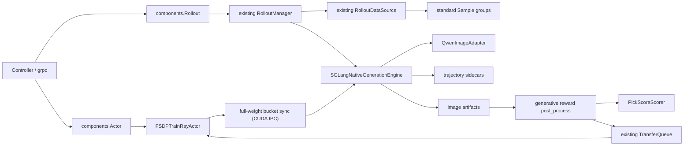

# 多模生成 RL 适配设计

> **当前发布范围：Qwen-Image T2I。** FlowGRPO + FSDP2（全参数或 LoRA）+ SGLang Native Diffusion + 同步 colocate。已验证配方是 LoRA adapter-sync：100 轮完整跑通并对齐 Qwen-Image LoRA 参考曲线（最终 eval 0.8643，对照 0.8620）。
>
> **设计上的多模型范围（Qwen-Image-Edit I2I、WAN 2.2 T2V/I2V/V2V、LTX-2.3 T2AV）已下线。** 完整代码只保留在**本地** git 分支 `backup/diffusion-generative-rl-full`（commit `f3e7e9e2`、`f7e30890`）。
>
> ::: danger 备份分支尚未推送
> 该分支和这两个 commit **只存在于本地仓库，`origin` 上没有**，所以对任何其他读者来说这个指针目前是无效的。若要让这条扩展参考真正可用，必须先 `git push origin backup/diffusion-generative-rl-full`；在那之前，请把本文中所有「已退役到备份分支」理解为「代码已从工作分支删除，只在某台机器的本地分支上」。
> :::
>
> 设计基线：Relax `e59cd7288995b13d6fac8cfbae2b638e45fb29b7`，SGLang `4ad418d2c3d43cb3c699bc9419d32673b1fca7d8`。初版日期 2026-07-16；本次按仓库实现回写，日期 2026-08-10。
>
> 阅读约定：本文既是设计文档也是实现记录。**「已实现」**表示工作分支上有对应代码；**「已退役」**表示代码只在上述本地备份分支；**「设计保留、未实现」**表示只有设计、没有代码。

## 0. 现状总结

### 0.1 实际发布的东西

| 维度 | 现状 |
|---|---|
| 任务 | 只有 `t2i`（Qwen-Image）。`GENERATION_TASKS = ("t2i",)` —— 词表已随代码收敛，自带 adapter 的调用方必须同时把任务名加进来 |
| 算法 | FlowGRPO（组内中心化 advantage + clipped policy loss），`--advantage-estimator grpo` |
| 训练后端 | `--train-backend fsdp` → `FSDPTrainRayActor`，FSDP2，纯 DP（无 TP/PP/CP）；`--fsdp-trainable-mode` 支持 `full` 与 `lora` |
| Rollout 后端 | `SGLangNativeGenerationEngine`（SGLang 主线 native diffusion + Relax 静态 patch 契约检查） |
| Reward | PickScore（`relax/engine/rewards/pickscore.py`） |
| 部署模式 | 仅同步 colocate（`--colocate`），fully-async / hybrid 在预检直接拒绝 |
| 权重同步 | 每步同步。full/merge：完整 transformer，DTensor `full_tensor()` → 分桶 → CUDA-IPC → engine commit，带 count/bytes/checksum 校验与版本回滚；adapter 模式只发 LoRA 张量 |
| Checkpoint | DCP sharded（LoRA 只存 adapter）+ `COMMITTED` 协议 + 保留轮转 + 离线 HF/diffusers 与 HF-PEFT 导出 |
| 验证入口 | `scripts/training/diffusion/run-qwen-image-t2i-lora-8xgpu.sh`（默认 adapter sync，唯一复现参考曲线的配方）；`run-qwen-image-t2i-8xgpu.sh` 是全参参考 |

### 0.2 已退役到 `backup/diffusion-generative-rl-full` 的东西

```text
relax/models/wan_video/{__init__.py,adapter.py}        # WAN 2.2 T2V/I2V/V2V
relax/models/ltx_av/{__init__.py,adapter.py}           # LTX-2.3 T2AV
relax/engine/rewards/editreward.py                     # EditReward (I2I)
relax/engine/rewards/video_reward.py                   # VideoPickScore / condition consistency / VideoCLIPDelta
relax/engine/rewards/t2av_reward.py                    # CLAP + 复合 reward
examples/diffusion/qwen_image_edit/i2i_full.yaml
examples/diffusion/wan22/{t2v,i2v,v2v}_full.yaml
examples/diffusion/ltx23/t2av_full.yaml
tests/models/{wan_video,ltx_av}/test_adapter.py
tests/engine/rewards/test_{editreward,video_reward,t2av_reward}.py
```

退役理由：这些路径没有 GPU 端到端验证，保留在主干上会让「配置得出来但跑不通」的表面积远大于实际可用面。

**这次退役不是纯删文件，抽象也一起收敛了**（与初版设计的最大差异，见 §4.1）：多 track（video + audio）支撑已经删除 —— `policy_tracks`、`track_weights`、`combine_track_logp`、`TrackLogp` 都不在了，`replay_transition` 直接返回 `torch.Tensor`。适配器协议同时去掉了 `encode_conditions` 与 `freeze_non_policy_modules`（冻结在 `load_train_model` 里一次做完）。因此从备份分支回接 T2AV 需要重新引入多 track 的 log-prob 合成，不再是「加一个 adapter 就行」。

`QwenImageAdapter.supported_tasks` 现在也只有 `("t2i",)`：i2i 分支曾经被声明为支持，但 `replay_transition` 会静默忽略源图，也就是在训练一个无条件速度场 —— 这是把词表和实际 replay 路径对齐的直接原因。

### 0.3 与初版设计相比的语义变化

1. **`--num-updates-per-batch` 的语义是切分，不是复用**（§6.4）。`_plan_micro_batch_updates` 把本 rank 的训练切片划成 N 份互不相交、样本数相等的更新，每个样本只参与一次 optimizer step。因此真正的 step 边界是 `global_batch_size / num_updates_per_batch`。初版设计里「每个 prompt group 一次 step」和中间那版「`--global-batch-size` 才是 step 边界」都已不成立，`--fsdp-optimizer-step-per-group` 也已删除。
2. **新增 LoRA**（§10.1）：`--fsdp-trainable-mode lora` + 共享的 `--lora-*` 参数，merge / adapter 两条 rollout 同步路径。
3. **新增按 optimizer step 计数的 LR schedule**（§10.1）：`--fsdp-lr-scheduler {constant,linear,cosine}`，默认 `constant`。
4. **`sde_indices` 可从 `num_sde_steps` + `sde_timestep_fraction` 推导，且默认被每轮重抽样覆盖**（§5.5 / §13）。
5. **评测、checkpoint 轮转、权重同步校验、artifact 保留、profiler 从「计划中」变成「已实现」**。
6. **不支持的 flag 从静默无效变成预检报错**（§13.1）。
7. **`sde_type="sde"` 下训练 SDE step 0 被硬拒绝**（§6.1 / §13.1）。

### 0.4 已知限制（诚实清单）

| 限制 | 说明 |
|---|---|
| 只有同步 colocate | `fully_async` / `hybrid` / 非 colocate 在 `validate_generative_config` 被拒；`update_weights_fully_async` 抛 `NotImplementedError` |
| 训练侧纯 DP | `_get_parallel_config` 固定 `tp_size=1, pp_size=1`；rollout 侧 TP 由 `--rollout-num-gpus-per-engine` 支持 |
| replay 的 DP 切分不完整 | rank 0 读整个 TQ partition 再 broadcast 数值行（`_read_train_partition` 里的 `TODO(agent)`）。组内候选按 `[dp_rank::dp_world]` 切分（`hydrate_micro_batches`），但 `group_size % dp_world != 0` 时退化为每 rank 全量重放（结果正确，算力冗余） |
| 无训练数据 dump / debug replay | `--save-debug-train-data` 只告警；`--load-debug-rollout-data` 直接拒绝。TQ 行是数值索引 + 磁盘 sidecar，不是 token 序列 |
| 无 MFU / TFLOPs | 共享 `FlopsCounter` 是 LLM 架构专用的，DiT 没有解析模型；改用 transitions/samples per second（§14） |
| 不支持 CFG | `guidance_scale != 1.0` 在 `build_rollout_request` 直接报错：actor 只回放一次正向条件前向，双前向 CFG replay 未实现 |
| 依赖 SGLang 静态 patch | `docker/patch/sglang/v0.5.15.post1.patch` 必须应用（内存态权重同步、`/set_lora_from_tensor`、offload 端点，以及 rollout/replay 一致性改动）；engine 启动前做只读契约检查（§9） |
| KL-to-ref 未实现 | 无 reference model、无 KL 项；`kl_coef` / `use_kl_loss` 非零直接报错 |
| resume 需要显式 `--load` | `_maybe_resume` 读的是 `--load` 而不是 `--save`，两个启动脚本都没设置它 |
| reward 只有进程内或 remote | `post_process` 跑在 rollout worker 里，没有 controller 创建的 placement group。`colocate` / `cpu` 都是进程内评分（区别只在允不允许用 CUDA），`remote` 走 HTTP；旧的 `dedicated` 只是 `colocate` 的同义词并额外打一条假告警，已删除 |

## 1. 目标方案

### 1.1 任务矩阵

| 任务 ID | 输入 | 输出 | 模型 | Rollout | 在线 reward | 状态 |
|---|---|---|---|---|---|---|
| `t2i` | text | image | `Qwen/Qwen-Image` | SGLang Native Diffusion | PickScore | **已实现并验证**（`GENERATION_TASKS` 中唯一项） |
| `i2i` / `t2v` / `i2v` / `v2v` / `t2av` | — | — | Qwen-Image-Edit、WAN 2.2、LTX-2.3 | — | EditReward / VideoPickScore / CLAP 等 | 已退役（见 §0.2 与 §4.3）。任务 ID 也已从 `GENERATION_TASKS` 移除 |

每个训练任务独立启动，一个进程组只持有一个模型族和一个任务配置。不做跨模型族的混合 batch 或联合 optimizer。

### 1.2 统一训练口径

1. 训练完整 diffusion/flow transformer；可选用 LoRA 只训练注入的 adapter（`--fsdp-trainable-mode lora`）。
2. VAE、text encoder、image encoder 保持冻结，且不在 FSDP actor 的模块里 —— 它们只存在于 rollout engine。
3. 训练后端固定为 PyTorch FSDP2，参数与 optimizer 使用 DCP sharded checkpoint（LoRA 只存 adapter）。
4. 算法固定为 FlowGRPO，rollout 保存被选中的 SDE transition，actor replay 产生 `old_logp`。
5. actor 与 rollout 使用同步 colocate。fully async 只保留 full-weight transport 的接口形状，未实现。
6. GPU 数量由任务 profile 决定，没有全局 8 卡上限。跨节点 FSDP 与多 GPU rollout engine 都是合法配置。
7. SGLang 主仓库的 native diffusion 是统一推理后端；SGLang-Omni 不进入这些 diffusion 任务的运行路径。

### 1.3 架构边界

运行时代码按 Relax 已有 ownership 放置，不创建 `relax/diffusion/` 顶层领域包：

- FSDP 状态、checkpoint 和完整权重导出进入 `relax/backends/fsdp/`。
- SGLang DiffGenerator 生命周期进入 `relax/backends/sglang/`。
- 通用生成模型协议和 FlowGRPO 数学进入 `relax/models/`。
- 各模型族的 condition、trajectory geometry 和参数边界进入各自模型目录（现在只剩 `relax/models/qwen_image/`）。
- rollout 编排进入 `relax/engine/rollout/`。
- scorer 实现进入 `relax/engine/rewards/`，Ray 资源生命周期进入 `relax/distributed/ray/`。

控制面继续使用现有 `Controller`、`Actor`、`Rollout`、`RolloutManager` 和 `grpo` 注册键。数据面继续使用现有 `RolloutDataSource`、`Sample`、`TransferQueue` 与 `GRPOGroupNSampler`。

## 2. Relax 能力复用

| 现有能力 | 使用方式 | 落地情况 |
|---|---|---|
| `Sample.multimodal_inputs` | 承载条件 image/video | 已实现（t2i 不使用） |
| `MultimodalTypes` | 复用 image/video/audio 类型与 placeholder | 生成输出走 artifact manifest，未新增 Sample 字段 |
| `RolloutDataSource` | 读取统一 JSONL，按 `n_samples_per_prompt` 展开 group | 已实现；额外改动：`hf_checkpoint` 为空时不加载 tokenizer/processor |
| `_shallow_copy_sample()` | 同组候选共享只读条件媒体 | 复用现状 |
| `--multimodal-keys` | 映射数据列到 image/video/audio | 由任务 YAML 配置；t2i 为 `null` |
| `RolloutManager` | 生命周期、健康检查、offload/onload、engine recovery | 已实现，engine class 由 `_resolve_rollout_engine_class` dotpath 解析 |
| `--rollout-function-path` | 指向统一 native generation driver | 已实现（`generate_rollout`，`evaluation=True` 分流到 `evaluate_rollout`） |
| `custom_reward_post_process_path` | 完整 group 生成后批量评分 | 已实现（`relax.engine.rewards.generative.post_process`） |
| `custom_convert_samples_to_train_data_path` | 生成轻量 diffusion TQ row | 已实现（`relax/utils/utils.py` 执行该 hook） |
| `TransferQueue` | 每个候选一条数值 row，partition 仍是训练屏障 | 已实现；大 trajectory 走磁盘 sidecar |
| `GRPOGroupNSampler` | 保证同 prompt 候选组完整分配 | 复用现状 |
| 共享 `--lora-*` flag | rank / alpha / dropout / target modules / merge-adapter 模式 | 已实现；注入与同步是 diffusers 形态的独立实现（`backends/fsdp/lora.py`），只在导出时复用 `megatron_peft_utils.write_hf_peft_adapter` 一类与后端无关的 helper |
| `UpdateWeightFromTensor` | pause、分桶、Ray IPC、engine fan-out、版本校验 | FSDP actor 独立实现 `_run_weight_transaction`，mirror 其 per-rank→per-engine 映射（不复用 Megatron iterator） |
| DCS coordinator | async 分支的 topology 与版本协调 | **设计保留、未实现**：`weight_update.py` 没有 FSDP comm backend factory，`checkpoint_service/client/engine.py` 未改动 |
| `train_dump_utils` | rollout JSONL 与 debug dump | **设计保留、未实现**：该文件未改动，未透传 artifact/trajectory manifest 摘要 |
| DCP/轮转目录约定 | `iter_0000001`、latest marker 与保留策略 | 已实现；`rotate_ckpt` 新增 `save_dir` 参数以匹配 `<save>/<task>/iter_*` 布局 |
| `TrainProfiler` | torch / memory profiler | 已实现（`--use-pytorch-profiler`、`--record-memory-history` 等对 FSDP actor 生效） |

以下核心对象保持原样（未因本方案改动其逻辑）：

```text
relax/core/registry.py
relax/core/controller.py
relax/core/service.py
relax/components/actor.py
relax/components/rollout.py
relax/utils/types.py
relax/utils/multimodal/*
```

同步 colocate 使用 `ROLES_COLOCATE`。FlowGRPO advantage 在 rollout 侧的 reward post-process 内计算、replay 与 loss 在 FSDP actor 内完成，不启动独立 Advantages Serve。

> **修正**：初版写「不新增或修改 `relax/components/advantages.py`」。实际做了一处**非语义**改动 —— 把 `from megatron.core import mpu` 改成函数内延迟导入，使控制面在无 megatron 的 diffusion 镜像里可以 import。同类改动还有 `relax/engine/sft/eval/runner.py`、`relax/utils/data/stream_dataloader.py`、`relax/utils/rocm_checkpoint_writer.py`、`relax/distributed/checkpoint_service/{utils.py,backends/device_direct.py}`、`relax/models/__init__.py`（Qwen-Omni import 容错）。这些都是「megatron 变可选依赖」的兼容改动，不改变 token RL 行为。

## 3. 总体架构



> 备份分支上同一张图还有 `WAN adapter` / `LTX adapter` 两个 engine 下游分支和 `EditReward/Video/CLAP` 三类 scorer；现在只剩 Qwen 一条。

### 3.1 Colocate 资源模型

actor 与 rollout 共享同一 placement group。每个任务满足：

```text
actor_world_size == rollout_total_gpus
rollout_total_gpus % rollout_num_gpus_per_engine == 0
num_rollout_engines = rollout_total_gpus / rollout_num_gpus_per_engine
```

Reward 只有两种落点：`post_process` 所在的 rollout worker 进程内（`colocate` 允许用 CUDA，`cpu` 禁用 CUDA），或外部 HTTP 服务（`remote`）。没有独立的 reward placement group —— `GenerativeRewardManager` 现在就是 remote 的 HTTP 代理，`LocalGenerativeRewardManager` 是进程内实现。两个启动脚本都用 `--reward-runtime colocate`：PickScore 约 5.6 GB，而它运行时 actor 已经 offload。

任务 profile 只提供容量规划起点，不构成固定上限：

| Profile | 建议起始 GPU | Rollout TP | Reward | 状态 |
|---|---:|---:|---|---|
| Qwen T2I LoRA | 8 x 96GB | 1 | colocate PickScore | **已验证**：`rollout_batch_size=32`、`n_samples_per_prompt=8`、384x384、12 步、训练 3 个 SDE step、rank 64 adapter |
| Qwen T2I 全参 | 8 x 96GB | 1 | colocate PickScore | 全参参考：`rollout_batch_size=8`、`n_samples_per_prompt=8`、384x384（曲线未复现） |
| Qwen T2I（YAML profile） | 8 x 96GB | 1 | colocate PickScore | `examples/diffusion/qwen_image/t2i_{full,lora}.yaml`：48 prompts x 16 / 24 candidates（未在本环境验证，作为参考片段保留） |
| Qwen Edit / WAN / LTX | — | — | — | 已退役 |

> **Rollout TP 分片权重同步已实现。** engine 跨 `rollout_num_gpus_per_engine` 张物理卡，与之同卡的 `tp` 个 FSDP rank 组成一个 Gloo gather group，向 engine 发送 `tp` 个 CUDA-IPC blob（worker `i` open physical GPU `base+i` 上的 handle 后内部再分片）—— mirror megatron `UpdateWeightFromTensor` 的 colocate IPC 路径（`_build_ipc_gather_topology` / `_run_weight_transaction`）。拓扑按 CUDA device UUID 匹配，不按 GPU 序号，因为 placement group 会重排。唯一硬约束是 `actor_world % rollout_num_gpus_per_engine == 0`（`validate_generative_config` fail-fast，运行时再校验 `world == sum(engine_gpu_counts)`）。`tp == 1` 退化为每 rank 一个单卡 engine。

OOM 时增加 actor/rollout world size、提高 rollout TP、减少 `n_samples_per_prompt`、缩小训练的 SDE step 子集，或改用 LoRA。Validator 不执行模式降级，不把 full-FT 自动切成 LoRA。

### 3.2 Owner 状态机

```text
TRAIN
  -> WEIGHT_SYNC
  -> ROLLOUT
  -> REWARD
  -> TRANSFER_COMMIT
  -> TRAIN
```

- `TRAIN`：只有 FSDP parameter/optimizer shard 在计算设备。
- `WEIGHT_SYNC`：FSDP parameter shard 与 SGLang weight receiver 同驻，不运行 forward/backward/generate。此时 engine 只 onload transformer（`tags=[WEIGHTS]`）。
- `ROLLOUT`：FSDP parameter 和 optimizer offload，SGLang encoder/DiT/VAE 全量 onload。
- `REWARD`：全部 artifact 已提交；scorer 评分。
- `TRANSFER_COMMIT`：完整 group 校验后写入 TQ partition，seal 后训练才可消费。

实现上 `REWARD` 与 `TRANSFER_COMMIT` 都发生在 `generate_rollout` 尾部的 `transfer_batch_to_data_system` 调用链里（reward post-process → converter → `async_put`），所以 `perf/reward_time` 覆盖的是「评分 + 转换 + TQ 落盘」三段之和。

## 4. 任务与模型适配

### 4.1 通用适配协议（已实现，`relax/models/generative.py`）

```python
@runtime_checkable
class GenerativeModelAdapter(Protocol):
    family: str
    supported_tasks: tuple[str, ...]

    def load_train_model(self, config) -> torch.nn.Module: ...
    def build_rollout_request(self, sample, sampling, seed) -> dict: ...
    def validate_rollout_response(self, response) -> None: ...
    def pack_trajectory(self, response) -> dict[str, torch.Tensor]: ...
    def replay_transition(self, model, batch, step_index) -> torch.Tensor: ...
    def artifact_tracks(self, response) -> list[ArtifactTrack]: ...
    def weight_name_map(self, name: str) -> str: ...
```

另有两个**可选属性**，用 `getattr` 读取、刻意不声明为协议成员（这样加属性不会让已有 adapter 失效 —— 协议是 `runtime_checkable` 的，adapter 单测会 assert 这一点）：`lora_target_modules`（`--fsdp-trainable-mode lora` 的默认目标模块，模块名后缀）与 `lora_task_type`（PEFT task type，默认 `FEATURE_EXTRACTION`）。

相对初版设计，协议**收窄**了三处：

- 去掉 `policy_tracks` 与多 track 支撑（见 §0.2 / §6.2）；`replay_transition` 直接返回 `torch.Tensor`。
- 去掉 `freeze_non_policy_modules`：`load_train_model` 返回的模块会被直接交给 FSDP，所以「不该拿梯度的东西」必须在那里就设好 `requires_grad=False`，没有第二个冻结钩子。
- 去掉 `encode_conditions`：条件由 engine 在 `denoising_env` 里回传，adapter 不再自己编码。

任务配置通过 `--model-adapter-path`（dotpath）选择实现。FSDP runtime、rollout driver、reward barrier 和 weight transport 只依赖该协议。

同模块还定义 `ArtifactTrack`、`FullWeightManifest`、`artifact_manifest_dict()`、`ordered_name_shape_hash()` 和 `resolve_sde_indices()`。

### 4.2 Qwen-Image T2I（已实现并验证）

- policy：完整 `QwenImageTransformer2DModel`，`--fsdp-trainable-attr transformer`；LoRA 时只训练八个 attention 投影上的 adapter。
- frozen：Qwen2.5-VL text encoder、VAE、scheduler —— 它们不在 FSDP actor 的模块里，只存在于 rollout engine。
- condition：`prompt_embeds` 与 `prompt_embeds_mask`，由 engine 在 `denoising_env` 里回传。
- output：PNG image track，从 `generated_output` 落盘到 `<artifact_root>/<task>/rollout_*/group_*_sample_*.png`。
- trajectory：packed latent（`image_x_t` / `image_x_next`）、`sigmas`、`sde_indices`、`image_grid`、seed hash。`image_grid` 由 engine 回显的 `height` / `width` 算出 —— 打包后的序列长度无法还原非正方形网格，所以这是重建 RoPE 的唯一来源。
- reward：PickScore，组内中心化后除以该组自己的 std。
- 硬约束：`guidance_scale` 必须为 `1.0`（`replay_transition` 只跑一次正向条件前向）。

### 4.3 已退役的模型族（WAN 2.2 / LTX-2.3 / Qwen-Image-Edit）

这些设计的完整推理与代码都在备份分支上（见文首的推送提醒），本文不再复述，只留必要的回接提示：

- **Qwen-Image-Edit I2I**：`QwenImageAdapter` 中的 i2i 分支已删除，`supported_tasks` 收敛为 `("t2i",)`。回接时要同时补上 source image 条件、`denoising_env.image_kwargs` 校验、EditReward scorer 与 aspect bucket 分组。
- **WAN 2.2 T2V/I2V/V2V**：5D latent `[B,C,T,H,W]`、frame count 与 VAE temporal factor 的约束、MP4 track manifest、VideoPickScore / condition consistency / VideoCLIPDelta。
- **LTX-2.3 T2AV**：video + audio 双 track、时长同步校验、CLAP 与 VideoPickScore 的加权合成。

::: warning 回接成本已经变高
多 track 的通用支撑**已经删除**（`combine_track_logp`、`TrackLogp`、`track_weights` 都不在了），所以 T2AV 不再是「换个 adapter」就能回来的：需要重新引入按 track 加权合成 log-prob 的那一层。视频/音频任务的 `GENERATION_TASKS` 条目也要一并加回。
:::

## 5. 数据契约

### 5.1 统一 JSONL

T2I（唯一在用的形态）：

```json
{"prompt":"a tram passing through a rainy city at night","metadata":{"task":"t2i","prompt_id":"pickapic_0001"}}
```

条件类任务（设计保留）：

```json
{"prompt":"<image> replace the sky with a sunset","images":["/data/source/0001.png"],"metadata":{"task":"i2i","sample_id":"magicbrush_0001"}}
{"prompt":"<video> turn the daytime scene into a snowy night","videos":["/data/source/clip_0001.mp4"],"metadata":{"task":"v2v","sample_id":"davis_0001"}}
```

配置映射：

```yaml
multimodal_keys: null                 # t2i/t2v/t2av
multimodal_keys: {image: images}      # i2i/i2v
multimodal_keys: {video: videos}      # v2v
```

`RolloutDataSource` 读取后把媒体放入 `Sample.multimodal_inputs`。t2i 路径上 `hf_checkpoint` 为空，DataSource 不加载 tokenizer/processor（prompt 是纯字符串，由 engine 侧编码）。

### 5.2 Artifact manifest（已实现）

每个候选生成一个轻量 JSON manifest（`artifact_manifest_dict()`），挂在 `Sample.train_metadata["manifest"]` 上：

```json
{
  "schema_version": 1,
  "task": "t2i",
  "sample_index": 42,
  "group_index": 5,
  "policy_version": 17,
  "conditions": [],
  "outputs": [
    {"track":"image","uri":".../group_00000005_sample_0003.png","mime":"image/png","sha256":"...","height":256,"width":256}
  ],
  "trajectory_uri": ".../group_00000005.safetensors",
  "sampling_fingerprint": "...",
  "weight_manifest_sha256": "..."
}
```

图片、视频、音频和大 tensor 不进入 TransferQueue。

### 5.3 Group trajectory sidecar（已实现）

每个 prompt group 写一个 safetensors sidecar，路径为
`<artifact_root>/<task>/rollout_{id:07d}/group_{index:08d}.safetensors`。
safetensors 是扁平的，所以三个命名空间以前缀编码（`common.` / `conditions.` / `tracks.`）：

```text
common.sigmas            # [T+1]，group 共享
common.sde_indices       # group 共享
common.sample_indices
common.policy_versions
common.seed_hashes
conditions.cond_*        # adapter 声明的冻结 condition
tracks.image_x_t         # [G, S, ...]
tracks.image_x_next
```

写入顺序固定为 `.tmp -> fsync -> atomic rename`（`runtime.write_trajectory_sidecar`）。`adapter_pack_group()` 负责把 per-candidate 的 `pack_trajectory` 输出按 dim 0 stack 成 group 张量，并把 `sigmas` / `sde_indices` 折叠成 group 共享的单份。

### 5.4 TransferQueue row（已实现）

统一 converter（`convert_samples_to_train_data`）输出纯数值字段：

```python
{
    "group_indices": int64[N],
    "sample_indices": int64[N],
    "trajectory_slots": int64[N],
    "policy_versions": int64[N],
    "advantages": float32[N],
    "raw_reward": float32[N],
    "total_lengths": int64[N],
    "skip_optimizer_step": int64[N],   # 退化轮标记（初版设计未包含）
}
```

一个 run 的 task/model adapter 固定在配置中，因此 row 不增加字符串 task 字段。Actor 用 `rollout_id + group_index` 定位 sidecar，用 `trajectory_slot` 定位组内候选。`skip_optimizer_step` 由 reward post-process 在 advantage 方差塌缩时置位，让「零梯度轮」成为显式 skip 而不是静默 no-op。

### 5.5 SDE step 解析（`resolve_sde_indices()`）

engine 需要显式的 `rollout_sde_step_indices`，但配置里更自然的写法是「在调度前半段取 3 个随机步」。这组下标同时决定生成时在哪里注入 SDE 噪声、以及哪些步会被 replay 求梯度。解析顺序：

1. **`sde_resample_per_rollout` 且传入了 `rollout_id`** —— 用 `np.random.default_rng(rollout_id)` 从 `sde_pool`（缺省则为 fraction 窗口）里抽 `num_sde_steps` 个。可复现，且所有 engine 与所有 rank 无需通信即可算出同一组。**这是最高优先级，会覆盖显式的 `sde_indices`**，两个启动脚本都开了它。固定一组 step 意味着探索永远困在同一子空间、其余步永远拿不到梯度。
2. 显式 `sde_indices` 列表 —— 原样使用（排序去重）。`rollout_id=None` 时总是走这条确定性路径：留出集评测必须固定一组 step，否则数字跨 step 不可比。
3. 否则由 `num_sde_steps` 在 `[frac_lo * N, frac_hi * N)` 窗口内按 stride `floor(k * len(window) / num_sde)` 取点。
4. 否则返回 `[]`（没有 SDE 配置就没有可训练的 transition，pipeline 会在打包轨迹时失败）。

**step 0 在 `sde_type="sde"` 下被硬拒绝**：那里 `sigma == 1`，扩散系数 `sqrt(sigma / (1 - sigma)) * eta` 奇异，只靠人为的 `sigma_max=0.99` clamp 保持有限，而那不是采样器用的值（实测 `std_dev_t` 7.0 vs ~2.92，并翻转 `prev_sample_mean` 中 `sample` 项的符号）。`_validate_sde_schedule` 会沿三条路径检查：显式 `sde_indices`、`sde_pool`、以及推导出的 fraction 窗口。因此 `sde_timestep_fraction=[0.0, 0.5]`（12 步下解析为 `[0, 2, 4]`）**不能再用**；两个启动脚本与两个任务 YAML 改用显式 `sde_indices` + `sde_pool: [1,2,3,4,5]`。`sde_type="dance"` 用常数系数，不受影响。

## 6. FlowGRPO

### 6.1 Transition 与 replay（已实现，`relax/models/flow_grpo.py`）

对每个选中 step：

```text
dt = sigma_next - sigma
std_dev = sqrt(sigma / (1 - sigma_star)) * eta

mu_theta = x_t * (1 + std_dev^2 / (2*sigma) * dt)
         + v_theta(x_t, condition, sigma)
           * (1 + std_dev^2 * (1-sigma) / (2*sigma)) * dt

x_next = mu_theta + std_dev * sqrt(-dt) * noise
```

Actor replay 使用 rollout 保存的 `x_t`、`x_next`、condition 和 sigma，计算同一高斯 transition 的 log-prob（`replay_transition_logp`，`reduce=True` 时先做 element mean 再返回 `[B]`）。模型前向与 sidecar 使用 bf16，均值、方差、log-prob 和 ratio 使用 fp32。

`_replay_logp()` 遍历 `step_indices`，通过 `_slot_map()`（一次 `sde_indices.tolist()` 建好 `step -> 稠密槽位` 的映射）定位 sidecar 里的存储槽。`sde_indices` 刻意留在 CPU：放 GPU 会在热路径每步引入一次 GPU→CPU 同步。

`_replay_logp` **不把各步求和**，而是返回 `[B, S]`（每个训练 SDE step 一列）。求和会让 PPO ratio 变成各步 ratio 的乘积，于是同一个 `clip_eps` 区间要容纳全部 S 步的合计漂移，而且任何一步漂出去就会把这个样本其余步的梯度一起清零。FlowGRPO 对每个 `(sample, step)` 独立 clip 再取均值，这里保持一致。

### 6.2 单 policy track

```text
logp_sample = mean_elements(logp_track)
```

只有单 track。初版设计里的多 track 加权合成（`combine_track_logp` / `TrackLogp` / `sampling_config.track_weights`）随视频、音视频任务一起删除了，见 §0.2 与 §4.3。

### 6.3 Reward 与 advantage（已实现）

每个 reward component 先在 prompt group 内中心化，再除以**该组自己的** std（可用 `--disable-grpo-std-normalization` 关掉除法，即 Dr.GRPO）：

```text
component_adv[k] = center(component_reward[k]) / (group_std[k] + 1e-6)
advantage = sum(component_weight[k] * component_adv[k])
```

> **修正**：初版写的是「除以 global std」，参数也曾被拼作 `use_global_std` 并直接接到 `grpo_std_normalization` 上 —— 那把 flag 的含义反了过来：设置 Dr.GRPO flag 反而把除数换成组内 std，清除它则改用一个全 batch 的 std。现在生成式路径使用显式三态 `generative_advantage_std_mode`：`group` 对齐 Relax/Text GRPO 的组内 std，`batch` 对齐参考 diffusion 配方的 global std，`none` 表示只中心化不除（Dr.GRPO）。少于 2 个成员的组在 `group` 模式下 advantage 直接置 0：torch 的 std 是无偏的（dof = n-1），单元素组会得到 NaN 并毒化整个 optimizer step。

- T2I：`pickscore=1.0`（已实现）。
- 其余任务的权重方案见备份分支。

任一必选 component 缺失或非 finite 时整组失败（`combine_group_advantages` 抛 `ValueError`）。若最终 advantage 的方差低于 `1e-6`，该轮标记 `degenerate`，写入 TQ 的 `skip_optimizer_step`，actor 仍然跑完整前反向（保持 collective 对齐）但不调用 `optimizer.step()`。

诊断这类退化轮的关键指标是 `reward/group_std_mean`（主 component 的组内 std 均值），见 §14。

### 6.4 PPO objective 与训练步语义

```text
ratio = exp(logp_theta - old_logp)          # 逐 (sample, step)
loss = mean(max(-advantage * ratio,
                -advantage * clamp(ratio, 1-eps, 1+eps)))
```

`old_logp_source=replay`，`beta=0`，不加载 reference model。FlowGRPO 的 clip 区间远小于文本 RL：验证配方用 `--eps-clip 1e-4`（与参考配方一致），而不是 0.2。`flow_grpo_update` 支持非对称 `clip_eps_high`，但 actor 目前只传对称的 `clip_eps`。

**训练循环（与初版设计以及中间那版都不同）**。`--num-updates-per-batch` 是**切分**，不是复用 —— `_plan_micro_batch_updates` 采用 CountPlanner-style 的等样本数切分：

```text
micro_batches = hydrate(...)                      # 一个 micro-batch == 一个 prompt group 的本 rank 切片
update_plans  = plan(micro_batches, N)            # N 份互不相交、样本数相等的更新

if N > 1:                                         # 任何 step 发生之前
    for i, mb in enumerate(micro_batches):
        old_logps[i] = freeze_anchor(mb)          # 全部 anchor 冻结在同一份 pre-update 权重

for u, indices in enumerate(update_plans):        # 一次更新 == 一次 optimizer step
    optimizer.zero_grad()
    for i in indices:
        flow_grpo_update(..., old_logp=old_logps.get(i),
                         loss_scale=mb_samples/update_samples)   # backward，组内累积
    clip_grad_norm_()
    apply_lr(); optimizer.step()
```

要点：

1. **每个样本只参与一次 optimizer step**，不存在跨 mini-epoch 的数据复用。真正的 step 边界是 `global_batch_size / num_updates_per_batch`，而不是 `global_batch_size`。
2. 划分是硬校验：`N` 必须整除本 rank 的样本数，且任何 micro-batch 不得跨越更新边界，否则 `train()` 直接报错，而不是悄悄改变有效 batch 大小。
3. 每个 micro-batch 的 loss 按 `本 micro-batch 样本数 / 本次更新样本数` 缩放，所以累积出来的是该次更新的均值梯度而不是求和。
4. anchor 在**任何 step 之前**为所有 micro-batch 一次性冻结（`N > 1` 时），所以第一次更新 ratio 恰为 1；后续更新跑在权重已被移动之后，于是偏离 anchor，产生非零 loss 与真实 clipping。
5. `N == 1` 时走 self-anchor 快路径：`flow_grpo_update(old_logp=None)` 用自己的 `new_logp.detach()` 当 anchor。这在第一个 mini-epoch 上是**精确**的（此时还没有任何 step），并省掉一整轮 no_grad replay（n=16 时约占训练阶段的 11%）。代价是 ratio 恒为 1、clipped loss 按构造为 0 —— 所以 `N == 1` 训不动任何东西，两个启动脚本都用 2。
6. `--fsdp-optimizer-step-per-group` **已删除**（旧的 group 外层循环路径整体移除）。

退化轮的 skip 判定：只有一次更新内**所有** micro-batch 都被标记退化时才跳过该 step（`all(...)`），保证部分退化的 batch 仍然更新。

## 7. 接口设计

### 7.1 FSDP actor（已实现，`relax/backends/fsdp/actor.py`）

```python
class FSDPTrainRayActor(TrainRayActor):
    def init(self, args, role, with_ref=False, with_opd_teacher=False) -> Optional[int]: ...
    def train(self, rollout_id: int, rollout_data_ref=None) -> None: ...
    def save_model(self, rollout_id: int, force_sync: bool = False) -> None: ...
    def update_weights(self) -> None: ...
    def update_weights_fully_async(self, ...) -> None: ...   # raise NotImplementedError
    def sleep(self, tags=None) -> None: ...
    def wake_up(self, tags=None, include_optimizer: bool = True) -> None: ...
    def _get_parallel_config(self) -> dict: ...
```

`RayTrainGroup` 只通过 `_resolve_train_actor_class(args)`（读 `--train-backend`）解析 actor class，外部生命周期不变。

`train()` 相比初版设计多承担了三件事，因为同步 colocate 的 Controller 路径不会替它做：

1. 训练结束后自己调 `update_weights()`（权重同步归 train 拥有，下一轮 rollout 才在新策略下采样）；
2. 自己做 checkpoint 门控 `_maybe_save()`（`components.Actor._maybe_save_model` 只在 fully_async 分支被调用）；
3. 自己触发 `_run_step_evaluation()`（rank 0 GET `rollout/evaluate`），否则 `--eval-interval` 永远不会生效。

模块级的 `flow_grpo_update()` 是纯 `(model, batch, adapter) -> loss/metrics` 函数，无 Ray / TQ 依赖，可在 CPU 上单测。

另外两个与设计文档不同、但属于合理适配的实现细节：

- `_load_train_model_waved()`：按 `--fsdp-load-wave-size` 分波加载基座模型。colocate 下每 rank 都要先在 CPU 上物化整份模型再由 `fsdp2_wrap` 切片，8 rank 同时加载会打爆宿主内存与共享存储读带宽。
- `_assert_microbatch_count_aligned()`：MAX-reduce `(count, -count)`，DP rank 间 micro-batch 数不一致时直接报错，而不是在 FSDP collective 上死锁。

### 7.2 SGLang native generation engine（已实现，`relax/backends/sglang/diffusion_engine.py`）

```python
class SGLangNativeGenerationEngine:
    def init(self, host=None, port=None, **engine_args) -> dict: ...
    def generate_batch(self, requests: list[dict]) -> list[dict]: ...
    def release_memory_occupation(self, tags=None) -> dict: ...
    def resume_memory_occupation(self, tags=None) -> dict: ...   # tags=[WEIGHTS] 只 onload DiT
    def update_weights_from_tensor(self, serialized_named_tensors,
                                   flush_cache=False, target_modules=None) -> dict: ...
    def set_lora_from_tensors(self, ...) -> dict: ...            # adapter 模式
    def commit_weight_version(self, version) -> dict: ...
    def get_weight_version(self) -> int: ...
    def get_weights_checksum(self, module_names=None) -> dict: ...
    def get_base_gpu_id(self) -> Optional[int]: ...
    def health_generate(self, timeout=5.0) -> bool: ...          # 200 返回 True，否则抛异常
    # 轻量访问器（已实现）：get_url / get_rank / get_pid_and_node_id / flush_cache /
    #   pause_generation / continue_generation / set_weight_updating / is_evicted / shutdown
    # 明确不支持（抛 NotImplementedError，不静默 no-op）：
    #   register_to_router / unregister_from_router / register_dcs /
    #   abort_requests / check_weights
```

Engine 构造参数与现有 `SGLangEngine` 对齐，使 `RolloutManager` 只需要一个 class resolver。Model adapter 负责把 Relax request 转成 DiffGenerator 参数并验证 response。

与初版设计的三处差异：

- **没有 `update_weights_from_disk` / `update_weights_from_distributed` / `init_weights_update_group`。** 磁盘更新与 NCCL broadcast 变体在 diffusion 侧没有调用方，索性不暴露（单测显式断言这些名字不存在，避免误用）。
- **`health_generate` 返回 `bool` 并在失败时抛异常**，与文本 `SGLangEngine` 一致。两个共享调用方都依赖这个契约：`RolloutManager.healthcheck_engines` 只在 Ray 调用抛异常时判定 engine 失败，`_health_check_engines` 做 `all(results)` —— 任何 dict 都为真，所以返回 `{"ok": False}` 会让一个挂死的 server 永远通过健康检查。
- **`release/resume_memory_occupation` 失败是致命的**，不再降级为 no-op 告警。它们依赖 SGLang 侧的 offload patch；吞掉 404/500 会让 pipeline 一直驻留显存，colocate 的 actor 在很多步之后 OOM，而现场没有任何线索指回这里。

`_map_response` 会把请求里的 `height` / `width` 回显进 response —— 训练侧需要真实 latent grid 来重建 RoPE，而打包后的序列长度无法还原非正方形网格（`h*w` 不等于 `h` 和 `w`），请求是唯一来源。`validate_rollout_response` 缺这两项即失败。

> **仍为计划中**：engine 端 `begin_weight_update(version, manifest)` / `abort_weight_update(version)` 的 staging→validate→swap 真事务。当前是「最优路径 + 事后校验」（见 §10.3）。

### 7.3 Reward scorer（已实现）

```python
@runtime_checkable
class GenerativeRewardScorer(Protocol):
    required_tracks: tuple[str, ...]

    def onload(self) -> None: ...
    def score_batch(self, requests: list[RewardRequest]) -> dict[str, list[float]]: ...
    def offload(self) -> None: ...
```

`BaseGenerativeScorer` 提供共享的 onload/offload 设备生命周期；`reward_runtime == "cpu"` 时强制 `allow_cuda=False`，保证 CPU scorer 绝不初始化 CUDA。

runtime 只有三种：`colocate` / `cpu`（都由 `LocalGenerativeRewardManager` 进程内执行，区别只在允不允许用 CUDA）与 `remote`（`GenerativeRewardManager`，HTTP 代理）。旧的 `dedicated` 已删除 —— 它是 `colocate` 的同义词，并额外打印一条关于它从未拿到的 Ray placement group 的告警。manager 按 scorer 配置缓存，模型只加载一次。

只发布 `PickScoreScorer`（`required_tracks = ("image",)`），离线加载 `yuvalkirstain/PickScore_v1`（自带 preprocessor/tokenizer）。

## 8. 文件与目录

### 8.1 运行时文件

```text
relax/
  backends/
    fsdp/
      __init__.py
      arguments.py
      actor.py
      runtime.py
      checkpoint.py
      weight_update.py
      lora.py
    sglang/
      diffusion_engine.py
  models/
    generative.py
    flow_grpo.py
    qwen_image/
      __init__.py
      adapter.py
  engine/
    rollout/
      native_generation.py
    rewards/
      generative.py
      pickscore.py
  distributed/
    ray/
      generative_reward.py
```

共 15 个业务 Python 文件和 2 个 package marker。没有新增顶层领域包、Controller 分支、算法 registry key、DataSource、Sample 类型或 Advantages component。

真正新增的 package 目录只有 `backends/fsdp/` 和 `models/qwen_image/`（备份分支上还有 `models/wan_video/`、`models/ltx_av/`）。其余父目录都是 Relax 已有目录，本方案只把新文件放进其既有职责范围。

### 8.2 文件职责

| 文件 | 职责 |
|---|---|
| `backends/fsdp/arguments.py` | 生成式 + FSDP2 parser（`add_generative_arguments` / `add_fsdp_arguments`）、`GENERATION_TASKS`、`validate_generative_config` fail-fast |
| `backends/fsdp/actor.py` | `TrainRayActor` lifecycle、TQ 消费、replay 与 optimizer 时序、权重事务、LR schedule、指标发射 |
| `backends/fsdp/runtime.py` | FSDP2 wrapping（`fsdp2_wrap`、`resolve_block_classes`）、offload/onload、sidecar 原子写与 hydrate |
| `backends/fsdp/checkpoint.py` | DCP save/load、`COMMITTED` 协议、per-rank RNG、离线 HF/diffusers 与 HF-PEFT 导出 |
| `backends/fsdp/weight_update.py` | DTensor full chunk iterator、`FullWeightManifest` 构建、`strip_transport_wrappers` |
| `backends/fsdp/lora.py` | PEFT 注入、`LoraSyncPlan`（merge 折叠）、engine / HF-PEFT 键名映射、`adapter_contract` 的 LoRA 块与比对 |
| `backends/sglang/diffusion_engine.py` | DiffGenerator 到 Relax engine lifecycle 的统一包装 + SGLang 静态 patch 契约检查 |
| `models/generative.py` | adapter、artifact、manifest、`resolve_sde_indices` 等通用协议 |
| `models/flow_grpo.py` | 通用 Flow-SDE transition/replay log-prob、clipped loss、组内归一化与分量合成 |
| `models/qwen_image/adapter.py` | T2I condition、latent packing、geometry、name map、LoRA 默认目标模块 |
| `engine/rollout/native_generation.py` | group request、sidecar、artifact manifest 与保留策略、TQ converter、actor 侧 hydrate、`evaluate_rollout` |
| `engine/rewards/generative.py` | deferred callback、component normalization、group barrier、reward 指标 |
| `engine/rewards/pickscore.py` | PickScore 模型加载与 batch score |
| `distributed/ray/generative_reward.py` | 进程内（colocate/CPU）与 remote reward manager |

> **与初版设计的偏差**：`weight_update.py` 里没有 DCS backend（`FSDPFullCommBackend` 未实现，见 §10.4）。

`strip_transport_wrappers` 值得单独说明：`apply_activation_checkpointing` 会在每个被包装 block 的参数名里插入 `._checkpoint_wrapped_module.` 段。manifest 与线上名字都必须先剥掉它 —— 否则 SGLang 的权重加载器对不认识的名字用一句裸 `continue` 跳过、**却仍然报告成功**，结果是每个 transformer block 的权重都被静默丢弃而同步显示干净提交。

### 8.3 修改的现有文件（实际清单）

| 文件 | 修改内容 | 默认路径影响 |
|---|---|---|
| `relax/utils/arguments.py` | 注册 `add_generative_arguments`；`--train-backend` 增加 `fsdp` 选项；`fsdp` 时走 `validate_generative_config` 而非 `megatron_validate_args` | 默认仍为 Megatron，所有新 flag 默认惰性 |
| `relax/distributed/ray/actor_group.py` | `_resolve_train_actor_class(args)` | Megatron 返回原 actor |
| `relax/distributed/ray/rollout.py` | 两处 engine 创建点使用 `_resolve_rollout_engine_class(args)` | class path 为空返回原 `SGLangEngine` |
| `relax/utils/utils.py` | `convert_samples_to_train_data` 优先调用 `custom_convert_samples_to_train_data_path` | hook 为空走原 token converter |
| `relax/utils/rotate_ckpt.py` | `rotate_ckpt(config, global_step, save_dir=None)` | 默认 `config.save`，行为不变 |
| `relax/engine/rollout/data_source.py` | `hf_checkpoint` 为空时不加载 tokenizer/processor；`dump_details` 相应加守卫 | 文本路径必然有 `hf_checkpoint`，行为不变 |
| `relax/models/__init__.py` | Qwen-Omni import 失败降级为 warning | 有 megatron 的镜像行为不变 |
| `relax/components/advantages.py` | `mpu` 改为函数内延迟 import | 无语义变化 |
| `relax/engine/sft/eval/runner.py`、`relax/utils/data/stream_dataloader.py`、`relax/utils/rocm_checkpoint_writer.py`、`relax/distributed/checkpoint_service/utils.py`、`relax/distributed/checkpoint_service/backends/device_direct.py` | megatron / megatron backend import 改为可选（`try/except ModuleNotFoundError`） | 有 megatron 时行为不变 |
| `relax/utils/megatron_peft_utils.py` | `build_hf_peft_config_dict` 增加 `task_type` 参数（默认仍是 `CAUSAL_LM`），供 diffusion DiT 传 `FEATURE_EXTRACTION` | 文本路径取默认值，行为不变 |
| `requirements.txt` | 安装 diffusion / LoRA runtime 依赖（`diffusers>=0.37.0` / `peft>=0.20.0,<0.21.0` / `imageio[ffmpeg]` / `soundfile`） | 由标准训练镜像 `docker/Dockerfile` 安装 |
| `docker/patch/sglang/v0.5.15.post1.patch` | CUDA-IPC `update_weights_from_tensor` 路径、`/set_lora_from_tensor` adapter endpoint、LoRA/full-weight 防误用保护 | 标准镜像应用的 canonical SGLang patch |

已删除的文件：`docker/Dockerfile.diffusion` 与独立的 `docker/patch/sglang/native_diffusion.patch`（+ 其说明文档）—— diffusion 不再需要 overlay 镜像或单独的 patch 文件，全部合入标准镜像与版本 patch。

初版设计中列出、但**实际未做**的修改：

- `relax/utils/training/train_dump_utils.py` —— 未透传 artifact/trajectory/reward component 摘要。
- `relax/distributed/checkpoint_service/client/engine.py` —— 未增加可选 comm backend factory（async 分支未实现）。
- 独立 diffusion SGLang patch 文件 —— 已合入 `docker/patch/sglang/v0.5.15.post1.patch`，不再维护。

`relax/components/advantages.py` 仍然只负责 token RL 的独立 advantage role。FlowGRPO advantage 依赖 diffusion group trajectory，在 rollout 侧的 reward post-process 里计算，放进该 component 反而会要求把大 sidecar 张量跨 Serve role 传输。

### 8.4 examples 与脚本

```text
examples/diffusion/
  README.md
  prepare_data.py
  curate_data.py
  inspect_data.py
  evaluate.py
  export_checkpoint.py
  assets/
  common/
    full_ft.yaml
    lora.yaml
  qwen_image/
    t2i_full.yaml
    t2i_lora.yaml
scripts/training/diffusion/
  run-qwen-image-t2i-8xgpu.sh
  run-qwen-image-t2i-lora-8xgpu.sh
```

| 文件 | 职责 |
|---|---|
| `README.md` | SGLang patch 布局与 hash、环境变量、数据准备、启动 runbook、复现出的精度曲线与监控命令 |
| `prepare_data.py` | 把源数据转成统一 JSONL。`CONVERTERS` 现在只有 `pickapic` 与通用 `prompts`（MagicBrush / DAVIS 等随条件类任务一起退役） |
| `curate_data.py` | 确定性去重、媒体过滤、固定 train/eval 切分；`--prefix` / `--min-prompt-words` / `--eval-size` / `--eval-subset-sizes` 直接产出启动脚本默认要读的 `pickapic_train.jsonl` / `pickapic_eval{,64,256}.jsonl` |
| `inspect_data.py` | schema、placeholder、媒体 decode、路径和 split 泄漏门禁 |
| `evaluate.py` | 用训练同款 scorer 对已生成的 artifact jsonl 做离线打分并输出 per-component summary。它刻意不做生成 —— 生成需要 SGLang diffusion server 和 GPU，由训练循环内的 `evaluate_rollout` 负责 |
| `export_checkpoint.py` | `--form merged` 调 `checkpoint.export_hf` 导出 diffusers 目录（LoRA 时需 `--base-model-path` 折叠 adapter）；`--form adapter` 导出 HF-PEFT 目录；`--verify` 重新加载校验 |
| `common/full_ft.yaml`、`common/lora.yaml` | FSDP2、FlowGRPO、colocate 的共享不变量，分别对应全参与 LoRA 参考 profile |
| `qwen_image/t2i_full.yaml`、`qwen_image/t2i_lora.yaml` | 两个 task YAML（几何比启动脚本激进，未在本环境验证） |
| `scripts/.../run-qwen-image-t2i-lora-8xgpu.sh` | **已验证配方**（默认 adapter sync，§13.2） |
| `scripts/.../run-qwen-image-t2i-8xgpu.sh` | 全参参考配方，记录 lr / adam-eps / offload / 桶大小的经验标定 |

任务 YAML 不复制公共训练参数；它们现在是参考配置片段，不是推荐启动路径。实际运行以 `scripts/training/diffusion/*.sh` 为准。

### 8.5 测试

```text
tests/backends/fsdp/test_actor_lifecycle.py
tests/backends/fsdp/test_checkpoint.py
tests/backends/fsdp/test_full_weight_update.py
tests/backends/fsdp/test_lora.py
tests/backends/fsdp/test_offload.py
tests/backends/fsdp/test_save_and_validation.py
tests/backends/sglang/test_diffusion_engine.py
tests/models/test_flow_grpo.py
tests/models/test_generative_contract.py
tests/models/qwen_image/test_adapter.py
tests/engine/rollout/test_native_generation.py
tests/engine/rewards/test_generative.py
tests/engine/rewards/test_pickscore.py
tests/examples/test_diffusion_data.py
tests/distributed/ray/test_generative_reward.py
```

共 15 个测试文件。`test_diffusion_engine.py` 覆盖 diffusion engine 的数据映射、health/offload 合约，以及一个合成 sglang 模块上的静态 patch 契约检查。

备份分支另有 `tests/models/{wan_video,ltx_av}/test_adapter.py` 与 `tests/engine/rewards/test_{editreward,video_reward,t2av_reward}.py`。

## 9. SGLang 适配

镜像使用 `docker/Dockerfile` 的 `lmsysorg/sglang:v0.5.15.post1-cu129` baseline，并应用 `docker/patch/sglang/v0.5.15.post1.patch`。需要的能力：

1. `DiffGenerator` 批量请求返回 selected trajectory，而不只返回最终媒体。
2. Qwen Edit 返回 source image latent 与 image size condition。
3. WAN 返回 image/video condition、5D latent 和实际 frame metadata。
4. LTX 返回 video/audio 双 track latent、waveform 和同步时长。
5. actor replay 所需的 frozen condition 可序列化（现由 `rollout_return_denoising_env=true` 触发；初版设计里写的 `populate_conditions` 开关并不存在）。
6. engine 支持按 tags offload/onload encoder、DiT、VAE、audio VAE、vocoder。
7. full tensor update 使用 `begin -> stream -> commit` 事务，生成期间禁止修改 active weights。
8. 每个 response 回显 request ID、policy version、sampling fingerprint、condition hash 和 patch hash。

**落地状态**（patch 布局与校验命令见 `examples/diffusion/README.md`）：第 1、2、3、4、5、6、8 项在 SGLang 主线 `multimodal_gen` 已上游化（`POST /rollout/generate` → `RolloutDitTrajectory` + `rollout_log_probs` + `denoising_env`，以及磁盘权重更新与 checksum）。主要私有 patch 是第 7 项的**内存态权重更新** —— diffusion engine 缺少 tensor/NCCL 路径（只有文本 `srt` engine 有），patch 通过 mirror 已有的磁盘更新链路补上 CUDA-IPC `update_weights_from_tensor`：

```text
io_struct.py            UpdateWeightFromTensorReqInput / SetLoraFromTensorReqInput
weights_api.py          POST /update_weights_from_tensor、POST /set_lora_from_tensor
managers/scheduler.py   dispatch + _handle_update_weights_from_tensor / _handle_set_lora_from_tensor
managers/gpu_worker.py  update_weights_from_tensor（按 rank 反序列化 IPC）
loader/weights_updater.py    WeightsUpdater.update_weights_from_tensor
pipelines_core/lora_pipeline.py  set_lora_from_tensors + _ingest_lora_state_dict
```

patch 里还有一条防误用保护：pipeline 一旦 `lora_initialized`，`update_weights_from_tensor` 直接拒绝 —— 转成 LoRA layer 之后 DiT 参数名变成 `*.base_layer.weight`，全量同步会被加载器逐个静默跳过却报告成功。

仍为多节点场景的后续项：`init_weights_update_group` + `update_weights_from_distributed`（NCCL broadcast）。单节点 colocate T2I 不需要，因此 engine 也不暴露它们。

同一个 canonical patch 还承载 rollout/replay 一致性改动。`SGLangNativeGenerationEngine` 启动 diffusion server 前会做只读契约检查，确认当前 SGLang 源码已经具备这些能力；它不再在 worker 进程内 monkey-patch。缺任何一项都会直接拒绝启动，并提示重新应用 `docker/patch/sglang/v0.5.15.post1.patch`。

必需契约：

| 名称 | 作用 |
|---|---|
| `sampling_io` | driver 提供的 sigmas / seeds / `x_T` 配方能穿过请求路径 |
| `external_sigmas` | scheduler 不再对 driver 的 sigmas 二次 shift |
| `qwen_text_encoding` | 参考 prompt-template 截断窗口 |
| `denoise_seeds` | 逐步、逐样本可复现的 generator |
| `rollout_variance_noise` | SDE 噪声从上述 generator 取 |
| `driver_xt` | `x_T` 来自 driver 的配方而不是 SGLang 的 seed |
| `dance_sde` | 接受 `rollout_sde_type="dance"` 及其 log-prob |

之所以做成强制契约而不是 best-effort：这些能力都改变 rollout **记录下来的东西**，静默漏掉一个不会崩溃，只会让训练用上与轨迹不匹配的 log-prob，任何地方都不报错。（初版设计里提到的 `offload_patch_apply.py` / `offload_fsdp_skip_apply.py` 两个逐节点脚本已经不存在，相关能力都在 canonical SGLang patch 里。）

SGLang 已提供 Qwen-Image 的 inference 基础。`generate_batch()` 允许按兼容 geometry 分 bucket 并在 engine 内退化为顺序请求；正确性不依赖 dynamic batching。当前 T2I 路径固定 `num_outputs_per_prompt=1`：Qwen-Image 的去噪路径不会把 text conditioning 复制到扩展后的 batch（`schedule_batch.py` 把 latent batch 乘以 `num_outputs_per_prompt`，而 `encoder_hidden_states` 仍是 B=1，AdaLN modulation 随即在 `fuse_scale_shift_kernel` 里报 shape 错），所以并行度来自把候选摊到多个 engine 上（`_dispatch_groups`），而不是单请求批量生成。

## 10. FSDP 与权重更新

### 10.1 训练状态与优化器

- `--fsdp-trainable-attr transformer`；`--fsdp-trainable-mode` 取 `full` 或 `lora`。
- 全参：transformer 全部参数 `requires_grad=True`。LoRA：只有注入的 adapter 可训练、base 必须冻结。两者都由 `_assert_trainable_boundary()` 在 init 阶段校验。
- encoder/VAE 不在这个模块里（它们只存在于 rollout engine），因此天然不进 optimizer 和 weight manifest。
- `--fsdp-param-dtype bf16`、`--fsdp-reduce-dtype fp32`、`--fsdp-activation-checkpointing`。前向后 reshard 是默认行为，只有反向 flag `--no-fsdp-reshard-after-forward`（正向 flag 会是空操作，所以不提供）。
- optimizer 固定 AdamW，没有切换 flag（旧的 `--fsdp-optimizer` 已删除）。

**LoRA（新增）**：`--lora-rank` > 0 + `--fsdp-trainable-mode lora`，两者必须一致（预检校验）。注入走 `peft.inject_adapter_in_model` 而非 `get_peft_model` —— `PeftModel` 包装层会挡住 `_no_split_modules`（分片粒度错）、改变 model adapter 按关键字调用的 forward 签名、并给所有 state-dict key 加 `base_model.model.` 前缀。三条硬约束：`lora_dropout` 必须为 0（随机前向破坏 π_old 锚点的 `ratio == 1` 不变量）、`--fsdp-cpu-offload` 被拒（CPU offload 的 DTensor 做 `clip_grad_norm_` 没有通信后端）、未设 `--fsdp-master-dtype fp32` 时告警（bf16 master 会把约 1e-4 的相对更新在尾数上抹掉）。

**AdamW 超参已接线**（初版遗漏）：`_adamw_kwargs()` 读取共享的 `--weight-decay`、`--adam-beta1/2`、`--adam-eps`。此前这些 flag 会被解析但静默无效，实际用的是 torch 默认值（`weight_decay=0.01`、`betas=(0.9, 0.999)`）。

**LR schedule（新增）**：`--fsdp-lr-scheduler {constant,linear,cosine}`，默认 `constant`（保持已验证的行为）。

- warmup：`--lr-warmup-iters` 内线性升到 `--lr`；
- 衰减：`--fsdp-lr-scheduler` 决定形状，horizon 为 `--lr-decay-iters`，下限为 `--min-lr`；
- **单位是 optimizer step，不是 rollout**（一个 rollout 会走多个 step）；
- 步数以 `lr_scheduler_steps` 写入 `trainer_state.json`，resume 时恢复，warmup 不会从零重来；
- megatron 的 `--lr-decay-style` 在该后端无效，`fsdp_lr_scheduler == "constant"` 且设置了 `lr_decay_style` 时会打告警。

学习率起点：LoRA `3e-4`（已验证配方），全参 `3e-5`（经验标定值，见 §13.2）。注意每轮 rollout 会走 `--num-updates-per-batch` 个 optimizer step，改这个值会同时改变 warmup / 衰减的实际进度。

### 10.2 Weight manifest（已实现）

```python
@dataclass(frozen=True)
class FullWeightManifest:
    schema_version: int
    model_family: str
    task: str
    policy_version: int
    base_model_sha256: str
    tensor_count: int
    total_bytes: int
    wire_dtype: str
    bucket_size_bytes: int
    ordered_name_shape_hash: str
```

`FullWeightChunkIterator` 按确定性参数顺序执行 DTensor `full_tensor()`，默认 bucket 上限 512 MiB（`--weight-sync-bucket-size-mb`；两个启动脚本都调到 2048，因为一次同步的开销几乎全在 per-RPC 上）。所有 rank 进入相同 collective；完整 state dict 不在 rank 0 聚合，也不构造全模型 Ray object。`ordered_name_shape_hash` 把参数顺序 + shape 钉死，收发双方只有在完全一致时才能算出同一个 hash。名字先经 `strip_transport_wrappers` 去掉 activation-checkpointing 包装段，再过 adapter 的 `weight_name_map`，所以 manifest hash 与线上名字不可能不一致。

LoRA merge 模式下由 `LoraSyncPlan` 提供一个「看起来就是全参模型」的视图：同名、同顺序，`B @ A` 在 gather 时按需折进对应 base 权重。因此 manifest 的形状与全参完全一致，engine 侧零改动。adapter 模式则完全不走这条路，改用 `set_lora_from_tensors`。

### 10.3 Colocate 同步（已实现）

```text
train loop 结束
  -> wake_up(include_optimizer=False) + zero_grad + optimizer state 移回 CPU + empty_cache
  -> rollout weight receiver onload（仅 engine transformer，tags=[WEIGHTS]）
  -> policy_version += 1，构建 manifest 与 iterator
  -> 逐 bucket：DTensor full gather -> CUDA-IPC 序列化 -> Gloo gather_object 到 src rank
                -> engine.update_weights_from_tensor(ordered_blobs, target_modules=[transformer])
                -> 每 bucket 一次 group barrier（保证源张量在 engine open 完成前不被释放）
  -> 校验 streamed tensor count / bytes == manifest（不符则整版本作废）
  -> rank0 get_weights_checksum，并交叉校验 engine 上报的 tensor_count
  -> commit_weight_version(version)
  -> FSDP parameter shards offload（actor.sleep()）
  -> rollout engine 全量 onload（VAE / text encoder）
  -> 下一轮 generation admission 打开
```

**事务保护现状**：actor 侧已实现「流式发送 → 数量/字节校验 → checksum 校验 → commit」。任一 engine 掉 bucket、IPC gather 不完整、count/bytes 不匹配、commit 失败或 checksum 不符，都抛 `WeightSyncError`。`update_weights()` 捕获后：

1. **回滚 `policy_version`**（`self.policy_version -= 1`），使整轮重试时用同一个版本号重建 manifest，避免 actor 与 engine 的版本号漂移；
2. `train/weight_sync_failures` 计数 +1；
3. 开启 `--use-fault-tolerance` 时由 rank 0 调 `recover_rollout_engines()`（engine 从最近 committed 磁盘 checkpoint 重建）并由 Controller 整轮重试；否则在所有 rank 上重新抛出，让整个 job 失败依赖外部重启。

engine 端 `begin/abort_weight_update` 的 staging→validate→swap 真事务仍为计划中项（需 SGLang 补丁）。

> **与 Megatron 的 offload 时序差异（合理适配，非 bug）**：Megatron actor 在 `update_weights()` *之前* 调 `sleep()`；FSDP actor 把 `sleep()` 放在 `update_weights()` *内部、权重事务之后*，因为 DTensor `full_tensor()` gather 需要参数仍在 GPU 上。改动此处前请注意该约束。
>
> **IPC 拓扑按 device UUID 建立**：placement group 会重排 GPU id，列表位置和裸索引都会误导。`_build_ipc_gather_topology` 用 `torch.cuda.get_device_properties(gpu).uuid` 把 engine 的 `base_gpu_id + offset` 映射回 FSDP rank，`dist.new_group` 由所有 rank 按同一顺序调用（collective），拓扑只建一次。

### 10.4 Async 分支（设计保留、未实现）

原设计：

```text
FSDPFullCommBackend
  -> DCS topology
  -> host/NVMe staging policy_version
  -> old-version request drain
  -> activation barrier
  -> layerwise in-place activate
  -> commit active_version
```

工作分支上没有 `FSDPFullCommBackend`，`update_weights_fully_async` 抛 `NotImplementedError`，`validate_generative_config` 在 `fully_async` / `hybrid` 时直接拒绝启动。设计保留的意义在于 manifest 与 chunk iterator 是共享的 —— async 分支接上时不需要重做权重序列化。

## 11. Reward 设计

### 11.1 Scorer 配置

| Scorer | 模型 | 输入 | 状态 |
|---|---|---|---|
| PickScore | `yuvalkirstain/PickScore_v1`（自带 CLIP-H preprocessor/tokenizer） | prompt + image | **已实现** |
| EditReward / VideoPickScore / Condition consistency / VideoCLIPDelta / CLAP | 见备份分支 | — | 已退役（随对应任务一起） |

Reward manifest 固定 scorer revision、preprocess、component weight 和 checksum。

### 11.2 资源与时序

`post_process` 由 rollout worker 的 post-process hook 调用，那里没有 controller 创建的 placement group，所以只有两种落点：

- `cpu` —— 进程内评分，强制 `allow_cuda=False`，scorer 绝不初始化 CUDA（parser 默认值）；
- `colocate` —— 进程内评分，允许用 rollout GPU（此时 actor 已 offload）。两个启动脚本都用这个；
- `remote` —— 调用独立评测服务（需 `--reward-endpoint`）。

> **修正**：初版设计里的 `dedicated`（常驻独立 PG 的 reward worker）已删除。它从来拿不到 placement group，实际行为与 `colocate` 完全相同，只是额外打印一条误导性的告警。`GenerativeRewardManager` 现在专指 remote HTTP 代理；进程内路径是 `LocalGenerativeRewardManager`，按 scorer 配置缓存，避免每轮重载模型。

评分不与同一 rollout partition 的生成重叠：所有 artifact 落盘后按完整 group 批量评分，再统一写 reward 并 seal partition。`reward/score_time` 只统计打分本身，而 `perf/reward_time` 是「评分 + 转换 + TQ 落盘」之和（256 样本下实测约 104 s/rollout），两者要分开看。

指标口径见 §14。

### 11.3 与现有 GenRM 的关系

现有 `relax/distributed/ray/genrm.py` 管理的是 SGLang 文本生成式 reward model：它通过可选 `genrm` Serve role 暴露 HTTP 生成接口。PickScore 这类 scorer 直接消费媒体文件/tensor，不需要 tokenizer、HTTP server 或 `GenRMEngine`。

`generative_reward.py` 复用 GenRM 已验证的生命周期原则：Ray manager 持有 worker、`onload()/offload()` 幂等、health check、placement group scheduling 和 finally-offload。区别只在 worker 类型和调用面：它由 rollout 的 post-process hook 内部调用，不注册新核心 role，并直接返回有名字的 reward component。这样既复用现有能力，也不把媒体 scorer 硬塞进文本 GenRM 协议。

## 12. Checkpoint 与恢复

```text
${SAVE_DIR}/
  latest_checkpointed_iteration.txt   # 两级都写（见下）
  <task>/
    latest_checkpointed_iteration.txt
    iter_0000007/
      fsdp/                      # DCP sharded model + optimizer（LoRA 只含 adapter）
        .metadata
        __0_0.distcp
        ...
      trainer_state.json
      weight_sync_manifest.json
      adapter_contract.json
      rng_rank0.pt ... rng_rankN.pt
      COMMITTED                  # 最后写；只有它存在的目录才可恢复
${SAVE_DIR}/dataset/
  global_dataset_state_dict_7.pt   # 由 Rollout 组件按框架通用路径保存，不在 <task>/ 下
```

写入顺序固定为 `fsdp/ shard → 各 rank RNG → JSON sidecar → COMMITTED → latest_checkpointed_iteration.txt`，崩溃在中途不会留下会被 resume 信任的半成品。`_write_latest_markers` 在 `<save>/<task>/` 与 `<save>/` **两级**都写这个文件（原子替换）—— 只写任务子目录那一层的话，按框架通用约定去 `<save>/` 找 marker 的调用方（以及运维脚本）看到的是一个从未 checkpoint 过的目录。

`trainer_state.json` 实际字段：

```json
{"rollout_id": 7, "policy_version": 8, "task": "t2i",
 "model_family": "qwen_image", "adapter_path": "...",
 "sampling_fingerprint": "...", "lr_scheduler_steps": 14}
```

transformer 的 parameter count / bytes / name-shape hash 在 `weight_sync_manifest.json`（`FullWeightManifest.to_dict()`）；adapter family、supported tasks、`trainable_mode`、`save_mode`、`base_model_sha256` 以及 LoRA 块（rank / alpha / dropout / target modules / task type）在 `adapter_contract.json`；RNG 按 rank 单独存。dataset cursor 由 Rollout 组件按框架通用路径存取，不在 FSDP checkpoint 内。

**LoRA checkpoint 只存 adapter**（`StateDictOptions(ignore_frozen_params=True)`），因此不到 1 GB 而不是全参的约 115 GB。代价是 base 每次都从 `--model-path` 重新加载，所以 `_assert_resumable` 必须逐项比对 `adapter_contract.json`：rank 不符至少还会在 DCP 里报 shape 错，**alpha 完全静默** —— 它只是重新缩放 adapter，训练照跑，结果是另一个策略。

**已实现的健壮性措施**（初版设计未覆盖）：

1. **rank-0 makedirs 后 barrier** —— 所有 rank 都往 `fsdp/` 写 shard，目录必须先存在，靠 DCP 自建会有竞态。
2. **集体 commit 协商** —— 每 rank 的写入成功标志做 MIN all-reduce，只有**全部** rank 都写成功才落 `COMMITTED`。否则某个 rank 本地盘满而 rank 0 成功，会产出一个「已 committed 但不可恢复」的 checkpoint。失败时所有 rank 抛同一个错误，调用方的 try/except 对称执行。
3. **per-rank RNG 存取** —— 纯 DP 下每 rank 有自己的生成器；best-effort，缺失时只告警不硬失败（world size 变化后 resume 仍可用）。
4. **保留轮转生效，且失败不死锁** —— `save_model()` 在写新 checkpoint 前由 rank 0 调 `rotate_ckpt(args, global_step, save_dir=<save>/<task>)`。因为 FSDP 布局把 iteration 目录嵌在任务子目录下，不显式传 root 的话默认 glob `<save>/iter_*` 匹配不到任何东西，`--max-actor-ckpt-to-keep` / `--rotate-ckpt` 会静默失效。这里用的是 `_rank0_then_agree()` 而不是「`if rank == 0` + barrier」：后者在 rank 0 抛异常时会让其余 rank 永远卡在 barrier 上 —— 任务挂死而不是报错，调用方的回滚在任何 rank 上都不会执行。改为广播结果后，rank 0 的失败在每个 rank 上都变成同一个异常。
5. **保存失败不杀训练** —— DCP 在所有 rank 上集体抛 `CheckpointException`，`_maybe_save` 捕获后记 `train/checkpoint_failures` 并继续训练（大声告警：resume 在修复前不可用）。
6. **save 门控归 train 拥有** —— 同步 colocate 的 Controller 路径不会调 `_maybe_save_model`，所以 `--save` / `--save-interval` / `--rotate-ckpt` / 末步由 `train()` 内的 `_maybe_save()` 处理，并用 `timer("checkpoint")` 计时（一次全参 DCP 写是分钟级，否则会被错算进 `perf/train_time`）。

恢复顺序：`find_latest_committed` → `_assert_resumable`（adapter contract 比对）→ DCP model/optimizer → trainer state（`policy_version`、`lr_scheduler_steps`）→ RNG → 返回 `latest + 1` 作为起始 rollout id → 首次 `update_weights()` 把权重同步到全部 engine。只有存在 `COMMITTED` 的 checkpoint 可以恢复（`load_checkpoint` 会显式拒绝未 commit 目录）。

> **`_maybe_resume` 读的是 `--load`，不是 `--save`。** 两个启动脚本都只设了 `--save`，所以重启默认从 rollout 0 开始。要真正续跑必须显式传 `--load <与 --save 同一目录>`。

**HF / diffusers 导出（已实现，可加载）**。`checkpoint.export_hf()` 在 CPU 上读 DCP，按 adapter `name_map` 重命名，然后：

- 写**分片** safetensors（默认 5 GiB/片）+ `diffusion_pytorch_model.safetensors.index.json` weight map —— 单个扁平文件对大模型不可加载且没有 weight map，`from_pretrained` 在多片时必须要有 index；
- 传 `--base-model-path` 时把训练从不触碰的冻结组件（VAE、text encoder、scheduler、tokenizer、`model_index.json`，以及 transformer 自己的 `config.json`）拷进来，产物是一个可直接 `from_pretrained` 的 pipeline 目录，训练权重落在 `<output_dir>/transformer/`；
- LoRA checkpoint 做 `--form merged` 时 `--base-model-path` 是**必填**：没有 base 就无处可折，否则会导出一个全部由 `lora_A`/`lora_B` 构成的「transformer」—— 非空且数值有限，粗略校验发现不了。另有 `--form adapter` 走 `export_peft_adapter()`，产出可移植的 HF-PEFT 目录；
- 这是离线工具，训练热路径不在 rank 0 聚合完整模型。`--save-hf`（训练内导出）在预检被拒绝，就是为了把这件事留在离线。

## 13. 配置契约

### 13.1 Fail-fast（`validate_generative_config`，仅在 `train_backend == "fsdp"` 时运行）

**报错**（收集全部违规后一次性抛 `ValueError`）：

- `generation_task` 不在 `GENERATION_TASKS`（`("t2i",)`）内；
- 缺 `model_adapter_path` 或 `model_path`；
- `fsdp_trainable_mode` 既不是 `full` 也不是 `lora`；
- `fsdp_trainable_mode='lora'` 但 `lora_rank <= 0`，或 `lora_rank > 0` 却没有 `--fsdp-trainable-mode lora`；
- `lora` 模式下 `lora_dropout != 0`，或开了 `--fsdp-cpu-offload`；
- `full` 模式下 `weight_sync_mode != 'full'`；
- 用了 `--lora-adapter-mode` 却显式给了矛盾的 `--weight-sync-mode`，或 `weight_sync_mode='adapter'` 却没开 `--lora-adapter-mode`；
- `sde_type='sde'` 下 `sampling_config` 可能训练到 SDE step 0（`_validate_sde_schedule` 同时检查 `sde_indices`、`sde_pool` 与推导窗口）；
- `weight_sync_wire_dtype != bf16`；
- `fully_async` / `hybrid` 为真，或未开 `--colocate`；
- `kl_coef != 0` 或 `use_kl_loss`（FlowGRPO 无 reference model / KL 项）；
- `rollout_num_gpus_per_engine < 1`，或 `actor_world % rollout_num_gpus_per_engine != 0`；
- `reward_component_weights` 缺少 `reward_required_components` 中的项；
- `use_dynamic_batch_size` 或 `max_tokens_per_gpu`（diffusion latent 定形，没有 token 预算分批）；
- `autoscaler_config`（diffusion engine 没有 elastic router / scale-out API）；
- `save_hf`（改用离线 `examples/diffusion/export_checkpoint.py`）；
- `load_debug_rollout_data`（生成式 actor 从 TQ + 磁盘 sidecar 读 batch）。

（函数里还留着 `i2i`/`i2v` 需要 `multimodal_keys.image`、`v2v` 需要 `multimodal_keys.video` 的分支，但这些任务名已不在 `GENERATION_TASKS` 里，所以现在不可达 —— 回接条件类任务时它会自动重新生效。）

**告警**（不阻断）：

- `fsdp_trainable_mode='lora'` 但没有 `--fsdp-master-dtype fp32`（bf16 master 会把约 1e-4 的相对更新抹掉；这里不硬报错，因为运维可能就是要换回这部分显存）；
- `async_save`（DCP save 是同步的；但 `slime_validate_args` 要求它与 `--rotate-ckpt` 同时出现，所以不能硬报错）；
- `lr_decay_style` 与 `fsdp_lr_scheduler == constant` 同时存在；
- `save_debug_train_data`（生成式 actor 不产出 token 序列 dump）。

这条清单的设计原则是：**只解析不生效的 flag 会在 dashboard 上读起来像「已配置」**，所以凡是会改变训练/服务语义的都拒绝，纯惰性的才降为告警。

已删除的检查项：`weight_sync_interval`、`weight_sync_lora_merged`、`fsdp_trainable_mode != full` —— 对应的 flag 本身都没了。

以下检查留给运行时（需要活对象）：可训练边界（`_assert_trainable_boundary`，全参要求无冻结参数、LoRA 要求 adapter 存在且 base 冻结）、`guidance_scale == 1.0`（`build_rollout_request`）、`world == sum(engine_gpu_counts)`（首次权重同步）、DP rank 间 micro-batch 数一致（`_assert_microbatch_count_aligned`）、engine 响应缺 `trajectory_latents`/`timesteps`/`sde_indices`/`height`/`width`（`validate_rollout_response`）、resume 时的 adapter contract 比对（`_assert_resumable`）。

`validate_generative_config` 刻意保持轻量导入（不引 torch、不加载模型），所以启动路径能在申请 GPU 之前先跑配置检查。它**不**校验 `reward_runtime`，该字段由 argparse choices 负责。

### 13.2 已验证的 T2I 配方（`scripts/training/diffusion/run-qwen-image-t2i-lora-8xgpu.sh`，默认 adapter sync）

用户文档里有逐项理由与全参配方的对照，见 `docs/{en,zh}/guide/diffusion-generative-rl.md` 的「参考配置」。这里只列骨架与关键取值：

```bash
--resource '{"actor": [1, 8], "rollout": [1, 8]}' --colocate

# 后端 / 适配
--train-backend fsdp --generation-task t2i
--model-path ${MODEL_DIR}/Qwen-Image
--model-adapter-path relax.models.qwen_image.adapter.QwenImageAdapter
--rollout-engine-class-path relax.backends.sglang.diffusion_engine.SGLangNativeGenerationEngine
--rollout-function-path relax.engine.rollout.native_generation.generate_rollout
--custom-convert-samples-to-train-data-path relax.engine.rollout.native_generation.convert_samples_to_train_data
--custom-reward-post-process-path relax.engine.rewards.generative.post_process

# 数据与 group 几何（global_batch = 32 * 8 = 256，切成 2 份各 128 样本的 optimizer 更新）
--prompt-data ${DATA_DIR}/processed/t2i/pickapic_train.jsonl --input-key prompt
--artifact-root ${ARTIFACT_ROOT}
--rollout-batch-size 32 --n-samples-per-prompt 8
--global-batch-size 256 --micro-batch-size 1 --rollout-seed 42

# 评测
--eval-prompt-data pickscore ${DATA_DIR}/processed/t2i/pickapic_eval256.jsonl
--eval-interval 10 --n-samples-per-eval-prompt 2

# 采样几何：12 步生成，每轮从排除 step 0 的池中重抽 3 个训练 SDE step
--sampling-config '{"height":384,"width":384,"num_inference_steps":12,"guidance_scale":1.0,"eta":0.7,"sde_type":"sde","sde_indices":[3,4,5],"sde_resample_per_rollout":true,"num_sde_steps":3,"sde_pool":[1,2,3,4,5],"driver_xt":true,"sample_id_mode":"metadata"}'
--generation-seed 42

# LoRA
--lora-rank 64 --lora-alpha 128 --lora-dropout 0.0 --lora-adapter-mode

# FSDP2
--fsdp-trainable-mode lora --fsdp-trainable-attr transformer
--fsdp-param-dtype bf16 --fsdp-reduce-dtype fp32 --fsdp-master-dtype fp32
--fsdp-activation-checkpointing --fsdp-load-wave-size 2
--offload-train --offload-rollout

# FlowGRPO + 优化器（默认 LoRA 配方）
--advantage-estimator grpo --eps-clip 1e-4
--generative-advantage-std-mode group --num-updates-per-batch 2
--lr 3e-4 --lr-warmup-iters 0 --adam-eps 1e-8 --weight-decay 0.0

# Reward：PickScore 在 rollout GPU 上进程内评分（此时 actor 已 offload）
--reward-runtime colocate
--reward-scorer-path relax.engine.rewards.pickscore.PickScoreScorer
--reward-model-path ${MODEL_DIR}/PickScore_v1
--reward-required-components '["pickscore"]'
--reward-component-weights '{"pickscore":1.0}'

# 权重同步 / engine 布局
--weight-sync-wire-dtype bf16 --weight-sync-bucket-size-mb 2048
--rollout-num-gpus-per-engine 1

# checkpoint + 可视化
--save ${SAVE_DIR}/ --save-interval 20 --max-actor-ckpt-to-keep 10
--use-clearml --use-metrics-service --tb-project-name ... --tb-experiment-name ...
```

关键取值理由（脚本内有完整注释）：

- **`sde_indices` / `sde_pool`**：生成仍走全部 12 步，只训练 3 步；actor 每个训练步对每个 SDE step 做一次完整 transformer 前反向，步数直接决定显存和时间。池子排除 step 0（奇异点，见 §5.5），且 `default_rng(0)` 在 `[1,2,3,4,5]` 上的首次抽样仍是 `[3,4,5]`，与确定性回退一致，所以 eval@0 与参考基线可比。
- **`--reward-runtime colocate`**：PickScore 约 5.6 GB，训练峰值实测 63.5/96 GB，且评分发生在 actor 已 offload 时。放 CPU 会让后处理成为瓶颈（256 样本约 104 s/rollout，占 523 s 周期的约 20%）。
- **不用 `--fsdp-cpu-offload`**：CPU 上的 DTensor 做 `clip_grad_norm_` 会报 "No backend type associated with device type cpu"；LoRA 下更是被预检直接拒绝。
- **`--rollout-num-gpus-per-engine 1`**：每卡一个单卡 diffusion server，权重同步退化为 rank j → engine j 的同卡 CUDA-IPC。
- **候选多样性**：`driver_xt` 打开时，每个候选的初始噪声与逐步噪声由它自己的 `sample_id` 决定（engine seed 保持不变）；关闭时退回 `base_seed + group_index * group_size + slot`。两条路径的目的一样 —— 同 seed 会生成完全相同的图 → 组内 reward 方差为 0 → advantage 塌缩 → 每步都 skip optimizer。
- **`--adam-eps 1e-8` / `--lr-warmup-iters 0`**：沿用已验证 LoRA 配方，而不是全参脚本的 `1e-15` / `20`。本次运行的目的就是对齐那条曲线，偏离一个已知收敛的配方会让曲线差异无法归因。

全参参考配方（`run-qwen-image-t2i-8xgpu.sh`）的差异见用户文档；主要是 `8 x 8 = 64` 的几何、`--micro-batch-size 2`、`sde_indices [1,3,5]`、`--lr 3e-5` / `--lr-warmup-iters 20` / `--adam-eps 1e-15`，以及 `--max-actor-ckpt-to-keep 2`（全参 DCP 约 115 GB/份）。

### 13.3 YAML profile

`common/full_ft.yaml` 与 `common/lora.yaml` 持有后端/算法/hook/FSDP/weight-sync 的共享不变量；任务 YAML（`qwen_image/t2i_full.yaml`、`t2i_lora.yaml`）只声明 model/adapter、条件映射、sampling geometry、reward 和资源 profile。这些 YAML 现在只作为参考片段保留，推荐启动路径是 `scripts/training/diffusion/*.sh`。

相对初版设计，YAML 里删掉了这些键：`forward_batch_size` 与 `populate_conditions`（没有代码读）、`training.reshard_after_forward` 与 `training.optimizer`（没有对应 flag）、`weight_sync.interval`、`reward.num_gpus`。`sampling.sde_timestep_fraction: [0.0, 0.5]` 也换成了显式 `sde_indices: [1,3,5]` + `sde_pool: [1,2,3,4,5]` —— 前者在 12 步下解析为 `[0,2,4]`，会被预检拒绝。

> 两个任务 YAML 的 group 几何（48 x 16 / 48 x 24、384x384）比 §13.2 更激进，**未在本环境验证**；请以 §13.2 为起点。

## 14. 可观测性与指标

所有指标同时进入**运行日志**和**可视化后端**（wandb / TensorBoard / ClearML，经 metrics service 分发），并且统一使用同一条 x 轴：`rollout/step = compute_rollout_step(args, rollout_id)`。

### 14.1 发射点与前提

| 发射点 | 文件 | 说明 |
|---|---|---|
| actor 训练指标 | `backends/fsdp/actor.py::_log_train_metrics` | 仅 rank 0 发射。前提：`init()` 里 rank 0 调 `init_tracking(args, primary=False)`，否则该进程没有 adapter，所有 `train/*` 被静默丢弃（日志里只有 RolloutManager 的 reward/rollout 指标） |
| 阶段耗时 | `utils/training/train_metric_utils.py::log_perf_data_raw` | 把 `Timer` 的 stage 记录转成 `perf/<stage>_time`；调用时 `flops_counter=None` |
| rollout 阶段 | `engine/rollout/native_generation.py::_log_rollout_perf` | 在 RolloutManager worker 内 |
| reward 分布 | `engine/rewards/generative.py::_log_reward_metrics` | `post_process` 没有 `rollout_id` 入参，driver 把它塞进 `train_metadata`，从而与 `train/*` 共轴（用 `policy_version` 会在 resume 后错位、step 0 前碰撞） |
| eval | `engine/rollout/native_generation.py::_log_eval_perf` + 框架 `_log_eval_rollout_data` | |

> **每个发射点都必须自己调 `flush_metrics(args, step)`。** metrics-service adapter 在 `log()` 时只做缓冲，后端要等 `report_step` 才收到数据；缓冲是按 step 的，第 N+1 步的 flush 救不回第 N 步。actor 侧的 flush 放在 `finally` 里，因为即使指标计算抛异常，`log_perf_data_raw` 也已经写过这一步的 `perf/*_time`。

### 14.2 `train/*`（每个训练 step 一条，DP 世界组内归约）

`loss`、`ratio_mean`、`ratio_std`、`ratio_min`、`ratio_max`、`clip_fraction`、`approx_kl`、`grad_norm`、`advantage_mean`、`advantage_std`、`lr`、`num_microbatches`、`optimizer_skips`、`optimizer_steps`、`policy_version`、`weight_sync_tensors`、`weight_sync_gb`、`weight_sync_failures`、`checkpoint_failures`。

读法：

- `ratio_std` / `clip_fraction` 在 `--num-updates-per-batch 1` 时恒为 0，`loss` 也按构造为 0；从第 2 次更新起才有意义 —— 它们是「PPO clipping 真的在起作用」的信号。
- `ratio_min` / `ratio_max` 是最直接的 clip 诊断。min/max 不能求平均，所以在 micro-batch 里本地累积，每步只做**一次** MAX 归约（打包成 `(max, -min)`）。
- `grad_norm` 由调用方单独记录：它是累积梯度的属性（每个 optimizer step 一个值），且 FSDP `clip_grad_norm_` 内部已经归约过。
- `advantage_mean` / `advantage_std` 用 DP 组内的 sum / sumsq / count 计算全局矩，而不是平均各 rank 的局部 std；否则 `n_samples_per_prompt == dp_world` 时每 rank 每组只有一个候选，局部 std 会误报为 0。
- `optimizer_skips` / `num_microbatches` 一起看退化轮：`skips == num_microbatches` 表示整轮被跳过。
- `weight_sync_*` 与 `policy_version` 提供权重同步的溯源 —— 没有版本序列就无法把 reward 回退和一次回滚/重试的同步关联起来。

### 14.3 `perf/*`

由 `log_perf_data_raw` 从 `Timer` 派生：`train_wait_time`、`train_time`、`actor_train_time`、`weight_sync_time`、`checkpoint_time`，以及组合量 `step_time`（= `train_wait_time + train_time`）和 `wait_time_ratio`。

actor 直接发射：`mem_allocated_gb`、`mem_reserved_gb`、`mem_peak_gb`（**取最差 rank**，与 ratio 尾部共用同一次 MAX 归约；每步后重置 peak）、`train_transitions_per_s`、`train_samples_per_s`。

rollout driver 发射：`rollout_time`（生成派发 + 图片落盘）、`reward_time`（**转换 + 评分 + TQ 落盘之和**，不只是评分）、`rollout_samples_per_s`。

eval 发射：`eval_time`。

> **没有 MFU / TFLOPs。** 共享 `FlopsCounter` 按 LLM `hf_config` 分派，对 DiT 没有解析模型，所以 `log_perf_data_raw` 传 `flops_counter=None`。生成式路径改报真正约束它的量：每秒重放的 transition 数和候选数。一个 "transition" = 一个候选的一个 SDE step 重放，也就是一次完整的 transformer 前向+反向 —— 这才是 diffusion 训练步的主导成本单位。

### 14.4 `reward/*`

每个 component：`reward/<component>_{mean,std,min,max}`；合成后：`reward/advantage_mean`、`reward/advantage_std`；另有 `reward/advantage_std_mode_{group,batch,none}`（one-hot）、`reward/degenerate`（0/1）、`reward/num_groups`、`reward/group_std_mean`，以及只统计打分本身的 `reward/score_time`、`reward/score_samples_per_s`（后两个用于把「CPU scorer 是不是瓶颈」变成可验证的问题 —— `perf/reward_time` 把评分、转换与 TQ 落盘算在一起）。

`reward/group_std_mean` 是主 component 的**每组内 std 的均值** —— 它塌到 `1e-6` 以下正是让整轮变成 `loss=0` 空转的直接原因，是排查「训练不动」的第一个要看的曲线。

### 14.5 `eval/*`

框架从 eval 契约 `{dataset: {"rewards": [...]}}` 生成 `eval/<dataset>` 主序列并写 eval-summary jsonl。因为框架只读 `rewards` 字段，`evaluate_rollout` 额外自己发射形状与分量：`eval/<dataset>_num_prompts`、`eval/<dataset>_num_candidates`、`eval/<dataset>/<component>_mean`。

评测路径本身（`evaluate_rollout`）与训练 rollout 的差别：只向 engine 要最终图片（`rollout_return_dit_trajectory=false`、`rollout_return_denoising_env=false`），不写 group sidecar —— 没有任何东西会被 replay，采集 trajectory 是纯浪费。seed 按 `(dataset, prompt, candidate)` 确定性生成，所以跨 step、跨 run 可比。

## 15. 测试与验收

### 15.1 单元测试（实际存在的文件见 §8.5）

必须覆盖：

1. adapter 的 condition、trajectory 和 artifact contract round-trip（`tests/models/qwen_image/test_adapter.py`、`tests/models/test_generative_contract.py`）。
2. rollout/replay 单 transition log-prob parity 与 clipped loss（`tests/models/test_flow_grpo.py`）。
3. `resolve_sde_indices` 的显式 / 推导 / 每轮重抽样 / 空四条分支（`tests/models/test_generative_contract.py`）。
4. TQ converter 与 `hydrate_micro_batches` 的数值 round-trip、DP 分片（`tests/engine/rollout/test_native_generation.py`）。
5. reward group barrier、component 归一化、退化判定（`tests/engine/rewards/test_generative.py`）。
6. CPU reward 路径不初始化 CUDA（`tests/distributed/ray/test_generative_reward.py`）。
7. full-weight iterator 只覆盖完整 transformer、manifest hash 稳定、包装层名字被剥离（`tests/backends/fsdp/test_full_weight_update.py`）。
8. DCP 恢复 model、optimizer、task contract 和 policy version；commit 协商与配置校验（`tests/backends/fsdp/test_checkpoint.py`、`test_save_and_validation.py`）。
9. LoRA 注入、merge 折叠与全参形状一致、键名映射、contract 比对（`tests/backends/fsdp/test_lora.py`）。
10. offload 真的释放了设备存储（`tests/backends/fsdp/test_offload.py`）—— 这条是为了钉住那个「`param.data` 赋值在 `fully_shard` 下释放零字节」的回归。
11. actor lifecycle、engine 包装与 SGLang 静态 patch 契约检查（`tests/backends/fsdp/test_actor_lifecycle.py`、`tests/backends/sglang/test_diffusion_engine.py`）。
12. 数据准备脚本的确定性与产出文件名（`tests/examples/test_diffusion_data.py`）。
13. 默认 Megatron、token SGLang 和 Controller 行为无回归。

备份分支上另有多 track（T2AV joint log-prob + component 权重）、mixed-aspect Qwen Edit 分 bucket、WAN frame factor/FPS/video hash 的对应用例 —— 注意多 track 的被测代码本身已经删除（§0.2）。

### 15.2 集成验收

| 任务 | 必须生成 | 必须验证 | 状态 |
|---|---|---|---|
| T2I（LoRA adapter 模式） | image | PickScore、trajectory parity、adapter sync、eval 曲线 | **已完成 100 轮**：最终 eval 0.8643，对照参考曲线 0.8620；resume 演练待补 |
| T2I（全参） | image | 同上 | 闭环跑通，参考曲线未复现 |
| I2I / T2V / I2V / V2V / T2AV | — | — | 已退役 |

所有任务必须满足：

- 训练日志确认可训练边界符合配置（全参：无冻结参数；LoRA：只有 adapter 可训练）；
- weight manifest 在全部 engine 上一致（count/bytes/checksum 三重校验）；adapter 模式下张量数与字节数符合预期（rank 64 Qwen-Image：1440 个张量、约 377 MB）；
- partition 只包含完整同版本 group；
- TQ 不含图片、字符串 prompt 或大 tensor；
- reward、loss、log-prob 非 NaN；
- checkpoint 恢复后 optimizer step、`lr_scheduler_steps`、dataset cursor 和 policy version 连续；
- 扩大资源时无需修改 Controller、Sample 或 DataSource。

## 16. 实施顺序与实际进度

### M1：通用底座 —— **已完成**

FSDP backend、engine/actor resolver、custom converter hook、generative adapter/trajectory/artifact contract、SGLang tensor transaction、通用 FlowGRPO 与 DCP。

### M2：图像任务 —— **T2I 完成（全参 + LoRA），I2I 退役**

Qwen T2I 的 rollout → reward → update → 权重同步闭环已在 8xGPU 上验证；PickScore 已接线；LoRA（merge + adapter 两条同步路径）已实现，adapter 模式已对齐参考曲线。Qwen-Image-Edit I2I、EditReward、aspect bucket 移交备份分支。

### M3 / M4：视频与音视频任务 —— **退役**

WAN T2V/I2V/V2V 与 LTX-2.3 T2AV 及其 scorer 都在备份分支，未做 GPU 验收。rollout TP 的权重同步路径本身已实现并保留；多 track 的通用支撑则已删除，回接成本见 §4.3。

### M5：发布门槛 —— **T2I 范围内进行中**

- 已有：全参与 LoRA 两个启动脚本、数据准备/巡检工具、离线评测与 HF / HF-PEFT 导出、中英文用户文档（`docs/{zh,en}/guide/diffusion-generative-rl.md`）、diffusion 示例 README（`examples/diffusion/README.md`）、100 轮精度对齐。
- 待补：resume 演练、SGLang commit/patch hash 的 CI 校验、把备份分支推上 `origin`（见文首）。

## 17. 最终修改规模

实际落地：

- 运行时新增 **15 个业务 Python 文件 + 2 个 package marker**（清单见 §8.1）；
- 修改若干现有 Python 文件（清单见 §8.3，其中 6 个只是把 megatron 变成可选依赖的兼容改动），另加 `requirements.txt` 与 `docs/.vitepress/config.mts`；
- diffusion 的 SGLang 改动合入 `docker/patch/sglang/v0.5.15.post1.patch`，不再单独维护 diffusion patch 文件或 overlay 镜像；
- 新增 **10 个 examples 文件**（5 个 Python + 1 个 README + 4 个 YAML，另有 `assets/`）、**2 个训练脚本**、**15 个测试文件**（清单见 §8.4 / §8.5）；
- 新增 **2 个用户文档页面**（中英各 1）与本篇 draft 设计文档。

备份分支 `backup/diffusion-generative-rl-full` 相对当前工作分支多出：2 个模型族 adapter 包（WAN / LTX，各 2 文件）、3 个 scorer、5 个 task YAML、5 个测试文件，以及多 track 的 log-prob 合成层。

不复制 Relax 的 Controller、Actor/Rollout component、DataSource、Sample、TransferQueue 或 tensor transport —— 任务扩展始终通过 adapter dotpath + scorer dotpath 完成。

## 18. 参考

- 社区实现参考：[Tencent-Hunyuan/UniRL](https://github.com/Tencent-Hunyuan/UniRL)
- 基础框架：[redai-infra/Relax](https://github.com/redai-infra/Relax)
- 推理后端：[sgl-project/sglang](https://github.com/sgl-project/sglang) 主仓库
- 退役代码：**本地** git 分支 `backup/diffusion-generative-rl-full`（`f3e7e9e2`、`f7e30890`）—— 尚未推送到 `origin`，见文首提醒
- SGLang diffusion patch 与执行手册：`examples/diffusion/README.md`
- 用户文档：`docs/{en,zh}/guide/diffusion-generative-rl.md`
