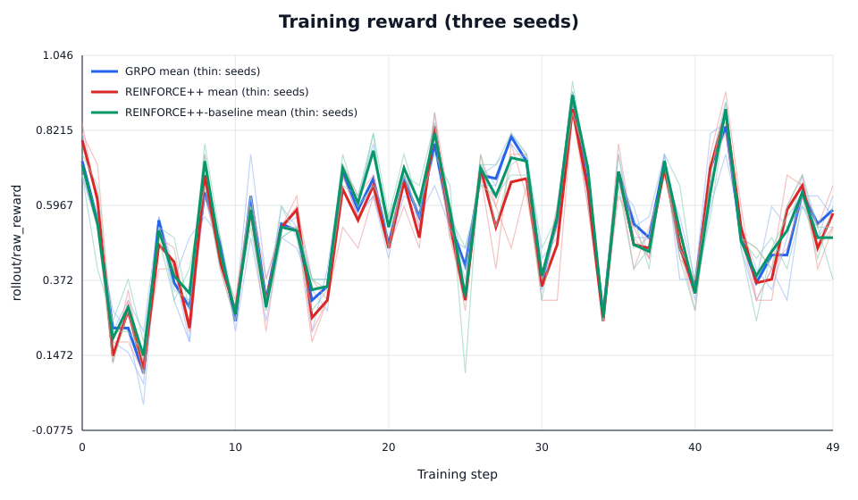
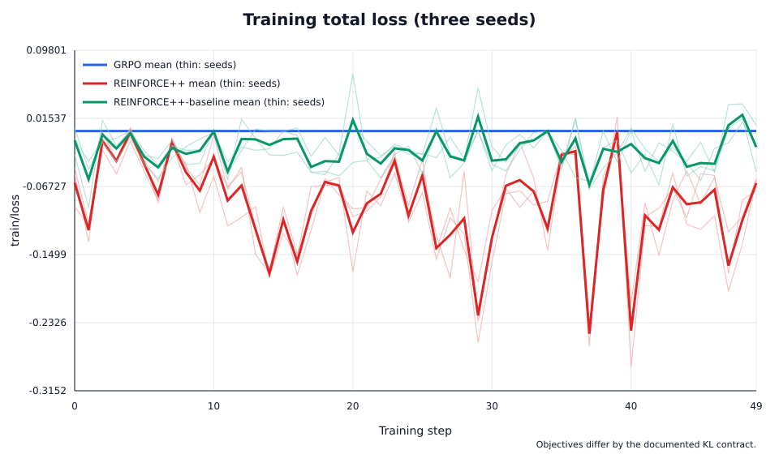
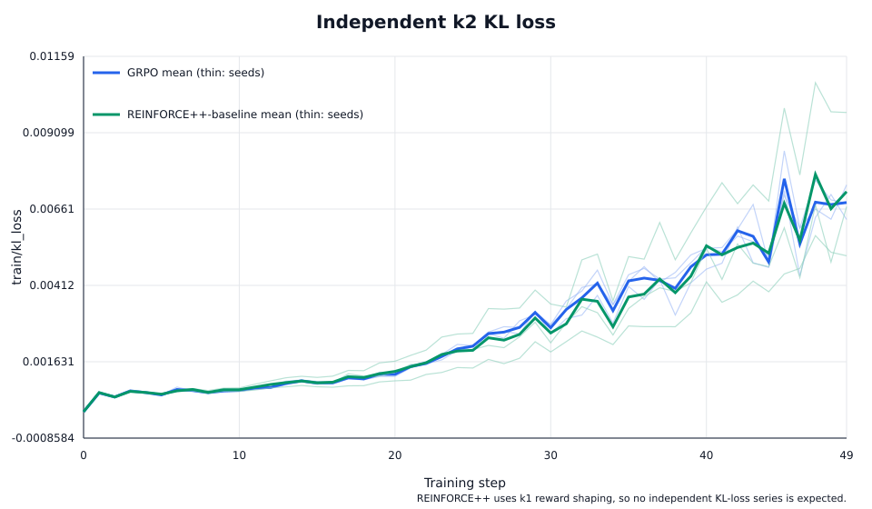
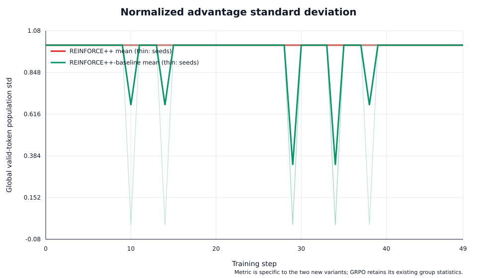
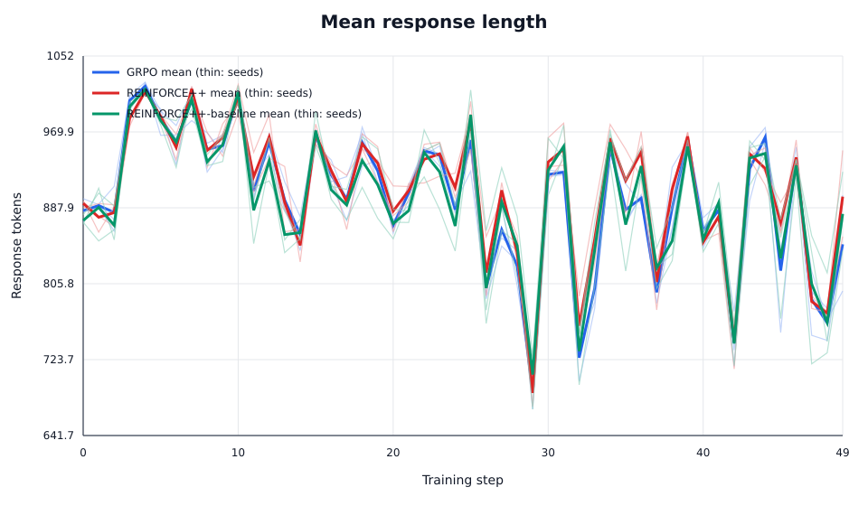
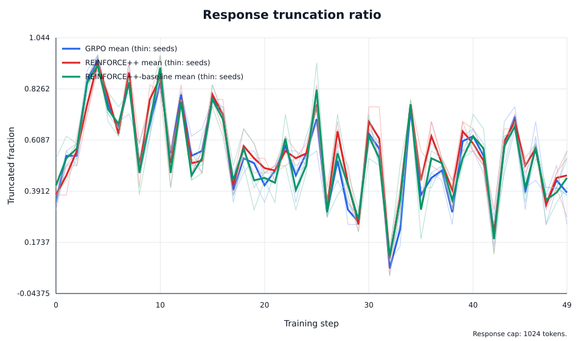
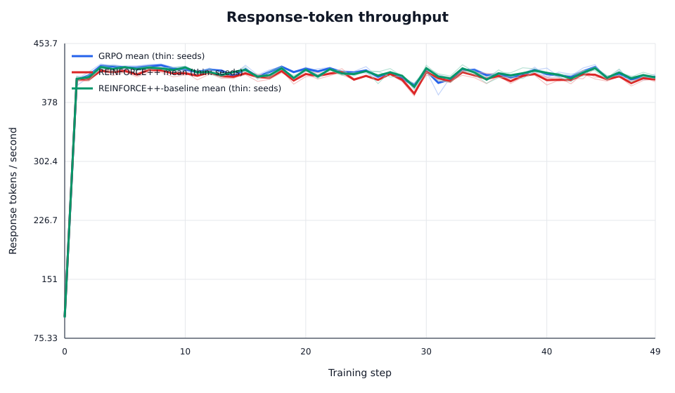
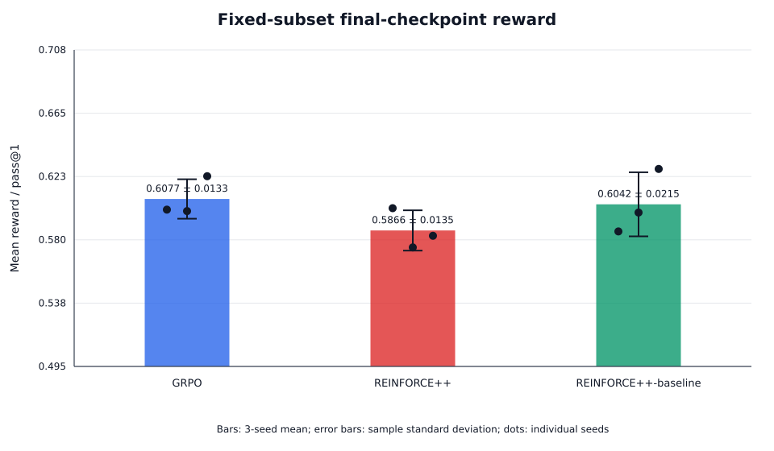

# REINFORCE++ 训练与数值验证报告

本报告配套 [REINFORCE++ 与 REINFORCE++-baseline](./reinforce-plus-plus.md) 的两个算法定义，记录数值测试，以及在冻结的相同预算下使用 Qwen3-0.6B 与 GRPO 进行的对比。该实验用于验证稳定性和实现正确性，并不声称某一算法在统计意义上更优。

## 范围与证据边界

- Proposal：[Task 29 issue #192](https://github.com/redai-studio/Relax/issues/192)
- 脱敏的可复现证据：[日志、展开命令、指标和 manifest](https://github.com/zheself/Relax/releases/tag/task29-reinforcepp-evidence-c72caf1)
- 实验源码 commit：`5f7cd574372288391bb1c41ca0677422cd31e725`
- 实验 upstream base：`b095ba68ce95c7d98762cf128eab630878f394e6`
- 实验后 rebase base：`0bc99af8dd39de8fd99c588a98b3f3a463bc818c`
- 模型：Qwen3-0.6B
- 训练数据：GSM8K `train_clean.parquet`，7,473 行
- 算法：GRPO、REINFORCE++ 和 REINFORCE++-baseline
- 训练重复：seed 42、1234 和 2026

下文 GPU 结果始终归属于准确的实验 commit。之后分支 rebase 到更新的 upstream base，并重新运行 CPU 数值和回归测试。本文不声称存在 rebase 后的新 GPU 结果。

Git tree 不包含 checkpoint、数据、凭据、集群路径或完整原始日志。公开的脱敏证据 release 包含 9 个接受训练日志、9 个接受评测日志与 summary、全部 18 条展开命令、GPU 采样、报告 CSV/SVG 文件和内部 SHA256 manifest。压缩包 SHA256 为 `0b52d8e8e6a85ff534e16569dd48c9dbef336402a2c80b6aa96b8bf2ffd7834f`。私有本地证据包还保留原始 TensorBoard event、评测 JSONL 和 checkpoint；使用 release 中的 CSV 即可复现本文表格，不需要这些私有文件。

文档同时发布了供图表和表格使用的机器可读、无路径证据：

- [全部 450 条训练 step 记录](/reinforce-plus-plus/training_metrics_long.csv)；
- [逐 run 训练汇总](/reinforce-plus-plus/training_summary_by_run.csv)和[三 seed 聚合](/reinforce-plus-plus/training_summary_by_algorithm.csv)；
- [逐 run 评测汇总](/reinforce-plus-plus/evaluation_summary_by_run.csv)和[三 seed 聚合](/reinforce-plus-plus/evaluation_summary_by_algorithm.csv)；
- [配对 reward 差值](/reinforce-plus-plus/evaluation_paired_reward_differences.csv)；
- [接受作业和证据索引](/reinforce-plus-plus/evidence_index.csv)，包括 Slurm 状态、耗时、源码 commit、接受 step/response 数量，以及保留主要 artifact 的 SHA256 标识。

## 算法契约

对比有意改变 advantage 和 KL 契约，同时固定工作负载：

| 算法 | Advantage | 归一化 | KL regularization |
|---|---|---|---|
| REINFORCE++ | terminal reward 加 token k1 KL shaping，随后以 `gamma=1` 反向计算 return | 跨全部有效 response token 和 DP rank 的 global population moments | k1 位于 shaped reward 内；没有独立 KL loss |
| REINFORCE++-baseline | reward 减去包含自身的同 prompt group mean；不除以 group std | 相同的 global valid-token population normalization | 独立 k2 KL loss |
| GRPO | 同 prompt group centering 和 group-std scaling | 既有 per-group normalization | 独立 k2 KL loss |

两个新增变体使用 token-level PPO clipped surrogate 和 response-mean loss reduction。Padding 和 mask-zero token 均不进入 moments 或 loss。专用分布式 normalizer 使用总体方差（`ddof=0`）和 `rsqrt(max(variance, 1e-8))`。零方差总体返回有限零；全局空 mask 触发协调的设备端异步错误。

由于 REINFORCE++ 还改变了 KL 的注入位置和方式，REINFORCE++ 与 baseline 的比较属于算法包对比，而不是单因素 baseline 消融。最清晰的机制对比是 baseline 与 GRPO：两者都使用独立 k2 regularization，但 group/global normalization 不同。

## 环境与冻结工作负载

| 项目 | 冻结值 |
|---|---|
| 镜像 digest | `dbd4c122f11e2e83f955ceeeadf541573c46f6458c47d892ce74c03794ed317e` |
| Python / PyTorch | 3.12.3 / 2.11.0+cu129 |
| CUDA runtime | 12.9 |
| Ray / SGLang | 2.56.0 / 0.5.12.post1 |
| GPU | 每个 run 使用 1 x NVIDIA A40 48 GB |
| CPU / host memory | 每个 run 使用 16 CPU / 64 GiB |
| Steps | 每个 run 50 次 Actor update |
| Batch geometry | 4 prompts x 8 responses；global batch 32 |
| Response cap | 1,024 tokens |
| Dynamic token cap | 每张 GPU 4,096 tokens |
| Learning rate / PPO clip | `1e-6` / `0.2` |
| Reward | Relax rule-based math reward |
| Sampling | temperature 1.0；相同 seed 集合和公共设置 |

训练时关闭 online evaluation，因为每 10 step 重复完整的 1,319-prompt test set 会压倒训练生成预算。每个 iteration-49 checkpoint 改为在同一个冻结 256-row 子集上评测一次，每个 prompt 生成 4 个 response，评测 seed 为 29，因此每个 checkpoint 产生 1,024 个 response。

第一次物化的子集保留原始 GSM8K rationale-form label，SHA256 为 `9f13d3bb27995a3902a11d879b31b909b3aed6fa3bd5b7a14928a56c313c8db4`。Relax math reward 需要训练文件使用的标量 target，因此保持问题和顺序不变，通过 `answer.rsplit("####", 1)[1].strip()` 确定性转换 label。接受的 clean-label 子集 SHA256 为 `b4a52290777ef180e5af2602e6dfc1614dda35b4b8534109acb13abbccfb4fce`。不兼容 label 的 run 已排除，并在下文记录。

## 复现入口

参数化 recipe 支持三个被比较算法。可移植的正式命令为：

```bash
MODEL_PATH=/path/to/Qwen3-0.6B \
PROMPT_DATA=/path/to/gsm8k/main/train_clean.parquet \
OUTPUT_DIR=/path/to/output/<algorithm>-<seed> \
ADVANTAGE_ESTIMATOR=<grpo|reinforce_plus_plus|reinforce_plus_plus_baseline> \
NUM_ROLLOUT=50 \
SEED=<42|1234|2026> \
ROLLOUT_BATCH_SIZE=4 \
N_SAMPLES_PER_PROMPT=8 \
GLOBAL_BATCH_SIZE=32 \
ROLLOUT_MAX_RESPONSE_LEN=1024 \
MAX_TOKENS_PER_GPU=4096 \
REWARD_NUM_WORKERS=4 \
REWARD_MAX_CONCURRENCY=16 \
SGLANG_MEM_FRACTION_STATIC=0.40 \
USE_HEALTH_CHECK=1 \
bash examples/algorithms/run-qwen3-0.6B-1xgpu-reinforce-plus-plus.sh
```

recipe 会提供各变体特有的 k1/k2、归一化和校验参数。集群 wrapper 为每个 Slurm job 使用隔离的 Ray runtime、cache、临时目录、输出目录和端口集合，并设置 `PYTHONNOUSERSITE=1`，将宿主 checkout bind mount 到不可变容器中。

每个正式训练的站点特定 Slurm 展开命令为：

```bash
sbatch \
  --partition=ShangHAI --account=hexm-shanghai \
  --gres=gpu:NVIDIAA40:1 --cpus-per-task=16 --mem=64G \
  --time=06:00:00 \
  --export=ALL,TASK29_ALGORITHM=<algorithm>,TASK29_SEED=<seed>,TASK29_NUM_ROLLOUT=50,TASK29_ROLLOUT_BATCH_SIZE=4,TASK29_N_SAMPLES_PER_PROMPT=8,TASK29_GLOBAL_BATCH_SIZE=32,TASK29_MAX_RESPONSE_LEN=1024,TASK29_MAX_TOKENS_PER_GPU=4096,TASK29_SGLANG_MEM_FRACTION=0.40,TASK29_REWARD_NUM_WORKERS=4,TASK29_REWARD_MAX_CONCURRENCY=16,TASK29_USE_HEALTH_CHECK=1,TASK29_USE_EVAL=0 \
  <job-isolated-wrapper.sbatch>
```

wrapper 在调用上述可移植 recipe 前校验 source commit、模型/数据/镜像输入、运行时模块路径和可见 A40，并为每个 job 分配独立的 Ray、Serve、cache、临时目录和输出根目录。站点路径和 wrapper 本身不是可移植项目 API；完整算法调用是上面的 recipe 命令。无路径证据索引记录每个接受训练和评测 job，经过 SHA256 验证的本地包保留展开命令和原始日志以供审计。

## 数值与回归验证

独立 float64 测试参考不调用生产环境的 return、advantage、normalization、policy-loss、KL-loss 或 reduction 函数。它们以 `atol=rtol=1e-6` 逐元素比较 shaped reward、return、原始/归一化 advantage、token loss 和 response-reduced loss。

覆盖范围包括：

- response 长度 `[1, 3, 5]`、右侧 padding 和内部 mask hole；
- mask 外的有限、`NaN`、`Inf` sentinel，以及精确 mask-zero 输出；
- 全零 reward、非零 KL、零方差和单个有效 token；
- baseline `k=1` 拒绝；
- PPO 上下界 clipping 和正负 advantage；
- 独立 k2 token 与 response-reduced loss；
- 两个真实 Gloo 进程和真实 `all_reduce`；
- 不等总体、一个本地空 rank、重分区不变性、单个 global token、零方差和全局空 mask。

rebase 到 upstream `0bc99af` 后，定向测试结果为：

```text
55 passed, 2 skipped in 20.37s
```

两个宿主 skip 是因为宿主 Conda 环境无法导入 Megatron。更广泛的宿主回归结果为：

```text
204 passed, 12 skipped, 3 warnings in 18.61s
```

固定容器中 rebase 后的 CPU-only Slurm 运行结果为：

```text
57 passed, 1 skipped, 30 warnings in 22.65s
```

唯一 skip 是新进入 upstream 的 FP16 测试模块；其独立容器进程无法导入镜像中 root-owned Megatron checkout，与 Task 29 无关。`git range-diff` 显示 rebase 前后五个 Task 29 commit 的 patch 完全一致，因此 upstream FP16 变化被加入而没有改变训练过的 Task 29 实现。

最终 pre-review 审计加强了对非有限 padding 的布尔 mask 处理，使本地全 mask response 安全参与 global DP 统计，并新增 production-dispatch 集成测试。更新后的宿主定向测试为 `62 passed, 2 skipped`；更广的 `tests/utils + tests/core` 回归为 `209 passed, 12 skipped, 3 warnings`。两个定向 skip 仍是需要完整 Megatron 安装的 upstream 模块。这些实验后修改只影响 masked/degenerate 输入和 monitoring scalar synchronization；GPU 结果仍归属于上文冻结的实验 commit。

根据维护者 review，实现在不改变两个算法数值契约的前提下再次 rebase 到 upstream `ce650113` 并缩小影响范围。commit `0e1531b` 用设备端异步断言和有限的设备端分母替换每 batch 的 `global_count.item()` 检查；同时将 `relax/backends/megatron/cp_utils.py` 完全恢复为 upstream 行为，把非有限 masked-token 防护移动到只为两个 REINFORCE++ estimator 选择的 reducer wrapper。GRPO、GSPO、SAPO 及其他既有算法因此继续保持 upstream 公共 reducer 的行为。

review 修复验证结果为：

- Task 29 定向套件 `51 passed`，包括真实双进程 Gloo collective；
- 固定容器中的 `tests/utils + tests/core` 为 `224 passed, 12 skipped`；
- 固定容器中的完整 Megatron backend 套件为 `168 passed, 4 skipped`；
- VitePress 1.6.4 对中英文页面的完整生产构建成功；
- 在 PyTorch synchronization debug mode 下运行 100 次 CUDA 迭代，没有触发 host-synchronization 错误（`TASK29_CUDA_SYNC_DEBUG_OK`）。

维护者 review 后，两个 Qwen3-0.6B 三步 smoke run 在 NVIDIA A40 GPU 上覆盖了收窄后的生产 dispatch：REINFORCE++ 作业 `938288` 和 REINFORCE++-baseline 作业 `938293`。两个作业都完成了三次 Actor 更新，通过结构化有限指标日志验证，产生非空的 TensorBoard、checkpoint 和 rollout 产物，并留下空的 job-scoped Ray cleanup 列表。

在实验 commit 上，固定容器通过 43 个 Task 29 测试和 14 个 metrics 测试。9 个正式训练都产生 50 条 rollout 记录、50 次 Actor update、有限 TensorBoard 指标和 iteration-49 checkpoint。9 个接受评测均产生 1,024 个 response、非空 summary 和 TensorBoard 文件、`TASK29_EVAL_OK` gate，以及空的 job-scoped Ray cleanup 列表。

## 训练稳定性

本报告的跨 seed 离散度使用样本标准差（`ddof=1`，`n=3`）。稳定性表先在每个 run 内对 step 40--49 求均值，再对三个 run-level 值计算均值和样本标准差。

| 算法 | Last-10 raw reward | Last-10 PG loss | Last-10 independent KL loss | Last-10 grad norm |
|---|---:|---:|---:|---:|
| GRPO | 0.5417 ± 0.0273 | -0.000000 ± 0.000000 | 0.006024 ± 0.000380 | 1.1674 ± 0.0396 |
| REINFORCE++ | 0.5469 ± 0.0188 | -0.111379 ± 0.015769 | N/A（k1 reward shaping） | 1.7015 ± 0.0244 |
| REINFORCE++-baseline | 0.5344 ± 0.0143 | -0.021490 ± 0.010483 | 0.006048 ± 0.002002 | 1.5847 ± 0.0499 |

`train/ppo_kl` 是 PPO importance ratio 使用的 response-reduced old-policy/current-policy log-prob 差值。在这个每个 rollout batch 只进行一次 Actor update 的冻结工作负载中，发布的 450 行数据全部为零，但它并不是 reference-policy KL，也不表示 reference regularization 被禁用。REINFORCE++ 把 k1 reference 项折入 return；GRPO 和 REINFORCE++-baseline 则将独立 k2 项报告为 `train/kl_loss`。

为了直接确认 k1 生效，下表用每一步 TensorBoard 的 `rollout/returns` 减去同一步的 `rollout/raw_reward`，再在指定区间内求均值。三个 REINFORCE++ 命令均使用 `--kl-coef 0.01 --kl-loss-type k1`。policy 移动后持续为负且非零的差值说明 reference KL shaping 确实进入生产 return，而不是仅存在于 recipe。

| Seed / job | All-50 mean difference | Last-10 mean difference | Final-step difference |
|---|---:|---:|---:|
| 42 / 937653 | -0.007241 | -0.017225 | -0.019743 |
| 1234 / 937680 | -0.007396 | -0.018403 | -0.020091 |
| 2026 / 937689 | -0.006929 | -0.017273 | -0.014912 |

baseline 单独优化的 k2 loss 也可在稳定性表中独立观察到（step 40--49 为 `0.006048 ± 0.002002`）。公开的展开命令和原始日志允许在不访问集群的情况下重新计算两项检查。



`train/loss`、`rollout/rewards` 和处理后的 advantage 幅值在不同算法间没有统一含义。特别是 REINFORCE++ 没有独立 KL-loss，而 GRPO 和 baseline 总 loss 包含该项。因此下面两张图是优化诊断，而非算法排名指标。





REINFORCE++ 的 150 个 step 中 normalized-advantage 标准差始终精确为 1。baseline 在 150 个 step 中有 7 个 step 的 global raw advantage population 方差为零，并产生有限的零 advantage；其余 step 标准差为 1。这是预期的退化输入行为，不是 NaN 或静默丢样本。



## 长度、截断与效率

全部 50 step 的汇总为：

| 算法 | Raw reward | Mean response length | Truncation | Response tok/s | Peak GPU memory |
|---|---:|---:|---:|---:|---:|
| GRPO | 0.5304 ± 0.0112 | 896.7 ± 6.1 | 0.5358 ± 0.0148 | 409.8 ± 0.7 | 35.33 ± 0.33 GiB |
| REINFORCE++ | 0.5144 ± 0.0087 | 905.9 ± 0.3 | 0.5608 ± 0.0150 | 405.3 ± 1.1 | 35.22 ± 0.09 GiB |
| REINFORCE++-baseline | 0.5346 ± 0.0113 | 896.9 ± 17.2 | 0.5396 ± 0.0328 | 409.2 ± 0.8 | 35.26 ± 0.09 GiB |

GRPO、REINFORCE++ 和 baseline 的平均 Slurm 耗时分别为 65.6、66.9 和 65.7 分钟。吞吐、耗时和峰值显存接近；该实验没有显示算法间存在实质系统成本差异。







response cap 是一个重要限制：约 54--56% 的训练 response 和 40--44% 的评测 response 被截断。长度行为可能影响观测到的质量排序，不能只报告准确率而隐藏这一点。

## 固定子集的最终 checkpoint 评测

下表每一行都是独立训练的 checkpoint，使用完全相同的 prompt 顺序、标量 label、采样数、解码参数和评测 seed。

| 算法 | Seed | Reward / pass@1 | pass@2 | pass@4 | Truncation | Mean length |
|---|---:|---:|---:|---:|---:|---:|
| GRPO | 42 | 0.6006 | 0.7096 | 0.7773 | 0.3926 | 844.1 |
| GRPO | 1234 | 0.5996 | 0.6973 | 0.7617 | 0.4355 | 854.5 |
| GRPO | 2026 | 0.6230 | 0.7188 | 0.7930 | 0.3711 | 834.1 |
| REINFORCE++ | 42 | 0.6016 | 0.7135 | 0.7734 | 0.4385 | 867.3 |
| REINFORCE++ | 1234 | 0.5752 | 0.6960 | 0.7812 | 0.4443 | 859.6 |
| REINFORCE++ | 2026 | 0.5830 | 0.6927 | 0.7656 | 0.4316 | 855.0 |
| REINFORCE++-baseline | 42 | 0.5859 | 0.6908 | 0.7773 | 0.4639 | 866.6 |
| REINFORCE++-baseline | 1234 | 0.5986 | 0.6927 | 0.7695 | 0.4395 | 867.2 |
| REINFORCE++-baseline | 2026 | 0.6279 | 0.7396 | 0.8203 | 0.3594 | 824.2 |

聚合结果：

| 算法 | Reward / pass@1 | pass@2 | pass@4 | Truncation |
|---|---:|---:|---:|---:|
| GRPO | 0.6077 ± 0.0133 | 0.7086 ± 0.0108 | 0.7773 ± 0.0156 | 0.3997 ± 0.0328 |
| REINFORCE++ | 0.5866 ± 0.0135 | 0.7007 ± 0.0112 | 0.7734 ± 0.0078 | 0.4382 ± 0.0064 |
| REINFORCE++-baseline | 0.6042 ± 0.0215 | 0.7077 ± 0.0276 | 0.7891 ± 0.0273 | 0.4209 ± 0.0547 |



按训练 seed 配对的 reward 差值为：

| 对比 | Seed 42 | Seed 1234 | Seed 2026 | Mean ± sample SD | 探索性 95% t-CI |
|---|---:|---:|---:|---:|---:|
| REINFORCE++ - GRPO | +0.0010 | -0.0244 | -0.0400 | -0.0212 ± 0.0207 | [-0.0726, 0.0303] |
| baseline - GRPO | -0.0146 | -0.0010 | +0.0049 | -0.0036 ± 0.0100 | [-0.0285, 0.0213] |
| REINFORCE++ - baseline | +0.0156 | -0.0234 | -0.0449 | -0.0176 ± 0.0307 | [-0.0938, 0.0587] |

这些区间只有三个配对训练 seed（`df=2`），且全部跨过零。GRPO 的 mean reward 最高，baseline 的 mean pass@4 最高，但排序会随 seed 反转。证据支持稳定执行和初步固定子集比较，不支持优越性或统计显著性结论。

## 问题与解决方案

| 问题 | 证据边界 | 解决方案 |
|---|---|---|
| 容器 preflight 缺少 Ruff | CUDA/import 检查通过；pytest 尚未运行 | 保留 Ruff 作为宿主静态 gate，随后成功重跑容器 pytest |
| Runtime-env JSON 多出一个右花括号 | Ray 已启动；训练尚未进入参数解析 | 用显式空值分支替换 Bash 默认展开，并增加回归覆盖 |
| 8/12 CPU smoke allocation 无法调度 Rollout 或 RewardWorker actor | 没有 optimizer step；已排除 | 正式 run 固定 16 CPU，并限制 reward-worker concurrency |
| 训练 job 937654 在全部 50 次 update 后以 `2:0` 退出 | 保留完整 TensorBoard、rollout 文件、checkpoint、成功标记和空 cleanup | 将会误匹配生成文本中 `Nancy` 的无限制 `loss...nan` 正则替换为结构化日志 validator；Slurm 状态仍报告为失败 |
| Eval-only 启动使用非法的零 step schedule，随后又使用错误 config 路径 | 没有接受 generation；已排除 | 保留有效 parser schedule 但不调用训练循环，并修正容器路径 |
| Eval job 937775 使用 rationale-form GSM8K label，reward 全零 | 只能验证 weight sync、generation、metrics routing 和 cleanup；质量指标已排除 | 将 label 确定性归一化为标量 target，并重跑全部 9 个接受评测 |

没有把失败 smoke、preflight 或不兼容 label 的结果混入正式对比。

## 局限与结论

1. 三个训练 seed 足以做可重复性检查，但不足以支撑强统计显著性结论。
2. 评测只覆盖一个冻结的 256-prompt 子集和一个解码 seed，不是完整 GSM8K benchmark。
3. 没有使用相同配置评测初始模型 checkpoint，因此不能声称相对 base model 有提升。
4. 正式 rollout generation 设置了 seed，但并非完全确定性；相同 seed 固定公共输入和随机源配置，不保证不同 policy 逐 token 一致。
5. 较高的 response 截断率可能影响质量排序。

在这些限制下，两个新增 estimator 名称都满足已记录的数学契约，与独立参考实现逐元素对齐，通过真实跨 rank Gloo 测试，并以与 GRPO 相同的九组训练和评测预算完成运行，没有 NaN、Inf、OOM 或无法解释的样本丢失。baseline 的 mean reward 与 GRPO 接近，并在该小规模研究中具有最高 mean pass@4；标准 REINFORCE++ 的 response 更长、截断更多。更大规模的后续工作应优先采用更长 response cap、更多训练 seed、完整评测集和 initial-checkpoint control。
