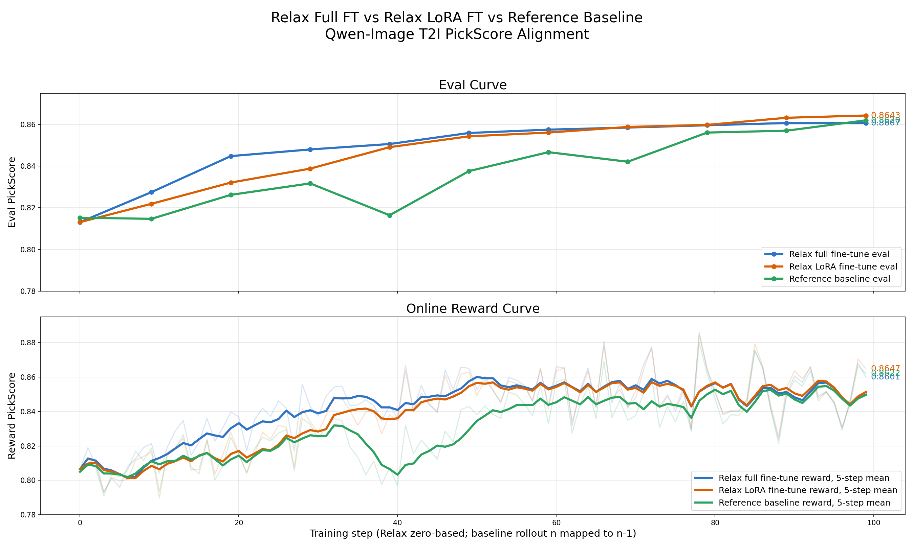
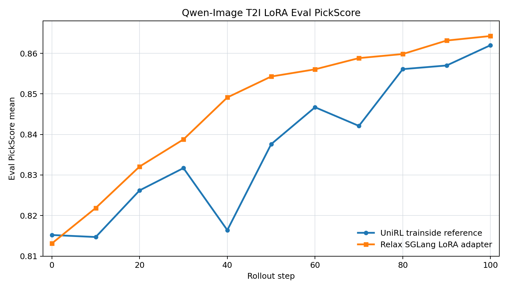

# Relax Diffusion

This directory contains Relax native diffusion RL examples. The current validated
path is Qwen-Image T2I LoRA on 8 GPUs, using FSDP2 for training, SGLang native
diffusion for rollout, FlowGRPO for policy optimization, and PickScore for
reward.

## Core Logic

Relax keeps diffusion training and rollout as separate Ray Serve components:

```text
prompt data
  -> RolloutManager / SGLangNativeGenerationEngine
  -> generated images + denoising trajectory + rollout metadata (memory)
  -> PickScore reward
  -> FlowGRPO train samples
  -> FSDP actor replay + optimizer step
  -> weight sync back to SGLang
```

The FSDP actor trains only the policy transformer. Frozen modules such as the
VAE and text encoder live on the rollout side. In colocate mode the actor and
rollout engines share the same 8 GPUs, so `--offload-train` and
`--offload-rollout` time-share GPU memory between train and generation phases.

For colocated/local reward training, generated images stay in the rollout
worker's process until PickScore consumes them, while each deduplicated prompt
group trajectory is published once through Ray's object store. TransferQueue
carries only numeric metadata and serialized ObjectRefs. This avoids PNG encode,
`fsync`, safetensors writes, and rereads on the shared filesystem. Eval still
writes inspectable PNGs; `--reward-runtime remote` also writes candidate images
because an external HTTP scorer cannot resolve process-local memory.

For LoRA, Relax supports two rollout sync modes:

| Mode    | Flag                  | Per-step sync                                           | SGLang requirement                 |
| ------- | --------------------- | ------------------------------------------------------- | ---------------------------------- |
| Merge   | `--lora-merge-mode`   | Full transformer, with `B @ A` folded into base weights | `docker/patch/latest/sglang.patch` |
| Adapter | `--lora-adapter-mode` | Adapter tensors only                                    | `docker/patch/latest/sglang.patch` |

Adapter mode is the default in `run-qwen-image-t2i-lora-8xgpu.sh` and is the
validated Qwen-Image parity path. It sends only the trained LoRA adapter every
step. For the validated rank-64 Qwen-Image run, that is 1440 tensors: 960
adapter tensors plus 480 alpha tensors, about 377.5 MB to 8 rollout engines.
Set `ADAPTER_MODE=0` only when validating merge-mode sync itself.

## SGLang Patch Layout

Relax uses one SGLang baseline and one combined SGLang patch:

- `docker/Dockerfile` starts from `lmsysorg/sglang:v0.5.17-cu129`.
- `docker/patch/latest/sglang.patch` points to the canonical patch for that image
  (`docker/patch/sglang/v0.5.17.patch`).
- The same patch carries the standard text-RL SRT changes and the
  `multimodal_gen` diffusion deltas.

The diffusion-specific delta in the combined patch covers:

- `UpdateWeightFromTensorReqInput` and `/update_weights_from_tensor` for
  colocate full/merge weight sync.
- `SetLoraFromTensorReqInput` and `/set_lora_from_tensor` for adapter-only LoRA
  sync.
- A guard that rejects full-weight tensor sync after SGLang has converted the
  DiT to LoRA layers.

The standard Relax image installs the diffusion/LoRA runtime dependencies from
`requirements.txt`, including `diffusers>=0.37.0`, `imageio[ffmpeg]`,
`soundfile`, and `peft>=0.20.0,<0.21.0`. A fresh node should use this image
instead of installing these packages locally.

Current combined patch hash:

```text
v0.5.17.patch  a1826903f452c2ac51243742edd208c28080fe8707be87bea8d976e5eefcf48d
```

Build the Relax image:

```bash
docker build -f docker/Dockerfile -t relax:latest .
```

For manual node debugging against a source SGLang checkout:

```bash
export RELAX=/path/to/Relax
export SGLANG_SRC=/sgl-workspace/sglang

cd "${SGLANG_SRC}"
git checkout v0.5.17
git apply "${RELAX}/docker/patch/latest/sglang.patch"
```

Verify the patched source tree:

```bash
SGLANG_DIFFUSION_RUNTIME=python/sglang/multimodal_gen/runtime
grep -q "class SetLoraFromTensorReqInput" \
  "${SGLANG_DIFFUSION_RUNTIME}/entrypoints/post_training/io_struct.py"
grep -q 'router.post("/set_lora_from_tensor")' \
  "${SGLANG_DIFFUSION_RUNTIME}/entrypoints/post_training/weights_api.py"
grep -q "def set_lora_from_tensors" \
  "${SGLANG_DIFFUSION_RUNTIME}/pipelines_core/lora_pipeline.py"
```

## Environment

The launch script reads these paths:

```bash
export EXP_DIR=/your/shared/fs/native-generation
export MODEL_DIR=${EXP_DIR}/models
export DATA_DIR=${EXP_DIR}/data
export ARTIFACT_ROOT=/tmp/relax-native-generation/artifacts/qwen-image-lora
export SAVE_DIR=${EXP_DIR}/runs/qwen-image-lora
```

Expected inputs:

```bash
test -d "${MODEL_DIR}/Qwen-Image"
test -d "${MODEL_DIR}/PickScore_v1"
test -f "${DATA_DIR}/processed/t2i/pickapic_train.jsonl"
test -f "${DATA_DIR}/processed/t2i/pickapic_eval256.jsonl"
```

## Data

Convert a raw prompt source to the unified JSONL, then curate it into exactly
the files the launch scripts default to:

```bash
python3 examples/diffusion/prepare_data.py \
  --source pickapic --input <raw pick-a-pic dir or parquet> \
  --output "${DATA_DIR}/raw/t2i/pickapic.jsonl"

python3 examples/diffusion/curate_data.py \
  --input "${DATA_DIR}/raw/t2i/pickapic.jsonl" \
  --out-dir "${DATA_DIR}/processed/t2i" \
  --prefix pickapic_ --min-prompt-words 6 \
  --eval-size 2048 --eval-subset-sizes 64 256 --no-check-media

python3 examples/diffusion/inspect_data.py \
  --train "${DATA_DIR}/processed/t2i/pickapic_train.jsonl" \
  --eval "${DATA_DIR}/processed/t2i/pickapic_eval256.jsonl"
```

That writes `pickapic_train.jsonl`, `pickapic_eval.jsonl` and the
`pickapic_eval64.jsonl` / `pickapic_eval256.jsonl` subsets.
`--min-prompt-words 6` and the 2048-prompt holdout are the alignment preset used
by the launch scripts: unfiltered one- and two-word captions score with almost no
intra-group variance and starve GRPO of signal.

No node-local Python install is required for the diffusion runtime dependencies.

## Launch

Start a single-node Ray head if the cluster is not already running:

```bash
export MASTER_ADDR=<ray-head-ip>

ray start --head \
  --node-ip-address "${MASTER_ADDR}" \
  --num-gpus 8 \
  --disable-usage-stats \
  --dashboard-host=0.0.0.0 \
  --dashboard-port=8265
```

Run the validated Qwen-Image T2I LoRA adapter recipe:

```bash
cd /path/to/Relax

export MASTER_ADDR=<ray-head-ip>
export MEGATRON=/root/Megatron-LM
export PYTHONPATH="${PWD}:${MEGATRON}:/sgl-workspace/sglang/python:${PYTHONPATH:-}"
export RELAX_ENTRYPOINT_MODE=manual
export RAY_NO_WAIT=1

TAG="qwen-image-lora-$(date +%Y%m%d-%H%M%S)"
export NUM_ROLLOUT=100
export EVAL_INTERVAL=10
export ARTIFACT_ROOT="/tmp/relax-native-generation/artifacts/${TAG}"
export SAVE_DIR="${EXP_DIR}/runs/${TAG}"
export KEEP_CKPT=5
export PROJECT_NAME="Relax/dev/native-generation"

ray serve shutdown -y || true
bash scripts/training/diffusion/run-qwen-image-t2i-lora-8xgpu.sh
```

The script submits a Ray job and writes the submit log to
`log/qwen-image-t2i-lora-gpu8-<timestamp>.log`.

Important defaults in the Qwen-Image parity script:

- `rollout_batch_size=32`, `n_samples_per_prompt=8`,
  `global_batch_size=256`
- `REFERENCE_DATALOADER_ORDER=1`, `REFERENCE_SHUFFLE_SEED=42`
- eval uses `pickapic_eval256.jsonl` with `n_samples_per_eval_prompt=2`
- sampling uses 384x384, 12 denoising steps, `guidance_scale=1.0`, `eta=0.7`
- SDE training uses 3 steps resampled from `[1,2,3,4,5]` per rollout. Step 0 is
  deliberately excluded: there `sigma == 1`, so the SDE coefficient
  `sqrt(sigma / (1 - sigma))` is singular and the replayed Gaussian no longer
  matches the one the sampler drew from. Preflight rejects a trained step 0.
- LoRA rank 64, alpha 128, dropout 0, learning rate `3e-4`
- `num_updates_per_batch=2`, matching the CountPlanner-style disjoint update geometry
- `--weight-sync-wire-dtype bf16` (the colocate transaction syncs every step)

## Accuracy

The current 100-rollout validation compares three PickScore curves:

- Relax LoRA adapter fine-tune, using the validated rank-64 adapter sync path.
- Relax full-parameter fine-tune, using the same prompt order, batch geometry,
  sampling config, eval set, and optimizer update count as the LoRA recipe.
- Qwen-Image reference baseline.

Relax logs use zero-based rollout indices (`eval 99` after 100 rollouts), while
the reference baseline logs `EVAL step 100`. In the comparison plot, baseline
rollout `n` is mapped to Relax step `n-1`, so the final baseline eval aligns
with Relax `eval 99`.



| Run                  | Eval start | Eval final | Eval delta | Reward first 10 mean | Reward last 10 mean | Reward final |
| -------------------- | ---------: | ---------: | ---------: | -------------------: | ------------------: | -----------: |
| Relax full fine-tune |     0.8131 |     0.8607 |    +0.0476 |               0.8085 |              0.8533 |       0.8601 |
| Relax LoRA fine-tune |     0.8131 |     0.8643 |    +0.0512 |               0.8068 |              0.8544 |       0.8647 |
| Reference baseline   |     0.8152 |     0.8620 |    +0.0468 |               0.8075 |              0.8523 |       0.8622 |

The three runs follow the same overall learning trend: online reward rises by
about 0.045 over 100 rollouts, and eval converges around 0.861-0.864. Relax LoRA
finishes slightly above the reference baseline on final eval (`+0.0023`) and final reward
(`+0.0025`). Relax full fine-tune finishes slightly below LoRA/reference on eval,
but it tracks the same reward curve and has no weight-sync or checkpoint
failures in the completed 100-step run. The remaining gap is small enough to be
consistent with sampling/eval noise, but full fine-tune is much more expensive:
each step syncs 1933 tensors / 40.8608 GB, versus 1440 tensors / 0.3775 GB for
LoRA adapter sync.

The source data for the plot is saved alongside the figure:

```text
examples/diffusion/assets/qwen-image-ft-lora-pickscore-comparison.csv
examples/diffusion/assets/qwen-image-ft-lora-pickscore-summary.json
```

The final 100-rollout adapter-mode validation run aligned with the Qwen-Image
LoRA reference baseline:

```text
Relax final eval: step 99 = 0.86426592
Reference baseline: step 100 = 0.8620
```

Acknowledgement: we thank the UniRL authors for the Qwen-Image / PickScore
reference recipe and metrics used for alignment checks.



| Rollout step | Reference eval | Relax eval |
| -----------: | -------------: | ---------: |
|            0 |         0.8152 |     0.8131 |
|           10 |         0.8147 |     0.8219 |
|           20 |         0.8262 |     0.8321 |
|           30 |         0.8317 |     0.8388 |
|           40 |         0.8164 |     0.8491 |
|           50 |         0.8376 |     0.8543 |
|           60 |         0.8467 |     0.8561 |
|           70 |         0.8421 |     0.8588 |
|           80 |         0.8561 |     0.8598 |
|           90 |         0.8570 |     0.8632 |
|          100 |         0.8620 |     0.8643 |

Numbers above come from a single tagged run. To reproduce them, set `TAG` as in
the Launch section and read back:

```text
${SAVE_DIR}/tensorboard_log      # Relax TensorBoard scalars
log/qwen-image-t2i-lora-gpu8-*.log   # Relax submit log (job id, then `ray job logs`)
```

## Monitoring

Capture the job id from the submit log:

```bash
grep -h "submitted successfully" log/qwen-image-t2i-lora-gpu8-*.log | tail
```

Check progress:

```bash
JOB_ID=<ray-job-id>
ray job status "${JOB_ID}"
ray job logs "${JOB_ID}" 2>&1 \
  | grep -iE '(\[eval [0-9]+\]|pickscore_mean|reward step|train [0-9]+|optimizer_steps|weight_sync_failures|clip_fraction|ratio_mean|grad_norm|Traceback|Exception|RuntimeError|CUDA|OOM|FAILED|Ray shutdown)' \
  | tail -160
```

Healthy checkpoints for this recipe:

- eval step 0 should be close to reference eval step 0, around `0.815`
- adapter sync should report 1440 tensors and zero `weight_sync_failures`
- `ARTIFACT_ROOT/recipes/qwen-image-t2i-lora-*.json` should record
  `advantage_std_mode=group`, the prompt/eval sets, sampling config, git
  revision, and the SGLang patch version used for this validation run
- train step 99 should report `optimizer_steps=200`
- final eval should appear after train step 99; the actor waits for
  `/is_eval_done` before job exit

## Notes

- Use `/tmp` or another quota-safe path for `ARTIFACT_ROOT` during long runs.
  Eval writes `256 * 2` PNGs at each eval checkpoint. Local/colocated training
  does not write per-candidate PNGs or trajectory sidecars; remote reward mode
  writes training images for the external scorer.
- Adapter mode requires the combined SGLang patch. Without it,
  `/set_lora_from_tensor` is missing.
- Do not mix adapter mode with full-weight sync on the same SGLang engine. Once
  SGLang converts the DiT to LoRA layers, full-weight names no longer match.
- If a stopped run leaves GPU memory occupied while `ray serve status` is empty,
  check for orphan `sgl_diffusion::scheduler` processes before relaunching.
- The 2026-09-02 in-memory validation measured a `47.87s` steady-state rollout
  and `184.89s` total step (`98.45s` actor train, `14.13s` adapter sync) for
  32 prompts x 8 candidates at 384x384/12 steps. The first rollout was `82.15s`
  because every SGLang worker paid one-time CUDA/kernel warmup. The comparable
  reference logs were about `70.11s` per rollout and `193-194s` per total step.
