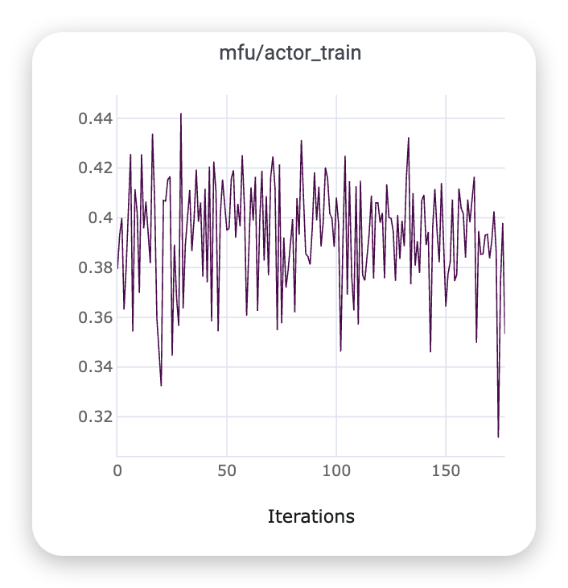
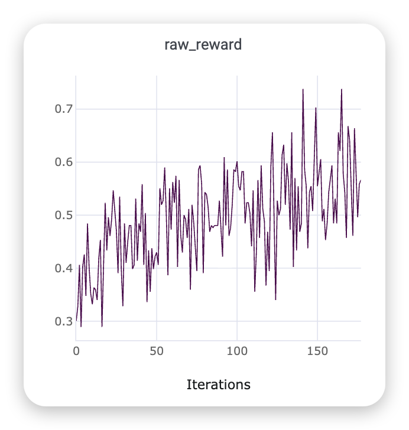
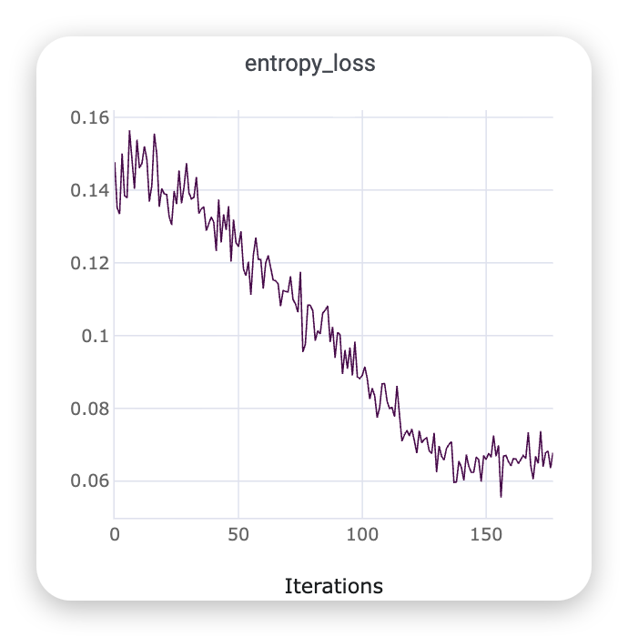

# Calendar：三步接入

本 recipe 使用固定 NeMo Gym commit 中的 `calendar_simple_agent`、Calendar verifier 和训练集，复用
Relax 已有 thin client、Gateway、数据转换和 Qwen3-4B 训练骨架。已知问题见 [PITFAIL.md](PITFAIL.md)。
从零只需完成下面三个步骤。

## 这是个什么任务

它是“长对话日历约束求解”任务：

- 输入一段平均 22.9 条消息的历史对话。
- 历史中不断添加、修改 1–7 个日程。
- 约束包括 `before / after / between / at`，并且旧约束永久生效。
- 所有事件必须在 10:00–16:00 内且不能重叠。
- 模型最终输出完整日历 JSON list。

训练集有 3872 条、无工具调用。虽然经过 NeMo Gym agent 服务运行，但 Calendar 实际上是一次模型生成，
所有样本 `agent_turns=1`，不是在线多轮 tool-use agent。

## Reward 怎么算

Reward 是严格二值：满足全部条件得 1，否则得 0。

Verifier 会：

1. 从最终回答中提取第一个 JSON list。
2. 检查事件 ID 数量是否和 `exp_cal_state` 一致。
3. 检查所有事件之间是否重叠。
4. 对每个事件检查：
   - `duration` 完全一致；
   - 开始时间不早于 `min_time`；
   - 结束时间不晚于 `max_time`；
   - `before X`：结束时间 ≤ X；
   - `after X`：开始时间 ≥ X；
   - `between X and Y`：整个事件落在区间内；
   - `at X`：开始时间必须精确等于 X。

解析失败、缺少 JSON、缺少事件、事件冲突、违反任意约束或 verifier 异常，都是 0。

### Reward 实现细节

- 保存的 `response` 里仍能看到 `<think>`，但训练使用了 `--agentic-reasoning-parser qwen3`，送给
  verifier 前会剥离 reasoning，所以不会因为保存结果里有 `<think>` 就自动得 0。
- Verifier 不核对 `event_name`，也不要求事件按某种顺序输出；它主要衡量时间表是否可行。
- Verifier 会提取第一个 JSON list，因此附带额外自然语言不一定扣分。
- TensorBoard 的 `rollout/rewards≈0` 是 GRPO 组内标准化后的均值，按构造就接近 0。真实成功率应看
  `rollout/raw_reward` 或 JSONL 中的 `reward`。

## 训练曲线示例

### Actor MFU



### Raw reward



### Entropy loss



前提：已按[顶层文档](../../README.md)构建 `NEMO_GYM_IMAGE`，远程 Ray 节点共享 Relax checkout、模型
目录和数据目录。本机与远程集群必须双向可达：远程节点访问本机 `:29100`，本机访问 Relax
Agentic Chat API `:8000`。

## 1. 准备数据

在能写入远程 Ray 共享数据目录的机器执行。若本机没有挂载该目录，先生成后把
`calendar_train.jsonl` 复制到远程共享路径。

Callback 白名单只配置 `NEMO_GYM_CALLBACK_ALLOWED_NETWORKS`，默认为 `10.0.0.0/8`，可覆盖为逗号分隔的 CIDR；
填写实际覆盖 Relax callback IP 的网段，单个 IPv4/IPv6 地址使用 `/32` 或 `/128`。
CIDR 按 URL 中的 IP 匹配，不解析域名，且不接受 `/0`。

```bash
export NEMO_GYM_CALLBACK_ALLOWED_NETWORKS="${NEMO_GYM_CALLBACK_ALLOWED_NETWORKS:-10.0.0.0/8}"
export REPO_ROOT="/path/to/Relax"
export DATA_ROOT="/shared/data"
export NEMO_GYM_IMAGE="relax-nemo-gym:a85670e"

docker run --rm --network host \
  -v "${REPO_ROOT}:/opt/relax-integration:ro" \
  -v "${DATA_ROOT}:/data" \
  -e HTTP_PROXY="${http_proxy:-}" \
  -e HTTPS_PROXY="${https_proxy:-}" \
  -e NO_PROXY="${no_proxy:-127.0.0.1,localhost}" \
  "${NEMO_GYM_IMAGE}" \
  bash /opt/relax-integration/examples/nemo_gym_agentic/recipes/calendar/prepare_calendar.sh

test -s "${DATA_ROOT}/nemo-gym/calendar_train.jsonl"
test -s "${DATA_ROOT}/nemo-gym/calendar_train_relax.jsonl"
```

训练传入原始 `calendar_train.jsonl`；`_relax.jsonl` 仅用于检查转换结果。

## 2. 本机启动 NeMo Gym Docker 服务

`GYM_HOST` 是远程 GPU 节点可路由到、且实际配置在 Docker 宿主机网卡上的本机 IP；不能填写未绑定在
本机的 NAT 公网 IP。`RELAX_HOST` 是 Gym 能访问的远程 Relax Serve IP。

```bash
export GYM_HOST="<本机可路由 IP>"
export RELAX_HOST="<远程 Relax Serve IP>"

docker run --rm -d \
  --name nemo-gym-calendar \
  --network host \
  --shm-size 12g \
  -v "${REPO_ROOT}:/opt/relax-integration:ro" \
  -e GYM_HOST="${GYM_HOST}" \
  -e NEMO_GYM_CALLBACK_ALLOWED_NETWORKS="${NEMO_GYM_CALLBACK_ALLOWED_NETWORKS}" \
  -e NO_PROXY="127.0.0.1,localhost,${GYM_HOST},${RELAX_HOST}" \
  "${NEMO_GYM_IMAGE}" \
  bash /opt/relax-integration/examples/nemo_gym_agentic/recipes/calendar/start_calendar_gym.sh

until curl --noproxy "*" -fsS "http://${GYM_HOST}:29100/readyz" | jq -e '.ready == true' >/dev/null; do
  docker ps --filter name=nemo-gym-calendar
  sleep 2
done

curl --noproxy "*" -fsS "http://${GYM_HOST}:29100/readyz" | jq .

docker exec nemo-gym-calendar \
  /opt/nemo-gym/resources_servers/calendar/.venv/bin/python \
  /opt/relax-integration/examples/nemo_gym_agentic/recipes/calendar/verify_calendar.py \
  --resource-url "http://${GYM_HOST}:29102"
```

最后一条命令必须输出 `correct_reward=1.0 incorrect_reward=0.0`。

查看服务日志：

```bash
docker logs -f nemo-gym-calendar
```

## 3. 在远程 Relax Ray head 启动训练

所有 Ray 节点必须能以同一个绝对路径读取 `NEMO_GYM_SOURCE_DATA` 和当前 Relax checkout。
提交前应从每个 Ray 节点确认 `http://${GYM_HOST}:29100/readyz` 可访问。

```bash
cd /path/to/Relax

export RAY_ADDRESS="<Ray head IP>:6379"
export MODEL_DIR="/shared/models"
export GYM_HOST="<第 2 步的本机可路由 IP>"
export NEMO_GYM_SOURCE_DATA="/shared/data/nemo-gym/calendar_train.jsonl"
export EXP_DIR="/shared/experiments/nemo-gym-calendar"

bash scripts/entrypoint/ray-job.sh \
  examples/nemo_gym_agentic/recipes/calendar/run-qwen3-4B-8xgpu-nemo-gym-calendar.sh
```

训练脚本默认转换并使用 `NEMO_GYM_SOURCE_DATA` 中的全部样本。
