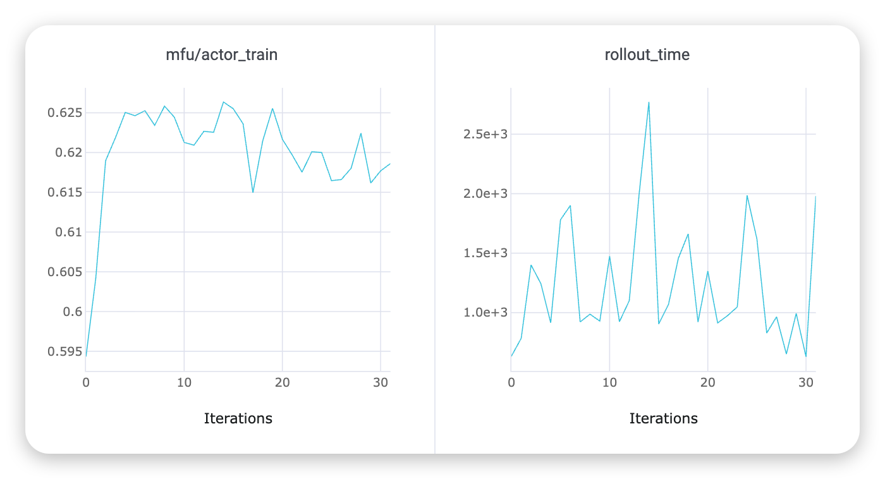
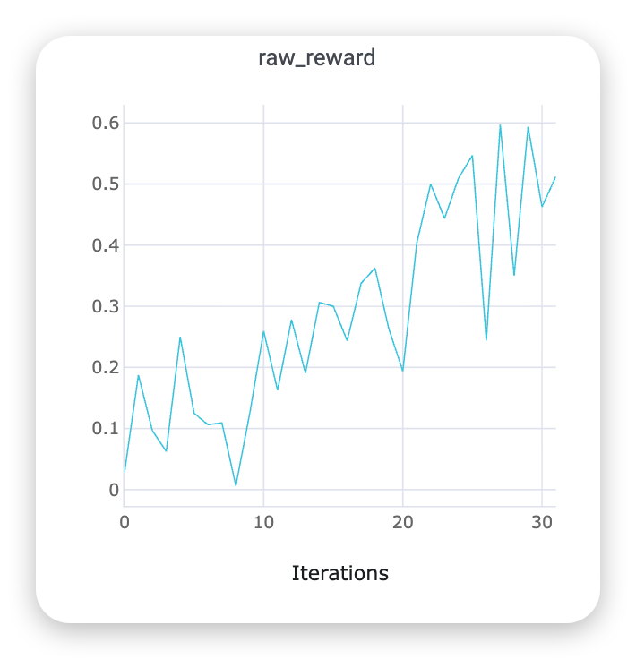
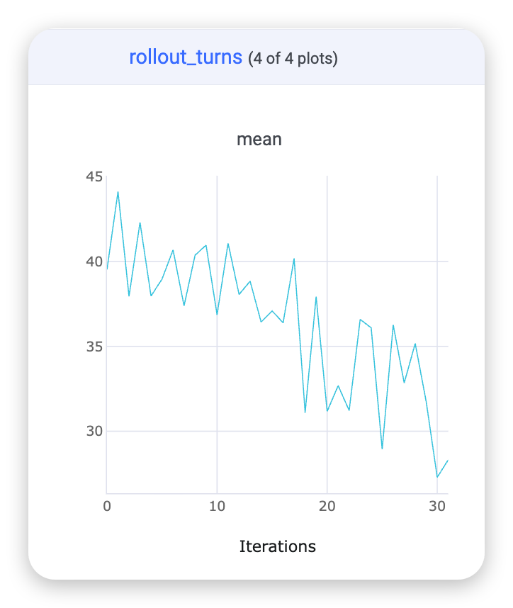
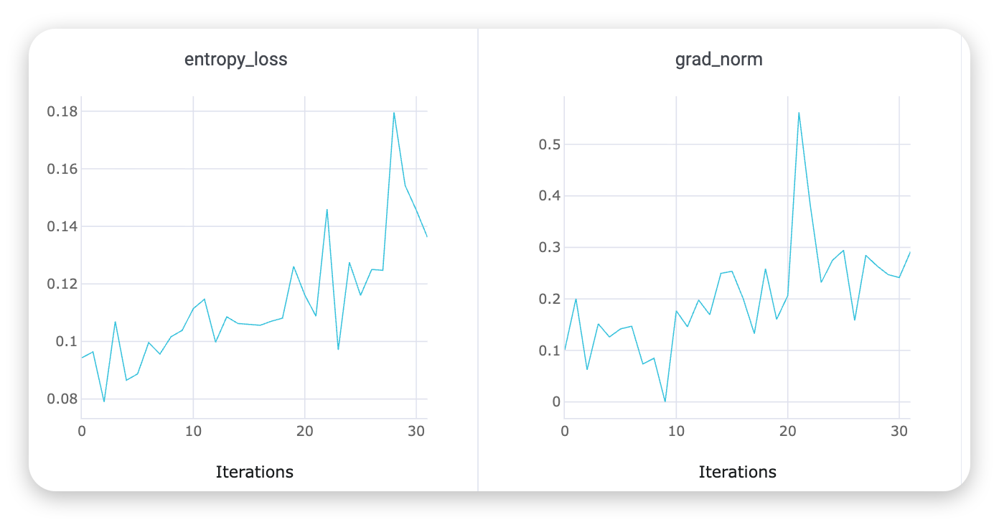

# R2E-Gym Recipe：OpenHands + Apptainer 软件工程训练

本 recipe 将 R2E-Gym 的代码仓库任务接入 NeMo Gym SWE agent，并由 Relax 提供每一轮模型推理和
强化学习训练。每题使用独立 Apptainer SIF，最终 reward 来自容器内可执行测试。

这是本目录最复杂、资源开销最大的 recipe。请先阅读 [PITFAIL.md](PITFAIL.md)，不要跳过 golden
verification 直接开训。总体 trial/session 协议见[顶层文档](../../README.md)。

## 这是个什么任务

[R2E-Gym](https://github.com/R2E-Gym/R2E-Gym) 是面向真实软件工程 agent 的可执行环境项目。
官方项目提供自然语言问题、代码仓库状态、容器镜像和单元测试，并支持根据测试执行结果计算 reward。

它是“真实开源仓库代码修复”任务：

- 输入一个自然语言 issue，以及对应仓库的修复前代码状态。
- 每道题在独立 Apptainer SIF 中运行，仓库从 `base_commit` 开始，而不是从已包含答案的修复 commit
  开始。
- `swe_agents` 驱动 OpenHands 多轮查看文件、搜索代码、编辑实现、执行 shell 命令和测试。
- agent 完成后，系统收集相对 `base_commit` 的 Git patch。
- R2E evaluator 将 patch 放入隔离环境并运行题目对应的可执行测试，判断问题是否真正解决。

因此它不是一次模型生成，也不是只比较最终文本；一次 trajectory 通常包含多轮模型调用、工具执行、
代码修改和测试反馈。

本 recipe 默认流式读取公开数据集
[`R2E-Gym/R2E-Gym-Lite`](https://huggingface.co/datasets/R2E-Gym/R2E-Gym-Lite)：

- 当前 train split 为 4578 条；
- 项目整体报告超过 8.1K 问题、覆盖 13 个仓库；
- 每题引用一个 OCI image，官方说明通常约 300—500 MB；
- prepare 默认只取 1 条并构建 1 个 SIF，确认流程后再扩大。

| 项目                 | 本 recipe 的值                                                            |
| -------------------- | ------------------------------------------------------------------------- |
| NeMo Gym environment | `r2e_gym`                                                                 |
| Gateway config       | `r2e-gym-v1`                                                              |
| Agent                | `swe_agents`                                                              |
| Agent framework      | pinned NVIDIA OpenHands fork                                              |
| Verifier             | pinned NVIDIA R2E evaluator，在 SIF 内执行测试                            |
| Reward               | resolved 为 1；有 patch 但未 resolved 为 0.1；其余为 0                    |
| 参考模型             | Qwen3.5-9B                                                                |
| 配置上下文           | 51.2K total context，单次最多 43K response；remote/local 最多 50/30 turns |
| 训练并行             | 8 GPU colocate；Megatron TP=2；4 个 SGLang TP=2 engine                    |
| 推荐模型规模         | 9B 是当前训练基线；更强能力评测仍建议 14B/32B 级代码模型                  |
| Sandbox              | 必需；每题独立 SIF，运行时通常有 OpenHands 与 evaluator 两个 Apptainer    |

Qwen3.5-9B 使用仓库已有的 `qwen35-9B.sh` Megatron Bridge 配置。当前训练脚本使用 51.2K context、
TP=2、CP=4，并启用 full recompute；R2E 仍是长耗时任务，应先用少量数据验证链路。

## Reward 怎么算

上游 R2E evaluator 的结果是严格二值：模型 patch 通过目标测试、`resolved=true` 时 reward=1，否则
reward=0。当前 Relax 接入额外加入一档部分奖励，让 GRPO 能区分“完全没有可评测修改”和“已经生成
patch 但尚未解决问题”：

| Relax 训练 reward | 条件                                            |
| ----------------- | ----------------------------------------------- |
| 1.0               | evaluator 返回 `resolved=true`                  |
| 0.1               | 上游 reward=0，但返回 `patch_exists=true`       |
| 0.0               | 没有可评测 patch，或在 patch 收集前链路已经失败 |

完整流程是：

1. OpenHands 在题目 SIF 中运行模型和工具，修改仓库。
2. agent 完成时收集相对稳定 `base_commit` 的 Git patch。
3. evaluator 应用模型 patch，并在隔离环境中执行题目测试。
4. Gym 返回 `patch_exists`、`resolved` 和原始二值 reward。
5. Relax adapter 在 `patch_exists=true` 且原始 reward=0 时，将训练 reward 改为 0.1。

### Reward 实现细节

- 0.1 是 Relax 接入增加的 reward shaping，不是 R2E-Gym 上游的原始分数，也不代表测试已经正常完成；
  evaluator timeout、OOM 等情况仍要结合日志判断。
- `patch_exists=true` 只说明系统收集到了可评测 patch；只有 `resolved=true`、reward=1 才表示测试通过。
- reward=0 不能单独证明模型能力失败。callback、OpenHands、patch 收集、SIF 或 evaluator 在更早阶段
  出错，也可能没有产生有效 patch。
- Golden 模式使用 reference patch 验证 dataset、SIF 和 evaluator，绕过真实模型与 patch 收集链路；
  golden reward=1 不等于模型训练链路已经跑通。
- `rollout/raw_reward` 包含 0.1 部分奖励，其均值不是严格的题目通过率。真实成功率应统计 reward=1，
  并结合 artifact 或 evaluator 日志中的 `resolved`、`patch_exists` 检查。

## 训练曲线示例

### Actor MFU 与 rollout time



### Raw reward



### 平均 rollout turns



### Entropy loss 与 grad norm



## 启动脚本命名

- `start_r2e_gym_remote.sh`：Gym 与 Relax 训练分离部署。它创建独立 Docker 容器和私有 Ray，
  这是当前已跑通的路径。
- `start_r2e_gym_local.sh`：只启动 Gym 组件并连接调用方提供的 Ray，作为 Gym 与训练共置方案的
  底层入口；共置流程仍待按下文约束完成验证。
- `submit_r2e_gym.sh`：通过 Ray Jobs 把 `start_r2e_gym_local.sh` 提交到目标 Ray，仍属于独立
  Ray Job；它不是后续共置 supervisor 的最终入口。

## 推荐架构

本次实际走通的主路径是：Gym 在一台可控的本地/服务主机运行私有 Ray，Relax 训练在独立远程 Ray。
两边通过可路由 IP 通信。

```text
Gym 主机 / Docker --network host / 私有 Ray :6381
  ├─ Gateway :28100
  └─ swe_agents :28101
       ├─ OpenHands Apptainer
       │    └─ /ng-rollout/<opaque-id>/v1/chat/completions
       └─ evaluator Apptainer
            └─ 执行测试 -> reward
                    │
                    ▼
Relax Ray head :6379 / dashboard :8265
  ├─ Agentic Chat API :8000
  ├─ SGLang rollout
  └─ Megatron Actor / GRPO
```

数据准备不需要 Ray。在当前已验证的 remote 模式中，Gym 不加入 Relax Ray。只要求：

- 所有 Relax worker 能访问 `${GYM_HOST}:28100`；
- Gym 主机能访问 `${RELAX_HOST}:8000`；
- Gym 主机能读准备好的 JSONL 与 SIF；
- 内网地址加入 `NO_PROXY`。

待验证的 local 共置模式不创建 Docker 或第二套 Ray。Gym 与训练运行在同一个双用途容器中，
共用已有 Relax Ray，但使用不同 HTTP 端口：

```text
Ray head / dual-use container
  ├─ NeMo Gym Gateway :28100
  ├─ NeMo Gym swe_agents :28101
  ├─ Relax Agentic Chat API :8000
  ├─ SGLang rollout
  └─ Megatron Actor / GRPO
```

local launcher 使用当前容器中的 Ray；未设置 `RAY_ADDRESS` 时默认使用 `auto`，再查询唯一的 ALIVE
head IP。它不要求用户传 Gym IP，也不会执行 `docker`、`ray start`、`ray stop` 或宽泛进程清理。

## Sandbox 依赖

准备和运行 R2E 需要：

- Linux x86_64；
- 数据准备和 remote 模式需要 Docker；
- remote 模式需要 `--privileged` 启动 Gym/prepare 容器；local 模式直接使用当前容器；
- Apptainer；当前 Relax Dockerfile 安装 `1.4.1`；
- 足够的磁盘、inode、内存和 shared memory；
- 能拉取 Hugging Face 数据、任务 OCI image、pinned R2E evaluator 和 OpenHands fork；
- 数据/SIF 目录在 Gym 容器中保持同一个绝对路径。

NeMo Gym 服务本身不需要 GPU。GPU 只由 Relax 模型训练使用。

## 0. 准备变量

在 Relax 仓库根目录执行：

Callback 白名单只配置 `NEMO_GYM_CALLBACK_ALLOWED_NETWORKS`，默认为 `10.0.0.0/8`，可覆盖为逗号分隔的 CIDR；
填写实际覆盖 Relax callback IP 的网段，单个 IPv4/IPv6 地址使用 `/32` 或 `/128`。
远程启动脚本也可重复传入 `--callback-network`。CIDR 按 URL 中的 IP 匹配，不解析域名，且不接受 `/0`。

```bash
export NEMO_GYM_CALLBACK_ALLOWED_NETWORKS="${NEMO_GYM_CALLBACK_ALLOWED_NETWORKS:-10.0.0.0/8}"
export REPO_ROOT="$(pwd)"
export RELAX_IMAGE="ghcr.io/redai-studio/relaxrl:latest"
export NEMO_GYM_IMAGE="relax-nemo-gym:a85670e"
export R2E_DATA_DIR="/绝对路径/nemo-gym/r2e-gym"
export MODEL_DIR="/绝对路径/models"
export GYM_HOST="<运行 Gym 的主机可路由 IP>"
export RELAX_HOST="<Relax Ray head 可路由 IP>"

export http_proxy="http://proxy.example.com:3128"   # 无代理时留空
export https_proxy="${http_proxy}"
export no_proxy="127.0.0.1,localhost,${GYM_HOST},${RELAX_HOST}"

mkdir -p "${R2E_DATA_DIR}" "${MODEL_DIR}"
```

`R2E_DATA_DIR` 必须是绝对路径。若使用共享存储，后续 Docker mount 保留相同绝对路径最不容易出错。

`REPO_ROOT` 必须由用户显式确认，它会作为 Docker bind mount 的 source，并挂载到 Gym 容器内的
`/opt/relax-integration`。普通宿主机 Docker 可以使用当前 checkout 的 `$(pwd)`；Docker-in-Docker
场景必须改成 Docker daemon 所在宿主机实际可见的 Relax checkout 绝对路径，不能填写当前容器内
独有的路径。

## 1. 构建镜像

Relax 训练直接使用 `${RELAX_IMAGE}`。只需构建 Gym 镜像：

```bash
DOCKER_BUILDKIT=1 docker build \
  --network host \
  -f examples/nemo_gym_agentic/service/Dockerfile \
  --build-arg HTTP_PROXY="${http_proxy}" \
  --build-arg HTTPS_PROXY="${https_proxy}" \
  --build-arg NO_PROXY="${no_proxy}" \
  -t "${NEMO_GYM_IMAGE}" \
  .
```

Dockerfile 默认基于 `ghcr.io/redai-studio/relaxrl:latest`。使用其他已有 Relax tag 时，给上述命令
增加 `--build-arg RELAX_IMAGE="<image>"`；不需要构建 Relax 镜像。

该镜像固定并 patch：

- NeMo Gym `a85670eb...`；
- SWE agent 对 `dataset_harness=r2e_gym` 的支持；
- R2E evaluator fork commit `6823e64f94ae645f5265c03af0eb2e8523530a0d`；
- OpenHands fork commit `5f0180054732945df08ad2293903e6873f0492b6`；
- rollout prefix 跨 Ray/Apptainer 透传；
- setup 路径和非 PEP 440 kernel release 的兼容；
- R2E instance metadata、eval mount 与 golden patch 路径。

检查：

```bash
docker run --rm "${NEMO_GYM_IMAGE}" bash -lc '
  test "${NEMO_GYM_COMMIT}" = "a85670eb167ba9b48cc53a36a070eed815e6c40d"
  apptainer version
  test -x /opt/nemo-gym/responses_api_agents/swe_agents/.venv/bin/python
  /usr/bin/python3 -c "import loguru, ray"
  ray serve --help >/dev/null
'
```

## 2. 下载模型

```bash
hf download Qwen/Qwen3.5-9B \
  --local-dir "${MODEL_DIR}/Qwen3.5-9B"

test -s "${MODEL_DIR}/Qwen3.5-9B/config.json"
test -s "${MODEL_DIR}/Qwen3.5-9B/tokenizer.json"
```

## 3. 准备数据和 SIF

这一步与 Ray 无关，可以在任意能运行 Docker、能访问互联网并能写
`${R2E_DATA_DIR}` 的机器执行。

```bash
docker run --rm \
  --privileged \
  --network host \
  -v "${R2E_DATA_DIR}:${R2E_DATA_DIR}" \
  -e R2E_GYM_OUTPUT_DIR="${R2E_DATA_DIR}" \
  -e R2E_GYM_DATASET="R2E-Gym/R2E-Gym-Lite" \
  -e R2E_GYM_SPLIT="train" \
  -e R2E_GYM_LIMIT=1 \
  -e HTTP_PROXY="${http_proxy}" \
  -e HTTPS_PROXY="${https_proxy}" \
  -e NO_PROXY="${no_proxy}" \
  -e http_proxy="${http_proxy}" \
  -e https_proxy="${https_proxy}" \
  -e no_proxy="${no_proxy}" \
  "${NEMO_GYM_IMAGE}" \
  bash /opt/relax-integration/examples/nemo_gym_agentic/recipes/r2e-gym/prepare_r2e_gym.sh
```

prepare 会流式读取数据，将一题转换为 NeMo Gym SWE agent schema，并根据 `docker_image` 构建 SIF：

```text
${R2E_DATA_DIR}/r2e_gym_train.jsonl
${R2E_DATA_DIR}/r2e_gym_train_relax.jsonl
${R2E_DATA_DIR}/r2e_gym_train_sifs.jsonl
${R2E_DATA_DIR}/sif/<repo>_final_<commit>.sif
${R2E_DATA_DIR}/apptainer-cache/
```

各文件用途：

| 文件                        | 用途                                          |
| --------------------------- | --------------------------------------------- |
| `r2e_gym_train.jsonl`       | Gym 和训练 recipe 的实际输入                  |
| `r2e_gym_train_relax.jsonl` | 转换后的 Relax `input + metadata` 预览        |
| `r2e_gym_train_sifs.jsonl`  | `instance_id`、OCI image、SIF 文件名 manifest |
| `sif/*.sif`                 | OpenHands/evaluator 实际执行环境              |

检查：

```bash
awk 'NF { count++ } END { print count, FILENAME }' \
  "${R2E_DATA_DIR}/r2e_gym_train.jsonl"
awk 'NF { count++ } END { print count, FILENAME }' \
  "${R2E_DATA_DIR}/r2e_gym_train_relax.jsonl"
awk 'NF { count++ } END { print count, FILENAME }' \
  "${R2E_DATA_DIR}/r2e_gym_train_sifs.jsonl"

jq -c '{
  instance_id,
  repo_name,
  docker_image,
  commit_hash,
  base_commit:.responses_create_params.metadata.base_commit,
  has_instance_dict:(.responses_create_params.metadata.instance_dict != null)
}' "${R2E_DATA_DIR}/r2e_gym_train.jsonl"

jq -c . "${R2E_DATA_DIR}/r2e_gym_train_sifs.jsonl"
find "${R2E_DATA_DIR}/sif" -maxdepth 1 -name '*.sif' -type f -size +0c -ls
```

首次只准备 1 题。一题 golden reward=1 后再提高 `R2E_GYM_LIMIT`；N 题通常意味着 N 个独立镜像，
磁盘开销会线性增长。

已有共享 SIF 时不需要复制或创建逐文件软链。启动脚本支持独立目录和文件名前缀，例如：

```bash
export R2E_GYM_SHARED_SIF_DIR="/shared/r2e-gym/sif"
export R2E_GYM_SHARED_SIF_PREFIX="r2egym_"
```

该目录中的 `r2egym_<repo>_final_<commit>.sif` 会按 prefix-aware formatter 直接解析。remote
launcher 会把外部 SIF 目录只读挂载到容器内的相同绝对路径。

remote launcher 的 `--sif-dir` 必须对 Docker daemon 所在宿主可见。Docker-in-Docker 场景中，
只在当前开发容器内创建的 FUSE mount 无法被外层 Docker daemon bind mount；应先在外层宿主挂载
共享目录，或改用直接运行在该 mount namespace 内的 local launcher。脚本会先用临时容器做可见性
检查，失败时不会删除或替换已有 NeMo Gym 容器。

## 4. Golden 模式启动 NeMo Gym

Golden 模式不调用模型。它从任务 metadata 重建 reference patch，在 SIF 中应用并运行 evaluator，
用于先验证 dataset、base commit、SIF 和测试 harness 的组合。

```bash
bash examples/nemo_gym_agentic/recipes/r2e-gym/start_r2e_gym_remote.sh \
  --gym-host "${GYM_HOST}" \
  --data-dir "${R2E_DATA_DIR}" \
  --sif-dir "${R2E_GYM_SHARED_SIF_DIR}" \
  --sif-prefix "${R2E_GYM_SHARED_SIF_PREFIX}" \
  --mode golden \
  --image "${NEMO_GYM_IMAGE}" \
  --repo-dir "${REPO_ROOT}" \
  --proxy "${https_proxy}"
```

该 wrapper 会：

- 创建 `--privileged --network host` 容器；
- 把 `${R2E_DATA_DIR}` 原路径 mount 进去；
- 创建持久 volume 缓存 R2E evaluator 和 OpenHands setup；
- 启动 Gym 私有 Ray `${GYM_HOST}:6381`；
- 启动 Gateway `:28100` 和 SWE agent `:28101`；
- 等待 `/readyz` 的 `ready=true`。

查看日志：

```bash
docker logs -f nemo-gym-r2e-local
```

首次运行要下载 pinned evaluator/OpenHands，可能持续数分钟。日志出现：

```text
All 2 / 2 servers ready!
```

并且下面返回 `ready=true` 才算服务 ready：

```bash
curl --noproxy "*" -fsS "http://${GYM_HOST}:28100/readyz" | jq .
```

## 5. 验证 golden reward

Golden 模式不会访问 callback，但协议仍校验 callback URL。下面使用 Gym IP 作为占位，
因此 `${GYM_HOST}` 必须在配置网段内；不属于默认 `10.0.0.0/8` 时，追加 `${GYM_HOST}/32`：

```bash
docker exec nemo-gym-r2e-local \
  /opt/nemo-gym/.venv/bin/python \
  /opt/relax-integration/examples/nemo_gym_agentic/recipes/r2e-gym/verify_r2e_gym_trial.py \
  --gateway-url="http://${GYM_HOST}:28100" \
  --callback-base-url="http://${GYM_HOST}:1/v1" \
  --task-jsonl="${R2E_DATA_DIR}/r2e_gym_train.jsonl"
```

必须看到：

```text
R2E-Gym golden verification passed: ... reward=1.0
```

如果返回 status `completed` 但 reward=0，仍然是验证失败。不要启动真实模型训练，先查
[PITFAIL.md](PITFAIL.md) 中的 base commit、instance metadata、SIF 命名和 evaluator mount。

## 6. Train 模式重启 NeMo Gym

使用相同 container name 重新执行 wrapper。它会删除 golden 容器，但保留 setup volumes：

```bash
bash examples/nemo_gym_agentic/recipes/r2e-gym/start_r2e_gym_remote.sh \
  --gym-host "${GYM_HOST}" \
  --data-dir "${R2E_DATA_DIR}" \
  --sif-dir "${R2E_GYM_SHARED_SIF_DIR}" \
  --sif-prefix "${R2E_GYM_SHARED_SIF_PREFIX}" \
  --mode train \
  --callback-network "${NEMO_GYM_CALLBACK_ALLOWED_NETWORKS}" \
  --max-concurrency 64 \
  --image "${NEMO_GYM_IMAGE}" \
  --repo-dir "${REPO_ROOT}" \
  --proxy "${https_proxy}"
```

当前训练配置为 `--rollout-batch-size 8`、`--n-samples-per-prompt 8`，未显式设置
`--agentic-concurrency` 时默认驻留 8 个 Group，共 64 个 Session。因此训练模式显式设置
`--max-concurrency 64`，为这 64 个 Session 提供执行槽位。

启动脚本自身的默认并发仍为 16，排队容量为执行并发的两倍；默认最多接收 48 个未结束的 trial，
无法承接训练的 64 个并发 Session，会返回 HTTP 429。只增加排队容量也可能使 Group 的部分
Session 等不到执行槽位，无法全部到达首次请求屏障。修改 Gym 并发后需要重新执行启动脚本重建
容器，`docker restart` 不会更新容器环境变量。

`--callback-network` 必须覆盖 Relax callback URL 中的 IP。启动完成后检查双向连通：

```bash
curl --noproxy "*" -fsS "http://${GYM_HOST}:28100/readyz" | jq -e '.ready == true'
```

Relax 训练启动后，`:8000` 才会出现 Agentic Chat API。启动前 connection refused 正常，但网络路由
和防火墙必须允许 Gym host 访问该端口。

## 7. 启动或连接 Relax Ray

已有平台 Ray：

```bash
export RAY_ADDRESS="${RELAX_HOST}:6379"
ray status --address="${RAY_ADDRESS}"
```

不要在平台管理的 Ray 上再次 `ray start`。remote 模式不把 Gym attach 到 Relax Ray；local
共置模式会有意连接现有 Relax Ray，因此以下 Python 环境中的 Ray 版本必须完全一致：

- Relax 系统 Python；
- `/opt/nemo-gym/.venv`；
- Gateway venv；
- SWE agent venv。

local launcher 以 Relax 系统 Python 的 Ray 版本为准。发现 Gym、Gateway 或 SWE venv 不一致时，
会立即通过镜像内已有的 `uv` 安装同版本 `ray[default]`，然后再次硬校验；安装失败会退出，不允许设置
`RAY_IGNORE_VERSION_MISMATCH=1` 绕过。重新构建双用途镜像会在 build 阶段预先完成相同对齐，避免每个
新容器首次启动时下载。

若从零自建单节点 8-GPU 训练容器：

```bash
docker run -dit \
  --name relax-train \
  --network host \
  --gpus all \
  --shm-size 128g \
  -v "${REPO_ROOT}:/workspace/Relax" \
  -v "${R2E_DATA_DIR}:${R2E_DATA_DIR}" \
  -v "${MODEL_DIR}:/models" \
  "${RELAX_IMAGE}" bash

docker exec relax-train ray start --head \
  --node-ip-address="${RELAX_HOST}" \
  --port=6379 \
  --dashboard-host=0.0.0.0 \
  --dashboard-port=8265 \
  --num-gpus=8 \
  --disable-usage-stats
```

### local 共置启动

local launcher 必须在 Ray head 容器中。它只需要数据目录、运行模式和并发：

```bash
bash examples/nemo_gym_agentic/recipes/r2e-gym/start_r2e_gym_local.sh \
  --data-dir "${R2E_DATA_DIR}" \
  --sif-dir "${R2E_GYM_SHARED_SIF_DIR}" \
  --sif-prefix "${R2E_GYM_SHARED_SIF_PREFIX}" \
  --mode train \
  --max-concurrency 64 \
  --proxy "${https_proxy}" \
  --verbose
```

脚本会自动：

- 从 `ray list nodes` 解析唯一 ALIVE Ray head IP；
- 确认当前 shell 确实运行在该 head；
- 使用 `0.0.0.0` bind Gym 服务，对外广告 Ray head IP；
- 默认通过 `auto` 复用当前 Ray；显式设置 `RAY_ADDRESS` 时使用该 GCS 地址；
- 使用显式配置的 `NEMO_GYM_CALLBACK_ALLOWED_NETWORKS` 作为 callback 白名单；
- 精确停止占用 `28100`、`28101`、`28103` 且 cwd 属于对应 NeMo Gym 服务目录的旧进程；
- 如果端口由其他进程占用则报错，不执行宽泛进程清理；
- 自动对齐并校验四套 Ray Python 的 Ray 版本；
- 执行首个 SIF 的 `apptainer exec ... true` preflight。

首次启动会下载 pinned R2E evaluator、OpenHands 和相关依赖；需要代理时必须传
`--proxy "${https_proxy}"`。launcher 会同时设置大小写 HTTP/HTTPS proxy，并把 Ray head、
Gym IP、localhost 加入大小写 `NO_PROXY`，并保留已有代理排除配置。

该命令以前台方式运行 Gym。启动前必须确保训练集群没有残留任务；Gym ready 后不要再执行
`ray-job.sh`，否则其中的残留进程清理会把共置 Gym 一并杀掉。请在另一个 shell 中直接执行下节的
训练 recipe。当前尚未提供把“清理、启动 Gym、提交训练、按 PID 回收 Gym”串起来的一体化
supervisor。

## 8. 启动 Relax 训练

### 8-GPU reference

在 Relax Ray head 的仓库根目录执行：

```bash
export RAY_ADDRESS="${RELAX_HOST}:6379"
export MODEL_DIR="/训练环境中包含 Qwen3.5-9B 的父目录"
export GYM_HOST="<Gym 主机可路由 IP>"
export NEMO_GYM_SOURCE_DATA="/训练环境可见的/r2e_gym_train.jsonl"
export EXP_DIR="/训练环境可写的/experiments/nemo-gym-r2e"

# Gym 独立运行在训练任务外时：
bash scripts/entrypoint/ray-job.sh \
  examples/nemo_gym_agentic/recipes/r2e-gym/run-qwen35-9B-8xgpu-nemo-gym-r2e.sh
```

如果使用上一节的 local 共置 Gym，并且已经在启动 Gym 前确认集群干净，则不要经过
`ray-job.sh`，直接执行：

```bash
bash examples/nemo_gym_agentic/recipes/r2e-gym/run-qwen35-9B-8xgpu-nemo-gym-r2e.sh
```

Ray 会为本次提交生成 job ID。查询、跟踪或停止任务时，使用提交输出中的实际 ID，不需要预先设置
固定 submission ID。

不要设置 `RAY_NO_WAIT`。R2E 单条 trajectory 可能运行几十分钟，命令会前台跟随内层 job。

自建 `relax-train` 容器时，把 `MODEL_DIR=/models`，并把数据目录换成容器中原样 mount 的
`${R2E_DATA_DIR}`，再执行同一命令。

### 缩小为单条 smoke

8-GPU recipe 使用 32 个 rollout step、每个 step 读取 8 个 prompt、每个 prompt 采样 8 条
trajectory，每批 64 条，`--global-batch-size 64`。仅验证链路时，直接在训练脚本中临时把以下参数改为：

```text
--num-rollout 1
--rollout-batch-size 1
--n-samples-per-prompt 1
--global-batch-size 1
```

一条 sample 只有链路意义，GRPO 没有组内相对信号。仅在训练也缩小为上述单 Session smoke 配置时，
可用 `start_r2e_gym_remote.sh --max-concurrency 1` 降低 Gym 并发。恢复完整训练配置时，将 Gym
并发恢复为 64；一般应保证 Gym 执行并发至少为 `agentic_concurrency × n_samples_per_prompt`。

## 9. 查看结果

Relax dump：

```text
${EXP_DIR}/Qwen3.5-9B_mcore_8xgpu_tp2_32k/rollout_result/train/*.jsonl
```

或 2-GPU：

```text
${EXP_DIR}/Qwen3-4B_mcore_2xgpu/rollout_result/train/*.jsonl
```

检查 canonical 字段：

```bash
export RESULT_DIR="${EXP_DIR}/Qwen3.5-9B_mcore_8xgpu_tp2_32k/rollout_result/train"

jq -c '{
  rollout_id,
  status,
  reward,
  agent_turns,
  prompt_token_count,
  response_token_count,
  total_token_count
}' "${RESULT_DIR}"/*.jsonl

jq -r '.response' "${RESULT_DIR}"/*.jsonl | rg -o '<tool_call>' | wc -l
jq -r '.response' "${RESULT_DIR}"/*.jsonl | rg 'str_replace|bash|grep|pytest|git diff' | head
```

当前 dump 的 `.response` 是序列化文本，不能用
`[.. | objects | select(.type == "function_call")]` 统计工具。应检查 `<tool_call>` 标签和真实命令。

验收层级：

1. golden reward=1：dataset/SIF/evaluator 正确；
2. model rollout status completed 且 tool call >0：模型、callback、OpenHands agent 和 sandbox 已经交互；
3. artifact 中 `patch_exists=true`：OpenHands completion 已成功收集模型修改；
4. model reward=1 且 `resolved=true`：模型 patch 已进入 evaluator 并通过测试；
5. Actor 无 OOM/traceback 且有 optimizer/metrics step：训练更新完成。

reward=0 不能单独区分“模型 patch 未通过测试”和“patch/evaluator 链路没有执行”。必须同时检查
`patch_exists`、`resolved`、`openhands_result` 和 evaluator 日志。只有 `patch_exists=true` 且 evaluator
正常返回时，reward=0 才能归因于模型 patch 未通过测试。

### 本次真实 artifact

2026-07-28 的一条 Qwen3-4B 2-GPU rollout 记录为：

```text
status=completed
reward=0
agent_turns=12
prompt_token_count=7388
response_token_count=12989
total_token_count=20377
tool_call tags=12
```

OpenHands agent 已实际执行，但该次记录没有生成可评测 patch；`patch_exists=false` 时 evaluator 不会
执行。因此 `resolved=false`、reward=0 只能证明模型到 OpenHands 的 rollout 链路，不能证明 evaluator、
模型能力或 optimizer step。

## 10. 可选：把 Gym 提交到受控的远程 Ray

只有在你能保证远程 Ray head/worker：

- 全部使用当前 NeMo Gym 镜像；
- 都安装 Apptainer；
- 都能看到同一绝对路径的 JSONL/SIF；
- 允许长期占用 28100/28101；
- runtime env 能传代理；
- worker 文件系统可写并可持久化 setup；

才使用：

```bash
R2E_DATA_DIR="${R2E_DATA_DIR}" \
  NEMO_GYM_CALLBACK_ALLOWED_NETWORKS="${NEMO_GYM_CALLBACK_ALLOWED_NETWORKS}" \
  bash examples/nemo_gym_agentic/recipes/r2e-gym/submit_r2e_gym.sh \
  "<environment-ray-head-ip>" train
```

平台不可修改、会驱逐 worker 或镜像不统一时，使用第 4—6 节的本地私有 Gym 更可靠。

## 11. 停止

停止训练：

```bash
ray job stop \
  --address="http://${RELAX_HOST}:8265" \
  relax-nemo-r2e-smoke-001
```

停止 Gym：

```bash
docker stop nemo-gym-r2e-local
```

setup 缓存在 named volumes 中，停止容器不会删除。需要确认后再手工删除，避免下次重新下载。
